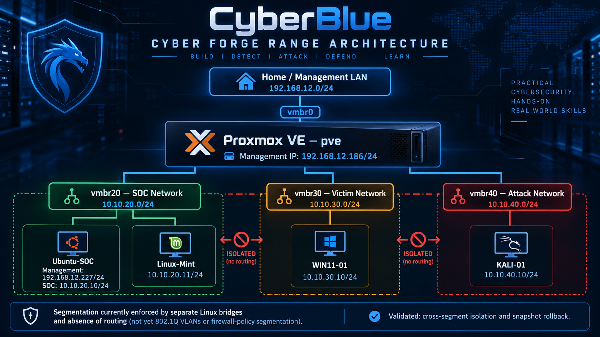

# CyberBlue



**CyberBlue** is a hands-on cybersecurity training and portfolio project built around a repeatable cyber range called **Cyber Forge**.

The goal is not to collect tools or screenshots. The goal is to demonstrate the ability to **design, build, validate, troubleshoot, explain, document, and qualify** real security capabilities in a controlled lab environment.

---

## Cyber Forge

Cyber Forge is the practical lab environment used throughout the CyberBlue training program.

The current range is built on **Proxmox VE** and uses separate virtual network segments for:

- **SOC systems**
- **Victim systems**
- **Attack systems**
- **Management access**

Current Module 02 architecture:

```text
                         HOME / MANAGEMENT LAN
                             192.168.12.0/24
                                    |
                                  vmbr0
                                    |
                         Proxmox VE — pve
                           192.168.12.186/24
                                    |
           +------------------------+------------------------+
           |                        |                        |
         vmbr20                   vmbr30                   vmbr40
       SOC NETWORK            VICTIM NETWORK           ATTACK NETWORK
      10.10.20.0/24          10.10.30.0/24           10.10.40.0/24
           |                        |                        |
    +------+-------+                |                        |
    |              |                |                        |
Ubuntu-SOC     Linux-Mint         WIN11-01                 KALI-01
10.10.20.10    10.10.20.11       10.10.30.10             10.10.40.10
```

> The current Cyber Forge segments are separate Linux bridges, not 802.1Q VLANs. Cross-segment isolation is currently achieved by architecture and the absence of routing, not by configured firewall policy.

---

## Training Method

CyberBlue uses a principle-first workflow:

```text
Principle
   ↓
Architecture
   ↓
Build
   ↓
Validate
   ↓
Break / Test
   ↓
Troubleshoot
   ↓
Restore
   ↓
Explain
   ↓
Document
   ↓
Qualify
```

A second operational loop used throughout the range is:

```text
BUILD → SIMULATE → DETECT → INVESTIGATE → RESPOND → DOCUMENT → RESET → REPEAT
```

The emphasis is on understanding **why** a capability works before focusing on a specific product or command.

---

## Skills Demonstrated

Current CyberBlue work demonstrates practical experience with:

- Proxmox VE virtualization
- Linux bridge networking
- Network segmentation
- IPv4 addressing and routing validation
- Dual-homed systems
- Linux and Windows VM provisioning
- Windows VirtIO storage and network drivers
- QEMU Guest Agent integration
- Linux NetworkManager and Netplan
- Windows routing and TCP/IP validation
- Connectivity and isolation testing
- Snapshot and rollback workflows
- Troubleshooting virtual infrastructure
- Evidence collection
- Technical documentation
- Windows Event Viewer and Security log analysis
- Sysmon process telemetry
- Linux auditd / ausearch investigation
- Controlled telemetry failure and recovery
- Endpoint visibility-gap analysis
- Portfolio-ready lab reporting
- Wazuh SIEM deployment and administration
- Docker Compose service orchestration
- OpenSearch security configuration
- SIEM administrative credential hardening
- Direct API authentication validation
- Docker service-exposure hardening

As additional modules are completed, this repository will expand into endpoint telemetry, SIEM, network monitoring, vulnerability management, detection engineering, incident response, threat hunting, SOAR, cloud security operations, and purple-team validation.

---

## Module Index

| Module | Topic | Status |
|---|---|---|
| [Module 02 — Cyber Forge Range Foundation](modules/module-02-range-foundation/README.md) | Proxmox networking, segmentation, VM provisioning, validation, and snapshot recovery | **QUALIFIED ✓** |
| [Module 03 — Virtual Networking & Segmentation](modules/module-03-virtual-networking-segmentation/README.md) | Layer-3 routing, persistent routes, packet tracing, return-path troubleshooting, and segmentation policy | **BUILD COMPLETE ✓** |
| [Module 04 — Endpoint Telemetry & Logging](modules/module-04-endpoint-telemetry-logging/README.md) | Native and enhanced endpoint telemetry, Sysmon, auditd, visibility-gap testing, and telemetry recovery | **BUILD COMPLETE ✓** |
| [Module 05 — Centralized Logging & SIEM Foundations](modules/module-05-centralized-logging-siem/README.md) | Wazuh SIEM deployment, platform hardening, centralized telemetry architecture, and upcoming endpoint enrollment | **IN PROGRESS** |

Modules 03 and 04 have completed their technical build gates. Module 05 is now actively building centralized logging and SIEM capability. Deeper knowledge review remains tracked separately and will be revisited after the wider Cyber Forge range is built.

---

## Module 02 — Cyber Forge Range Foundation

Module 02 establishes the core infrastructure required for the rest of the Cyber Forge training environment.

The completed range includes:

```text
VM 100 — Ubuntu-SOC
  Management: 192.168.12.227/24
  SOC:        10.10.20.10/24

VM 101 — Linux-Mint
  SOC:        10.10.20.11/24

VM 102 — WIN11-01
  Victim:     10.10.30.10/24

VM 103 — KALI-01
  Attack:     10.10.40.10/24
```

The module includes configuration steps, validation commands, troubleshooting notes, qualification questions, and embedded evidence screenshots.

**[View Module 02 documentation →](modules/module-02-range-foundation/README.md)**

---

## Module 03 — Virtual Networking & Segmentation

Module 03 has completed its **technical build gate** and advances the Cyber Forge from isolated Layer-2 segments to deliberately routed and policy-controlled trust zones.

Work completed so far includes:

```text
[✓] Dedicated ROUTER-01 VM across vmbr20/vmbr30/vmbr40
[✓] IPv4 forwarding validated and made persistent
[✓] Persistent routes on Ubuntu-SOC, WIN11-01, and KALI-01
[✓] Cross-subnet routing validated
[✓] Return-path failure diagnosed with tcpdump and Windows PktMon
[✓] Host-firewall policy behavior validated
[✓] Pre-policy router baseline captured
[✓] Stateful nftables segmentation policy implemented
[✓] Directional allow/deny matrix validated
[✓] nftables persistence validated
[✓] Post-reboot security policy validated
[ ] Knowledge review — deferred until range build-out
```

**[View Module 03 documentation →](modules/module-03-virtual-networking-segmentation/README.md)**

---

## Module 04 — Endpoint Telemetry & Logging

Module 04 has completed its **technical Build Gate** and establishes native and enhanced endpoint visibility across both Windows and Linux.

```text
[✓] Native Linux and Windows telemetry investigated
[✓] Known authentication and privilege activity correlated
[✓] Linux service lifecycle telemetry validated
[✓] Native file/process visibility gap demonstrated
[✓] Sysmon installed and Event ID 1 process telemetry validated
[✓] auditd installed and exec auditing validated
[✓] Controlled telemetry failure created
[✓] Blind spot demonstrated while the rule was absent
[✓] Same activity detected after telemetry was restored
[✓] Temporary management access and audit rules removed
[✓] Endpoint network architecture restored
[✓] Technical Build Gate passed
[ ] Knowledge review — deferred until range build-out
[ ] Independent qualification — deferred until range build-out
```

**[View Module 04 documentation →](modules/module-04-endpoint-telemetry-logging/README.md)**

---

## Module 05 — Centralized Logging & SIEM Foundations

Module 05 is **in progress** and moves Cyber Forge from endpoint-local telemetry into centralized security monitoring.

Completed work includes:

```text
[✓] Ubuntu-SOC resized to 4 vCPU / 8 GB RAM / 64 GB disk
[✓] Linux LVM and root filesystem expanded
[✓] Docker / Docker Compose prerequisites validated
[✓] Pre-Wazuh snapshot created
[✓] Wazuh Docker 4.14.8 staged and deployed
[✓] Wazuh certificate generation completed
[✓] Dashboard bound to the management interface
[✓] Transient Docker TLS image-pull failure diagnosed and recovered
[✓] Wazuh administrative credential rotated
[✓] OpenSearch security configuration reapplied
[✓] Direct indexer authentication validated with HTTP 200
[✓] New dashboard admin login validated
[✓] External host exposure of indexer port 9200 removed
[✓] Dashboard validated after indexer-port hardening
[ ] Linux-Mint agent enrollment
[ ] WIN11-01 agent enrollment
[ ] Centralized event ingestion and correlation
[ ] Module 05 Technical Build Gate
```

**[View Module 05 documentation →](modules/module-05-centralized-logging-siem/README.md)**

---

## Current Lab Status

```text
[✓] Proxmox management network preserved
[✓] SOC bridge created
[✓] Victim bridge created
[✓] Attack bridge created
[✓] Ubuntu-SOC dual-homed
[✓] Linux Mint SOC endpoint operational
[✓] Windows 11 victim endpoint operational
[✓] Kali attack endpoint operational
[✓] Cross-segment isolation validated
[✓] Snapshot rollback validated
[✓] Module 02 qualification completed
[✓] ROUTER-01 deployed across SOC/Victim/Attack networks
[✓] Persistent inter-subnet routing validated
[✓] Packet-path troubleshooting completed
[✓] Stateful router segmentation policy validated
[✓] Module 04 endpoint baselines captured
[✓] Native Linux and Windows telemetry reviewed
[✓] Known Linux sudo event correlated to authentication logs
[✓] Known Windows interactive logon correlated to Security log
[✓] Sysmon enhanced Windows process telemetry validated
[✓] Linux auditd enhanced process telemetry validated
[✓] Controlled telemetry failure and restoration validated
[✓] Module 04 technical Build Gate completed
[✓] Ubuntu-SOC expanded for SIEM workload
[✓] Wazuh 4.14.8 single-node SIEM deployed
[✓] Wazuh administrative credential hardened
[✓] Direct indexer authentication validated
[✓] Wazuh dashboard operational on management network
[✓] External indexer port 9200 removed from host exposure
[ ] Wazuh endpoint agent enrollment pending
```

The current range has completed the **Module 04 technical Build Gate** and is actively progressing through **Module 05 — Centralized Logging & SIEM Foundations**. The Wazuh platform foundation and initial hardening are complete; endpoint enrollment and centralized event ingestion are next.

---

## Documentation Standard

Each CyberBlue module is expected to include:

- the core security or infrastructure principle;
- the capability being learned;
- the architectural role of that capability;
- inputs, outputs, and dependencies;
- implementation steps;
- validation checkpoints;
- troubleshooting notes;
- evidence screenshots;
- qualification questions;
- a portfolio-ready summary.

The objective is to produce documentation that can be used both as a **learning record** and as **technical evidence during interviews**.

---

## Repository Purpose

This repository serves as:

- a cybersecurity learning record;
- a cyber range build journal;
- a troubleshooting history;
- an evidence repository;
- a technical portfolio;
- a foundation for repeatable hands-on training.

CyberBlue is built around demonstrated competency rather than passive course completion.
