# CyberBlue — Module 02

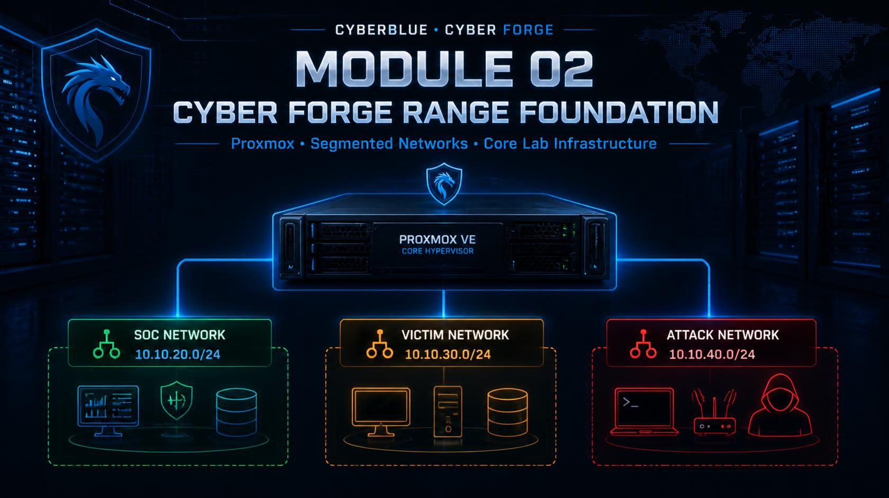

## Cyber Forge Range Foundation

**Status:** QUALIFIED ✓  
**Platform:** Proxmox VE 9.2.2  
**Range host:** `pve`  
**Module focus:** Virtualization, segmentation, VM provisioning, isolated networking, validation, and rollback  
**Training method:** Principle → Architecture → Build → Validate → Break/Test → Troubleshoot → Restore → Explain → Document → Qualify

---

## Module Purpose

Module 02 establishes the infrastructure foundation for the Cyber Forge cyber range.

The objective was not simply to create several virtual machines. The objective was to build a segmented virtual environment in which systems can later be used for security monitoring, attack simulation, endpoint telemetry, incident response, detection engineering, and repeatable live-fire exercises.

The range was built so that the learner could explain:

- how Proxmox Linux bridges act as virtual Layer-2 switches;
- why a host on one subnet cannot reach another subnet without a Layer-3 path;
- the difference between separate Linux bridges and true 802.1Q VLANs;
- how paravirtualized VirtIO devices work;
- why Windows required a VirtIO storage driver during installation;
- how guest-agent integration improves VM management;
- how routing tables prove expected reachability;
- how to validate isolation instead of assuming it;
- how snapshots create reusable cyber-range baselines; and
- how to restore a victim system after controlled changes.

This module follows the CyberBlue principle that a learner should be able to **build, validate, explain, and document** the environment—not merely follow a sequence of clicks.

---

# 1. Core Principle

## Virtual segmentation creates controlled trust boundaries

A cyber range needs separate security zones. An attacker workstation should not automatically have unrestricted access to a victim, the SOC, the hypervisor, or the household/management network.

In this implementation, segmentation is provided by **separate Proxmox Linux bridges**:

- `vmbr20` — SOC network
- `vmbr30` — Victim network
- `vmbr40` — Attack network

These are isolated Layer-2 software bridges. They are **not currently 802.1Q VLANs**.

No router was placed between the three lab bridges during this module. The bridges also do not have IPv4 addresses on the Proxmox host. IPv4 forwarding on the host remained disabled.

The result is a range in which connectivity must be deliberately introduced later rather than existing by default.

---

# 2. Architecture Role

The completed Module 02 environment is:

```text
                              HOME / MANAGEMENT LAN
                                  192.168.12.0/24
                                         |
                                         |
                                      vmbr0
                                         |
                         Proxmox VE — pve
                            192.168.12.186/24
                                         |
            +----------------------------+-----------------------------+
            |                            |                             |
          vmbr20                       vmbr30                        vmbr40
        SOC NETWORK                 VICTIM NETWORK                ATTACK NETWORK
       10.10.20.0/24               10.10.30.0/24                10.10.40.0/24
            |                            |                             |
     +------+-------+                    |                             |
     |              |                    |                             |
 Ubuntu-SOC     Linux-Mint            WIN11-01                     KALI-01
 VM 100          VM 101               VM 102                       VM 103
     |              |               10.10.30.10/24              10.10.40.10/24
 ens19            ens18                  |                             |
10.10.20.10/24 10.10.20.11/24           |                             |
     |              |                    |                             |
     +------↔-------+                 isolated                      isolated

Ubuntu-SOC also has:
ens18 → vmbr0 → 192.168.12.227/24 → default gateway 192.168.12.1
```

### Important architectural distinction

Ubuntu-SOC is dual-homed:

```text
Ubuntu-SOC
  net0 / ens18 → vmbr0  → Management/Home LAN
  net1 / ens19 → vmbr20 → SOC Network
```

That does **not** mean Ubuntu-SOC automatically routes traffic between those networks. Routing requires explicit Layer-3 forwarding/configuration. No such routing was enabled in this module.

---

# 3. Addressing Plan

| Zone | Proxmox bridge | IPv4 subnet | System | IPv4 address | Default gateway |
|---|---|---|---|---|---|
| Management | `vmbr0` | `192.168.12.0/24` | Proxmox `pve` | `192.168.12.186/24` | `192.168.12.1` |
| Management | `vmbr0` | `192.168.12.0/24` | Ubuntu-SOC `ens18` | `192.168.12.227/24` DHCP | `192.168.12.1` |
| SOC | `vmbr20` | `10.10.20.0/24` | Ubuntu-SOC `ens19` | `10.10.20.10/24` | None |
| SOC | `vmbr20` | `10.10.20.0/24` | Linux-Mint `ens18` | `10.10.20.11/24` | None |
| Victim | `vmbr30` | `10.10.30.0/24` | WIN11-01 | `10.10.30.10/24` | None |
| Attack | `vmbr40` | `10.10.40.0/24` | KALI-01 `eth0` | `10.10.40.10/24` | None |

The SOC, Victim, and Attack endpoints were intentionally configured without a default gateway unless management connectivity was explicitly required.

---

# 4. Starting State

The Proxmox host initially had one management bridge:

```text
auto lo
iface lo inet loopback

iface nic0 inet manual

auto vmbr0
iface vmbr0 inet static
    address 192.168.12.186/24
    gateway 192.168.12.1
    bridge-ports nic0
    bridge-stp off
    bridge-fd 0

source /etc/network/interfaces.d/*
```

The physical interface `nic0` had no IPv4 address of its own. It was connected to `vmbr0`, and the bridge owned the Proxmox management address.

Initial routing:

```text
default via 192.168.12.1 dev vmbr0
192.168.12.0/24 dev vmbr0 scope link src 192.168.12.186
```

Existing VM 100, `Ubuntu-SOC`, initially had one virtual NIC on `vmbr0`.

---

# 5. Section 01 — Proxmox Network Baseline & Segmentation

**Result: PASS ✓**

## Objective

Preserve the working management network while creating three isolated virtual Layer-2 segments for SOC, Victim, and Attack roles.

## Backup before change

The network configuration was backed up before modifications:

```bash
cp /etc/network/interfaces /etc/network/interfaces.bak-module02
```

## Bridges created

Three Linux bridges were created through the Proxmox GUI:

```text
vmbr20 — Cyber Forge - SOC Network
vmbr30 — Cyber Forge - Victim Network
vmbr40 — Cyber Forge - Attack Network
```

Each bridge was configured with:

```text
Bridge ports: none
IPv4/CIDR:    none
IPv6/CIDR:    none
Autostart:    enabled
VLAN aware:   disabled
```

Final relevant configuration:

```text
auto vmbr20
iface vmbr20 inet manual
    bridge-ports none
    bridge-stp off
    bridge-fd 0
#Cyber Forge - SOC Network

auto vmbr30
iface vmbr30 inet manual
    bridge-ports none
    bridge-stp off
    bridge-fd 0
#Cyber Forge - Victim Network

auto vmbr40
iface vmbr40 inet manual
    bridge-ports none
    bridge-stp off
    bridge-fd 0
#Cyber Forge - Attack Network
```

## Troubleshooting event

The first SOC bridge was accidentally created as `vmbr1`.

The error was caught while the configuration was still pending. The pending change was reverted and the bridge was recreated correctly as `vmbr20`.

**Lesson:** staged configuration is a safety mechanism. Review pending hypervisor networking changes before applying them.

## Validation

The host retained only its intended IPv4 management route. The internal bridges had no Proxmox IPv4 addresses.

### Evidence

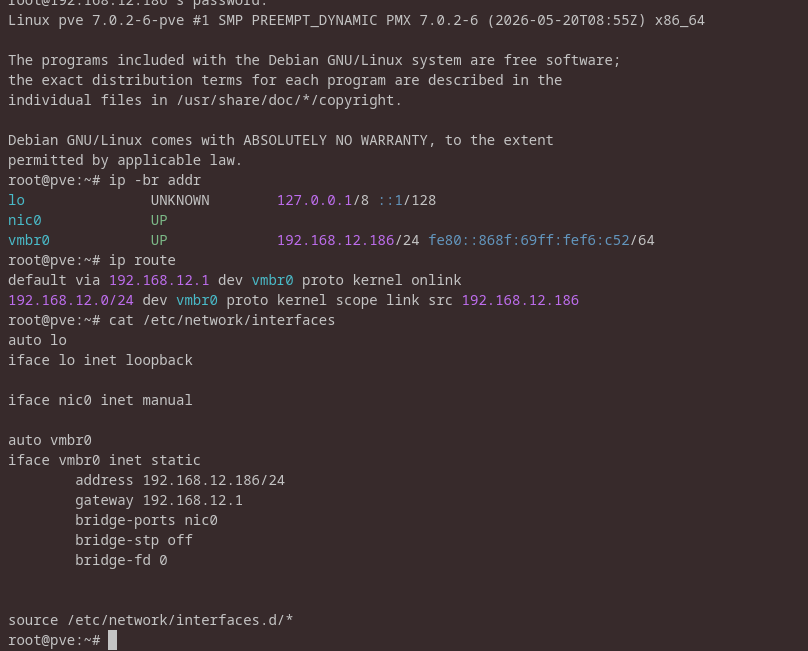

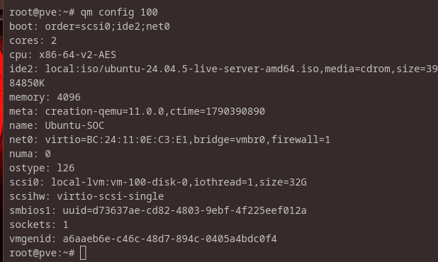

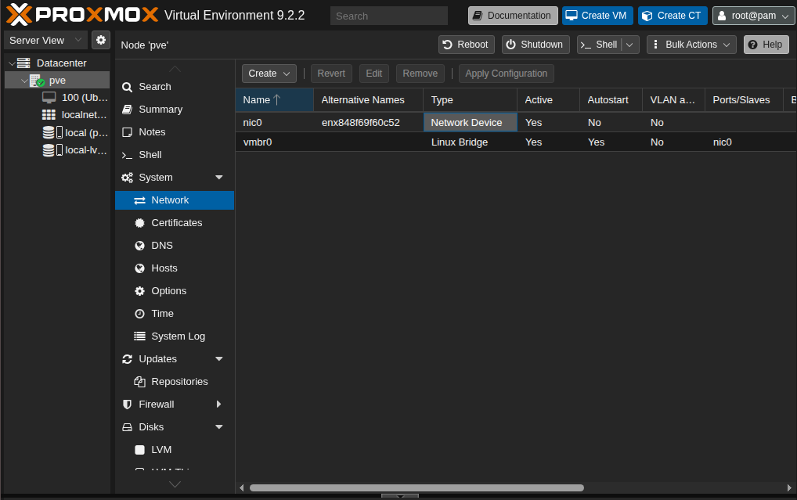

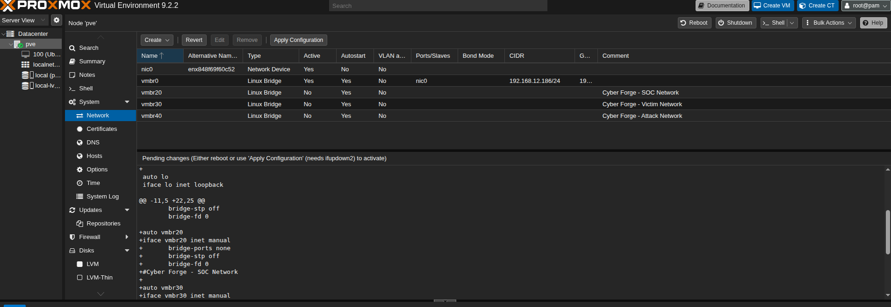

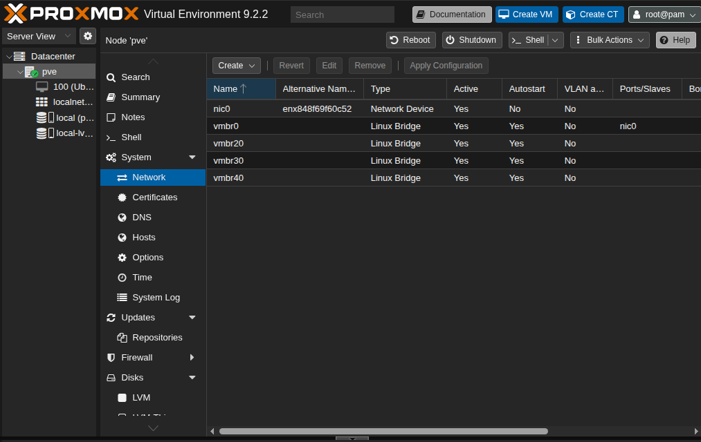

---

# 6. Section 02 — Connect Ubuntu-SOC to the SOC Network

**Result: PASS ✓**

## Objective

Dual-home Ubuntu-SOC so it retains management connectivity while also participating in the isolated SOC network.

## Proxmox configuration

VM 100 was configured with:

```text
net0 → vmbr0
net1 → vmbr20
```

`net1` used a VirtIO virtual NIC.

## Ubuntu configuration

The Ubuntu interfaces became:

```text
ens18 → 192.168.12.227/24  Management
ens19 → 10.10.20.10/24     SOC
```

The Netplan file was backed up:

```bash
sudo cp /etc/netplan/50-cloud-init.yaml /etc/netplan/50-cloud-init.yaml.bak-module02
```

The configuration used:

```yaml
network:
  version: 2
  ethernets:
    ens18:
      dhcp4: true
    ens19:
      dhcp4: false
      addresses:
        - 10.10.20.10/24
```

Validation commands:

```bash
sudo netplan generate
sudo netplan try

ip -br addr
ip route
```

Expected/observed routing included:

```text
default via 192.168.12.1 dev ens18
10.10.20.0/24 dev ens19 scope link src 10.10.20.10
192.168.12.0/24 dev ens18
172.17.0.0/16 dev docker0
```

The critical validation point was that there was **only one default route**, through the management interface.

### Evidence

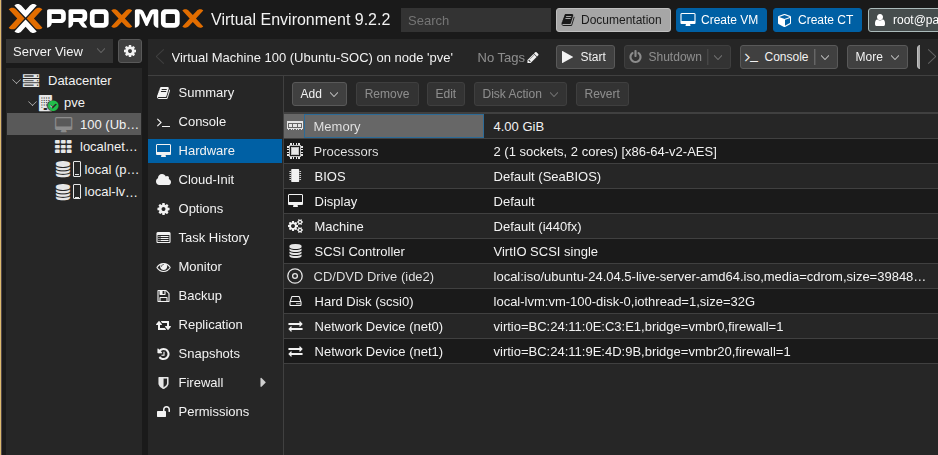

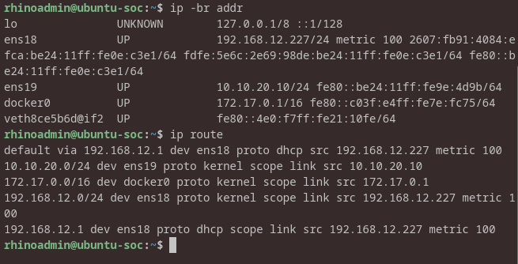

---

# 7. Section 03 — VM Provisioning & SOC Connectivity Validation

**Result: PASS ✓**

## Objective

Provision a second endpoint on the SOC network, validate guest hardware, configure static addressing, and prove same-segment communication.

## ISO catalog

Linux Mint Cinnamon was added to the Proxmox ISO library.

The catalog also later included Ubuntu Server, Windows 10 Pro, Windows 11, Kali Linux, and the VirtIO Windows driver ISO.

### Evidence

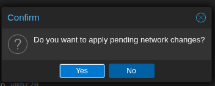

## ISO integrity validation

The Linux Mint ISO was hashed on the Proxmox host:

```bash
sha256sum /var/lib/vz/template/iso/linuxmint-22.3-cinnamon-64bit.iso
```

Observed SHA-256:

```text
a081ab202cfda17f6924128dbd2de8b63518ac0531bcfe3f1a1b88097c459bd4
```

### Evidence

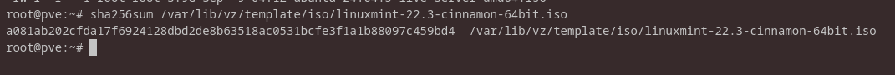

## VM 101 — Linux-Mint

Provisioned configuration:

```text
VM ID:          101
Name:           Linux-Mint
CPU:            2 vCPU
Memory:         2048 MiB
Disk:           32 GiB
SCSI:           VirtIO SCSI single
Network:        VirtIO → vmbr20
Firewall flag:  enabled
QEMU Agent:     enabled in VM configuration
```

### Evidence

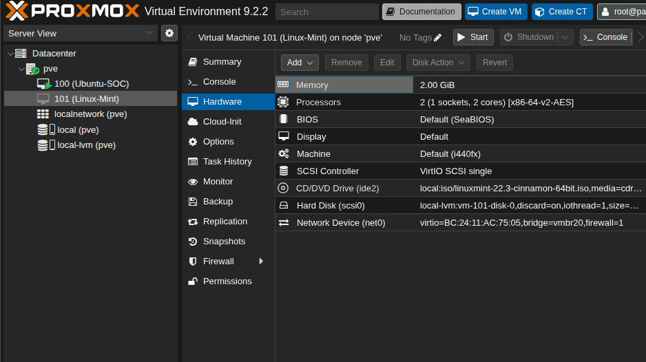

## Guest hardware validation

Before installation, the live environment was inspected using:

```bash
lscpu | grep -E 'Model name|Socket|Core|CPU\(s\)'
free -h
lsblk
ip -br addr
```

The guest saw:

```text
2 virtual CPUs
~2 GiB RAM
32 GiB virtual disk
Kali/Mint installer media as virtual CD-ROM
VirtIO-backed network interface
```

### Evidence

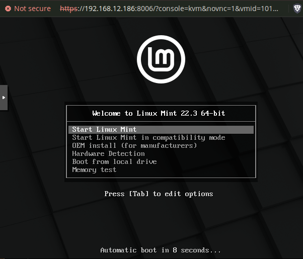

## SOC addressing

Linux-Mint was configured:

```text
Address: 10.10.20.11/24
Gateway: none
DNS:     none
```

Validation:

```bash
ip -br addr
ip route
```

Result:

```text
ens18 UP 10.10.20.11/24

10.10.20.0/24 dev ens18 proto kernel scope link src 10.10.20.11
```

### Evidence

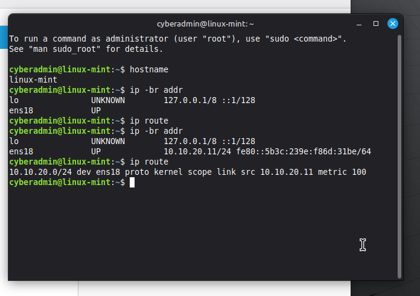

## Same-segment connectivity

From Linux-Mint:

```bash
ping -c 4 10.10.20.10
ip neigh
```

The ping returned:

```text
4 packets transmitted
4 received
0% packet loss
```

The neighbor table learned Ubuntu-SOC's MAC address.

Reverse communication was also tested from Ubuntu-SOC to `10.10.20.11` and succeeded.

### Principle demonstrated

Two hosts on the same Layer-2 bridge and IPv4 subnet communicate directly using ARP/neighbor discovery and Ethernet switching. They do not require a router for local-subnet communication.

### Evidence

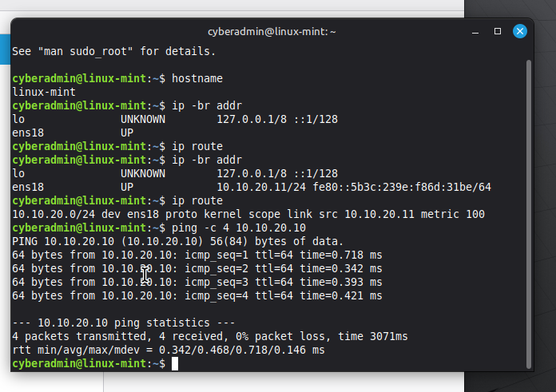

---

# 8. Section 04 — Victim Network Systems

**Result: PASS ✓**

## Objective

Build an enterprise-style Windows 11 victim endpoint on the isolated Victim network.

## VM 102 — WIN11-01

Windows-specific virtual hardware was deliberately selected:

```text
VM ID:           102
Name:            WIN11-01
OS:              Windows 11 Pro
Machine:         q35
Firmware:        OVMF (UEFI)
EFI Disk:        enabled
Pre-enrolled keys: enabled
TPM:             2.0
CPU:             2 vCPU
Memory:          4096 MiB
System Disk:     64 GiB
SCSI Controller: VirtIO SCSI single
Network:         VirtIO → vmbr30
QEMU Agent:      enabled
Windows ISO:     Windows 11 25H2
Driver ISO:      virtio-win.iso
```

### Evidence

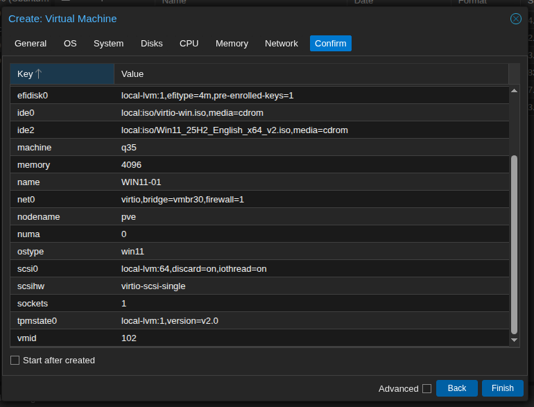

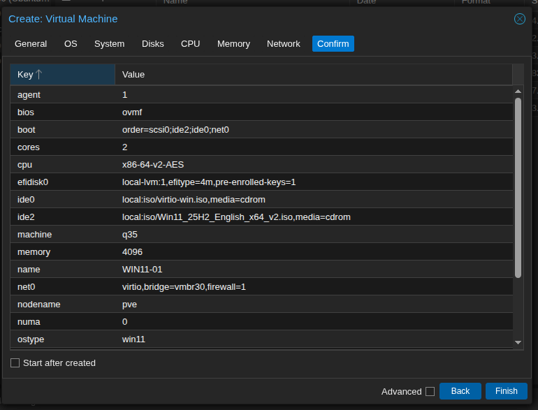

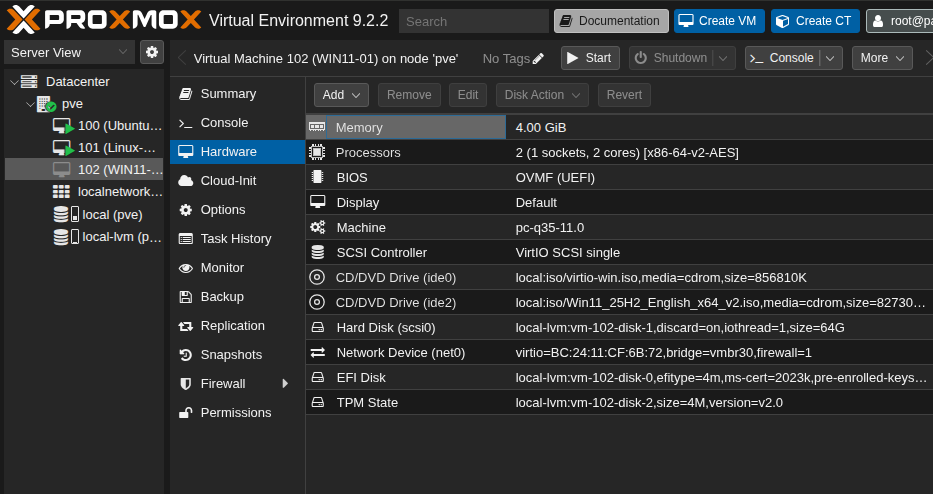

## VirtIO storage troubleshooting

Windows Setup initially displayed no installation disk even though Proxmox had already created the 64 GiB virtual disk.

### Cause

The Windows installer did not yet contain the driver required to communicate with the **VirtIO SCSI controller**.

### Resolution

The mounted `virtio-win.iso` was used to load:

```text
D:\vioscsi\w11\amd64
```

Windows identified the driver as the Red Hat VirtIO SCSI controller driver.

After the driver loaded, the 64 GiB disk appeared in Windows Setup.

### Principle demonstrated

The virtual disk existed the entire time. The failure was a **driver/controller visibility problem**, not a missing disk.

### Evidence

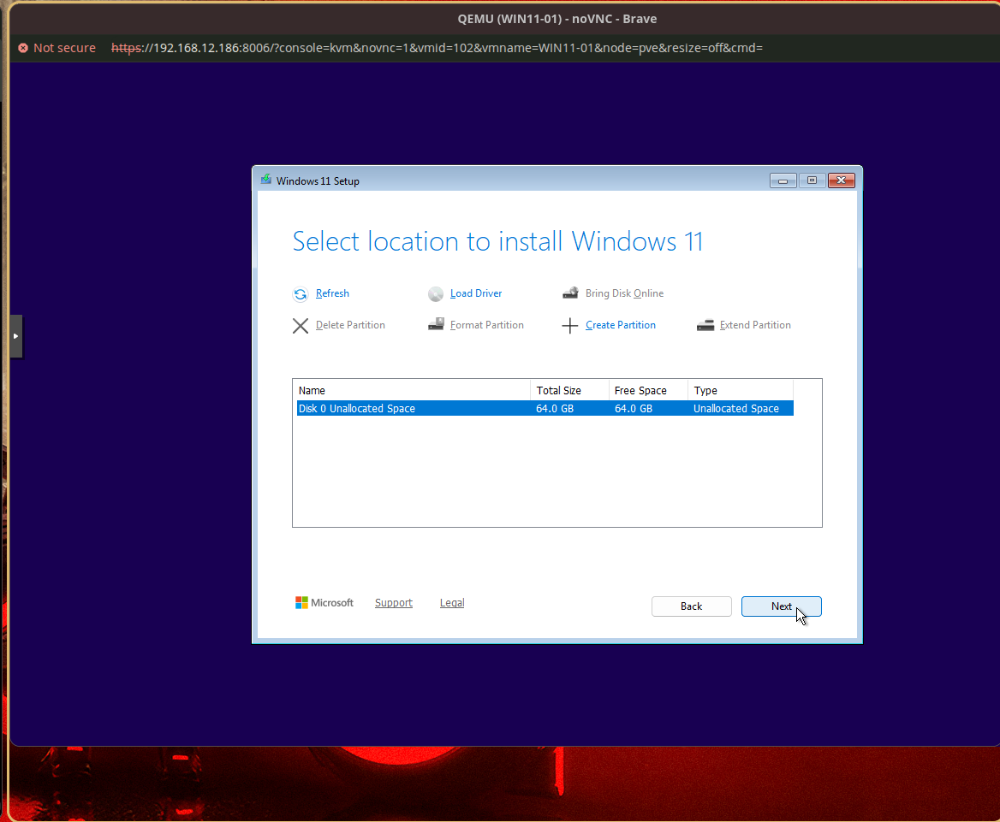

## Windows installation and local account

Windows 11 Pro was installed.

Because `vmbr30` intentionally had no Internet path, OOBE could not use an Internet-dependent setup flow. A local lab account was created while maintaining network isolation.

### Evidence

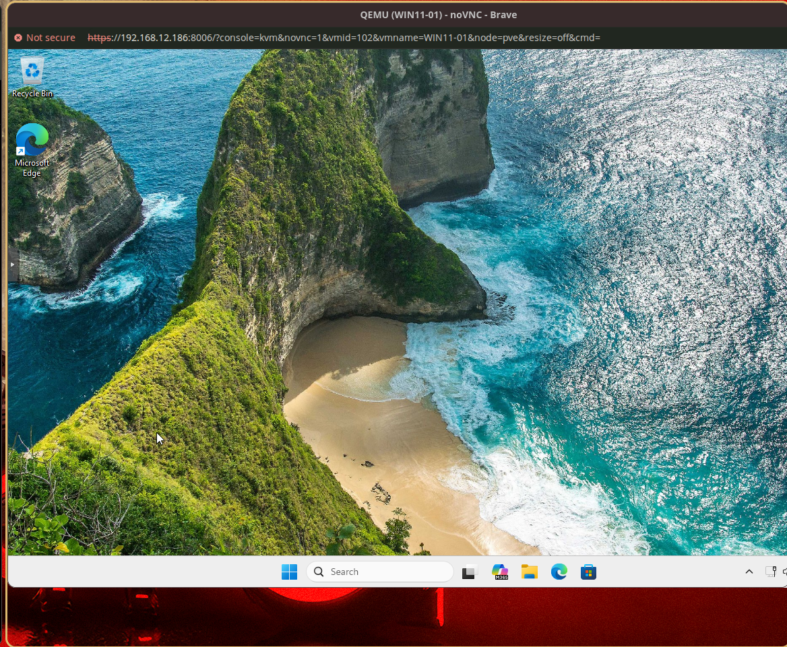

## VirtIO guest integration

The VirtIO guest tools were installed from the mounted driver ISO.

The QEMU Guest Agent service was validated:

```text
Service:      QEMU Guest Agent
Status:       Running
Startup Type: Automatic
```

Device Manager showed no unresolved/unknown devices.

### Evidence

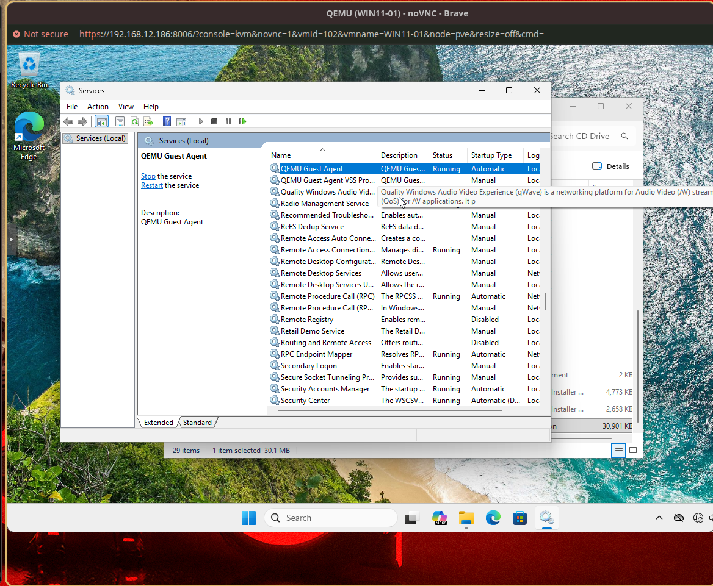

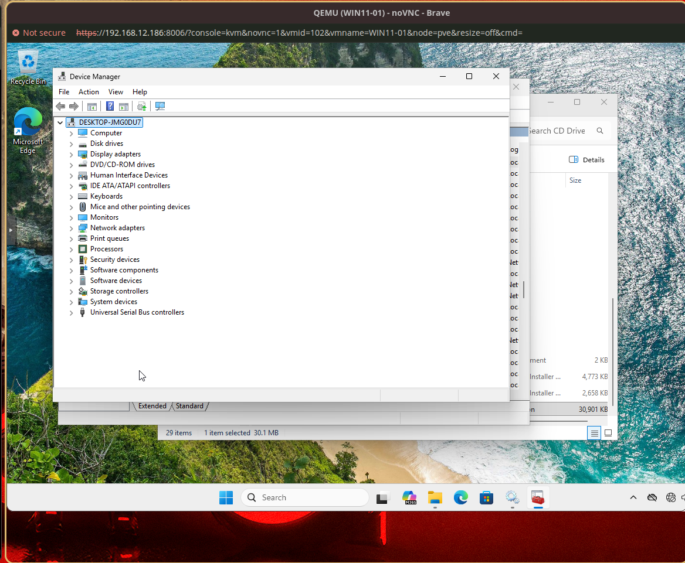

## Victim addressing

WIN11-01 was assigned:

```text
IPv4:            10.10.30.10
Subnet mask:     255.255.255.0
Default gateway: none
DNS:             none
```

Validation used:

```powershell
ipconfig
route print -4
```

The routing table contained the directly connected Victim subnet but no default route.

### Evidence

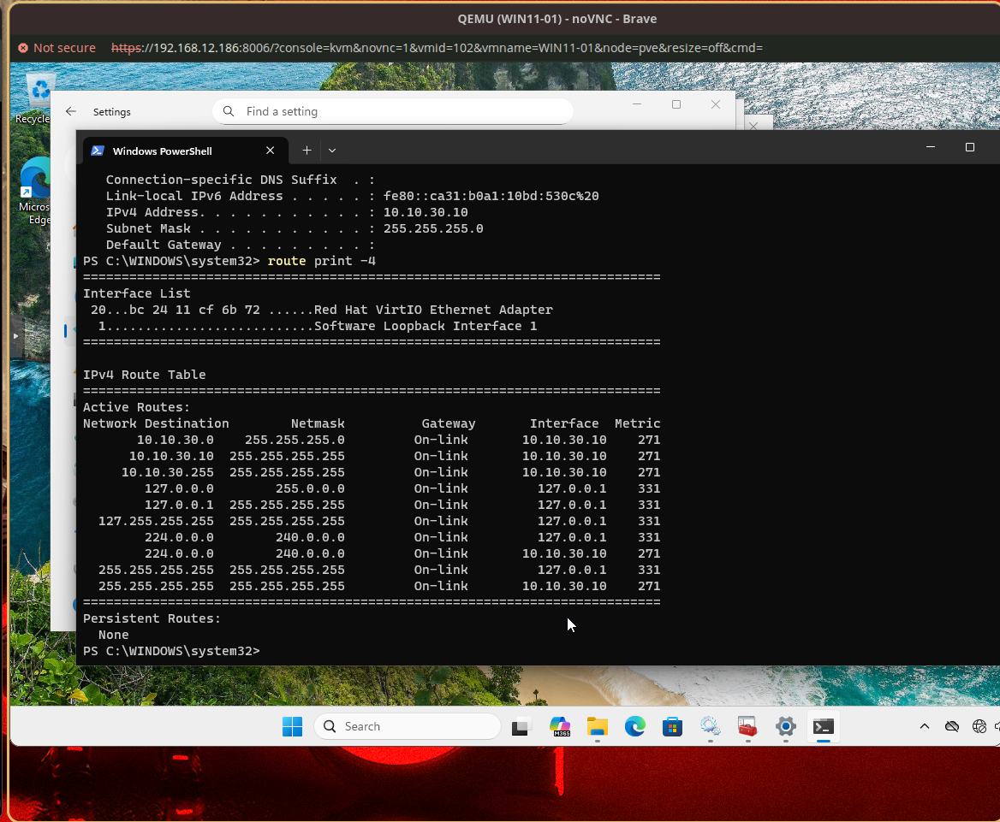

## Victim isolation test

WIN11-01 tested:

```powershell
ping 192.168.12.1
ping 10.10.20.10
```

Both failed.

Because there was no default route, Windows reported transmit failures rather than successfully forwarding the packets to another network.

### Evidence

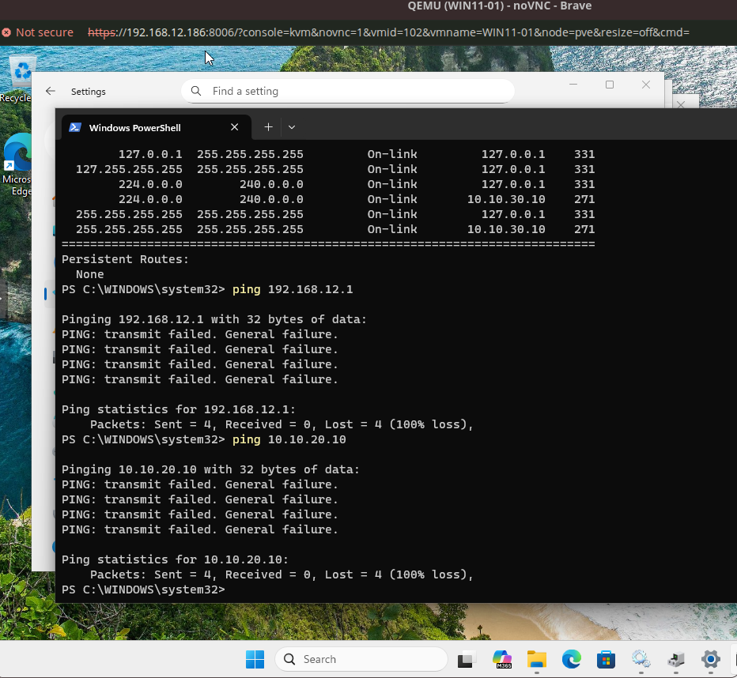

## Local TCP/IP validation

WIN11-01 successfully pinged its own address:

```powershell
ping 10.10.30.10
arp -a
```

The self-ping returned 0% loss.

No dynamic peer host was present on the Victim segment yet, so the ARP table contained no learned neighboring victim endpoint.

### Evidence

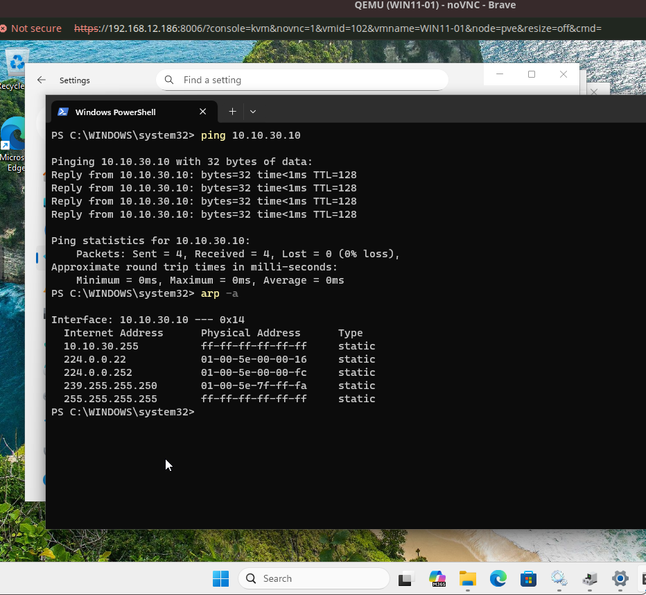

---

# 9. Section 05 — Attack Network Systems

**Result: PASS ✓**

## Objective

Provision a Kali Linux attacker workstation on an isolated Attack network.

## VM 103 — KALI-01

Configuration:

```text
VM ID:          103
Name:           KALI-01
OS:             Kali Linux 2026.2
CPU:            2 vCPU
Memory:         4096 MiB
Disk:           32 GiB
BIOS:           SeaBIOS
Machine:        i440fx
SCSI:           VirtIO SCSI single
Network:        VirtIO → vmbr40
Firewall flag:  enabled
QEMU Agent:     enabled in Proxmox configuration
```

### Evidence

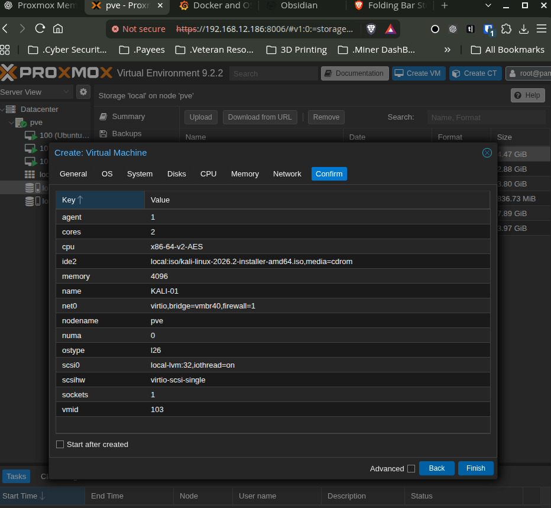

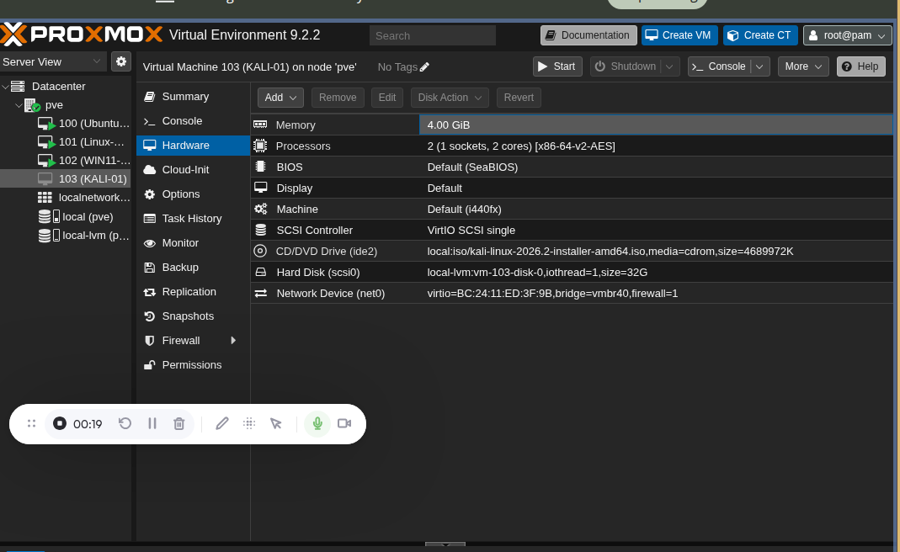

## Kali installation

The graphical installer was used.

Key installation choices included:

```text
Hostname:       kali-01
User:           cyberadmin
Partitioning:   Guided — use entire disk
Filesystem:     ext4 + swap
Desktop:        Xfce
Tool sets:      Top 10 + default recommended tools
GRUB target:    /dev/sda
```

### Evidence

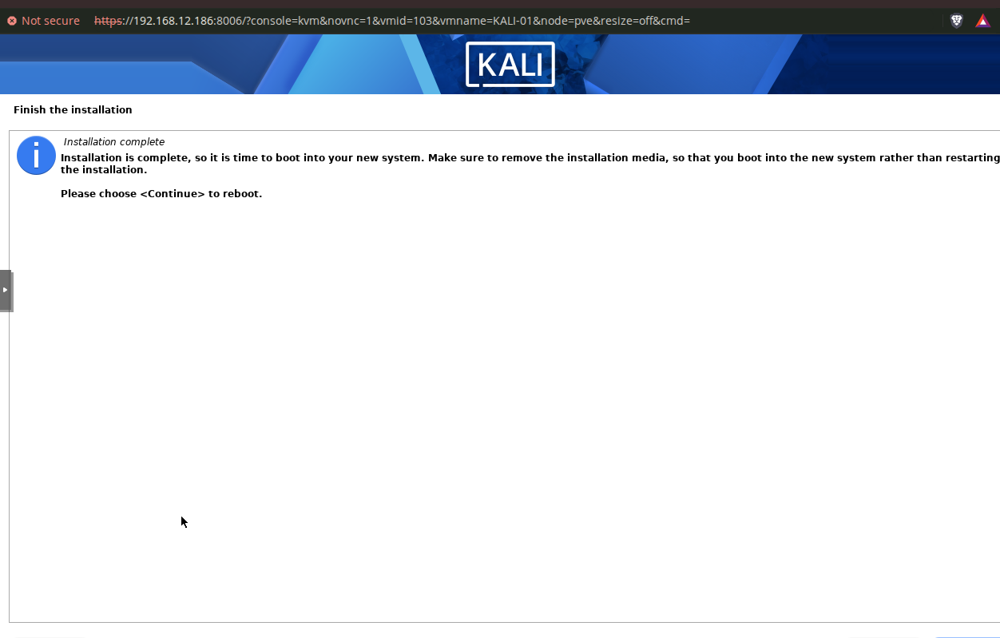

## Attack-network addressing

The static IPv4 configuration did not persist from the installer into the installed NetworkManager configuration, so it was configured after first boot.

Final configuration:

```text
Hostname:        kali-01
Interface:       eth0
IPv4:            10.10.40.10/24
Default gateway: none
DNS:             none
```

Validation:

```bash
ip -br addr
ip route
hostname
```

Result:

```text
eth0 UP 10.10.40.10/24

10.10.40.0/24 dev eth0 proto kernel scope link src 10.10.40.10
```

### Evidence

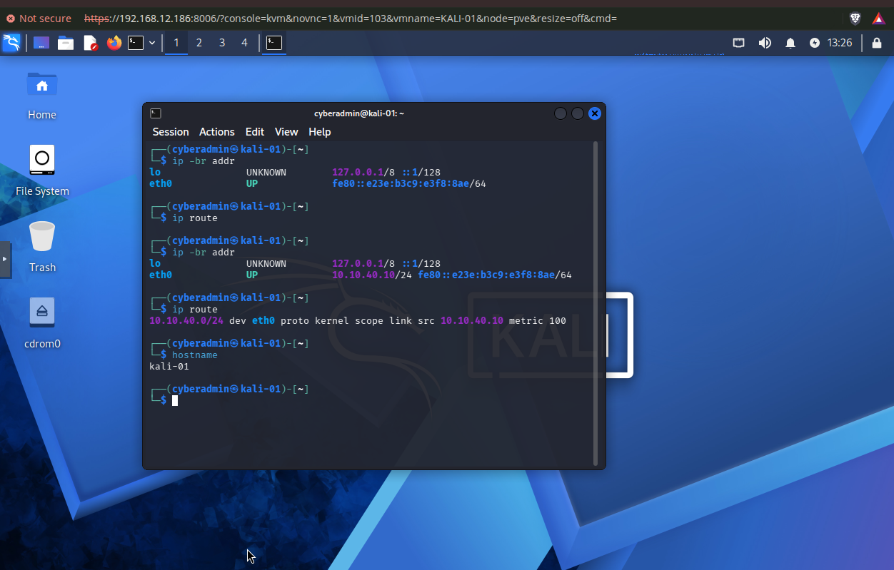

## Attack-network isolation test

Kali tested:

```bash
ping -c 4 10.10.30.10
ping -c 4 10.10.20.10
ping -c 4 192.168.12.1
```

Each returned:

```text
ping: connect: Network is unreachable
```

This showed the Kali kernel had no Layer-3 route from the Attack segment to the Victim, SOC, or management networks.

### Evidence

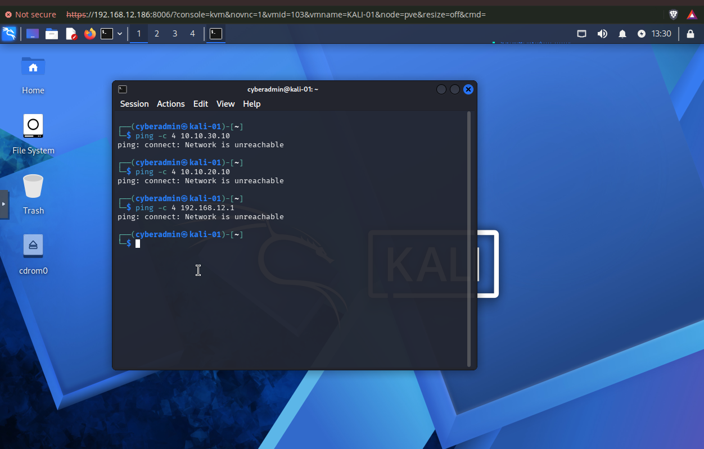

---

# 10. Section 06 — Isolation & Security Validation

**Result: PASS ✓**

## Objective

Validate the range as a complete architecture and prove that expected communication and isolation behavior is caused by the actual network design.

## Proxmox bridge validation

Commands:

```bash
ip -br addr
bridge link
ip route
sysctl net.ipv4.ip_forward
```

Observed addressing:

```text
vmbr0   UP   192.168.12.186/24
vmbr20  UP   no IPv4
vmbr30  UP   no IPv4
vmbr40  UP   no IPv4
```

Observed host routing:

```text
default via 192.168.12.1 dev vmbr0
192.168.12.0/24 dev vmbr0 scope link src 192.168.12.186
```

There were no Proxmox routes to:

```text
10.10.20.0/24
10.10.30.0/24
10.10.40.0/24
```

IPv4 forwarding:

```text
net.ipv4.ip_forward = 0
```

### Meaning

The Proxmox host was not acting as an IPv4 router between the Cyber Forge segments.

## Bridge membership

The host-side bridge plumbing showed:

```text
VM 100 Ubuntu-SOC
  net0 → vmbr0
  net1 → vmbr20

VM 101 Linux-Mint
  net0 → vmbr20

VM 102 WIN11-01
  net0 → vmbr30

VM 103 KALI-01
  net0 → vmbr40
```

The `fwbr`, `fwpr`, and `fwln` interfaces are Proxmox firewall bridge plumbing created because firewall capability is enabled on the virtual NICs.

Their presence does **not** prove that firewall policy has been configured.

### Evidence

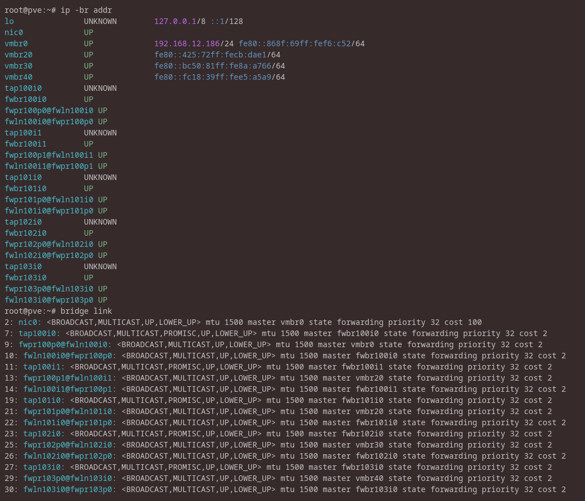

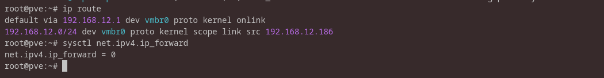

## SOC cross-segment validation

From Ubuntu-SOC:

```bash
ping -c 4 10.10.30.10
ping -c 4 10.10.40.10
```

Both returned 100% packet loss.

### Evidence

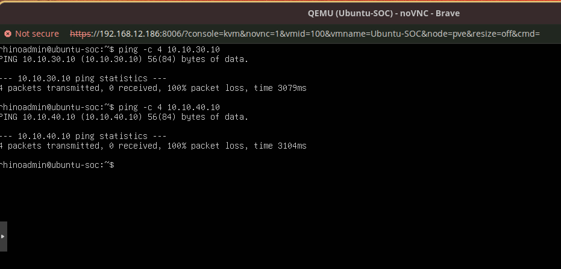

## Final connectivity matrix

| Source | Destination | Expected | Observed |
|---|---|---|---|
| Linux-Mint `10.10.20.11` | Ubuntu-SOC `10.10.20.10` | Allowed | PASS |
| Ubuntu-SOC `10.10.20.10` | Linux-Mint `10.10.20.11` | Allowed | PASS |
| WIN11-01 `10.10.30.10` | SOC `10.10.20.10` | Isolated | PASS |
| WIN11-01 `10.10.30.10` | Management `192.168.12.1` | Isolated | PASS |
| KALI-01 `10.10.40.10` | WIN11-01 `10.10.30.10` | Isolated | PASS |
| KALI-01 `10.10.40.10` | SOC `10.10.20.10` | Isolated | PASS |
| KALI-01 `10.10.40.10` | Management `192.168.12.1` | Isolated | PASS |
| Ubuntu-SOC `10.10.20.10` | WIN11-01 `10.10.30.10` | Isolated | PASS |
| Ubuntu-SOC `10.10.20.10` | KALI-01 `10.10.40.10` | Isolated | PASS |

---

# 11. Section 07 — Snapshot / Restore

**Result: PASS ✓**

## Objective

Create a known-good victim baseline and prove that the VM can be restored after a controlled change.

## Snapshot created

On WIN11-01:

```text
Snapshot name: clean-baseline
Include RAM:   No
Description:   Windows 11 Pro clean baseline after VirtIO/QEMU integration and isolated victim-network configuration
```

### Evidence

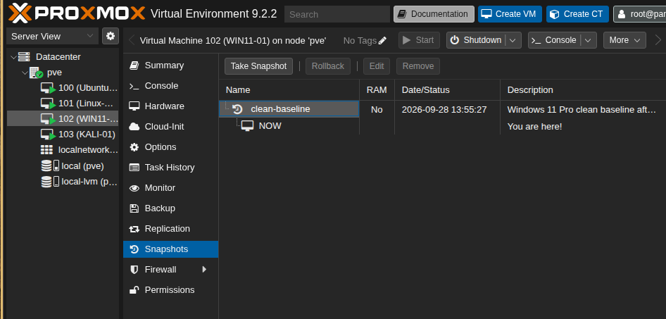

## Controlled post-snapshot change

A marker file was created on the Windows desktop after the snapshot:

```text
ROLLBACK-TEST.txt
```

The file represented an observable change made after the known-good capture point.

### Evidence

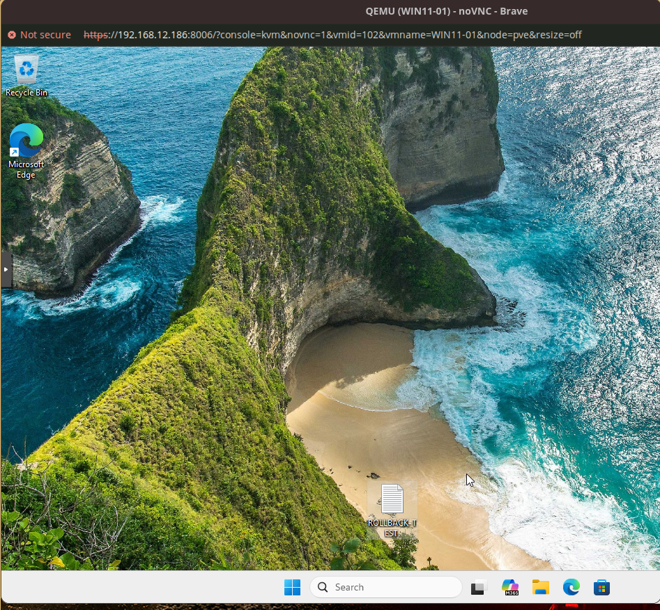

## Rollback

WIN11-01 was shut down, the `clean-baseline` snapshot was selected in Proxmox, and rollback was performed.

### Supplemental evidence

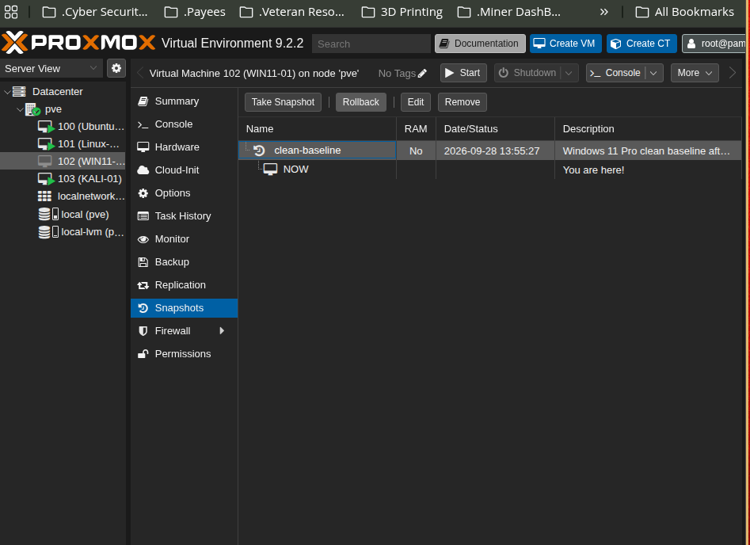

After booting WIN11-01 again, `ROLLBACK-TEST.txt` was no longer present.

### Evidence


## Principle demonstrated

A cyber range can be reused safely when a known-good state is captured before testing. Changes made after the baseline can be removed by restoring that baseline, allowing exercises to be repeated without rebuilding the operating system from scratch.

---

# 12. Section 08 — Qualification & Evidence Review

**Result: QUALIFIED ✓**

The learner was required to explain the architecture in their own words rather than simply point to successful screenshots.

## Qualification questions

### 1. Why can Linux-Mint communicate with Ubuntu-SOC while Kali cannot communicate with WIN11-01?

**Qualified understanding:**

Linux-Mint and Ubuntu-SOC share `vmbr20` and the `10.10.20.0/24` subnet. They can communicate directly at Layer 2/Layer 3 without a router.

KALI-01 and WIN11-01 are attached to different Linux bridges (`vmbr40` and `vmbr30`) and different IPv4 subnets. No router/default gateway joins those networks.

### 2. How are `vmbr20`, `vmbr30`, and `vmbr40` different from real 802.1Q VLANs?

**Qualified understanding:**

They are separate Linux software bridges inside Proxmox. Isolation is created by placing virtual NICs on different software switches.

No VLAN tags are currently being added to Ethernet frames, and there is no VLAN trunk carrying VLAN 20/30/40 to a physical switch.

### 3. Why did Windows Setup initially show no disk?

**Qualified understanding:**

The disk existed in Proxmox, but Windows Setup did not yet have the VirtIO SCSI driver needed to communicate with the virtual storage controller. Loading `vioscsi` from `virtio-win.iso` made the disk visible.

### 4. What does leaving the default gateway blank accomplish?

**Qualified understanding:**

The endpoint knows how to reach directly connected destinations in its own subnet but has no route for remote networks. This helps preserve isolation until a deliberate routing design is introduced.

### 5. Why does `net.ipv4.ip_forward = 0` matter?

**Qualified understanding:**

It prevents the Proxmox host from forwarding IPv4 packets between its interfaces/bridges. Proxmox therefore does not become an unintended router between the Cyber Forge security zones.

### 6. What did the snapshot rollback prove?

**Qualified understanding:**

A change made after the clean baseline can be removed by rolling the VM back to the captured state. This provides a repeatable recovery/reset mechanism for future attack and detection labs.

---

# 13. Troubleshooting & Lessons Learned

## Mistake: SOC bridge initially named `vmbr1`

**Symptom:** The intended SOC bridge was created with the wrong identifier.

**Resolution:** The pending change was reverted before activation and recreated as `vmbr20`.

**Lesson:** Review staged networking changes before applying them, especially on a remotely managed hypervisor.

---

## Windows Setup could not see the system disk

**Symptom:** The Windows installer displayed no available disk.

**Root cause:** Windows lacked the VirtIO SCSI controller driver.

**Resolution:**

```text
virtio-win.iso
└── vioscsi
    └── w11
        └── amd64
```

The driver was loaded, after which the 64 GiB virtual disk became visible.

**Lesson:** Virtual hardware can exist correctly at the hypervisor layer while remaining unusable to the guest until the correct driver is present.

---

## Windows OOBE had no Internet connectivity

**Symptom:** Windows requested network connectivity during OOBE.

**Root cause:** WIN11-01 was intentionally attached only to the isolated `vmbr30` network and had no Internet path.

**Resolution:** A local lab account was created without changing the segmentation design.

**Lesson:** Do not weaken the intended network architecture merely to satisfy an installer workflow.

---

## Kali static address did not persist through installation

**Symptom:** Kali booted with `eth0` up but no IPv4 address.

**Resolution:** The NetworkManager connection was configured manually with:

```text
10.10.40.10/24
Gateway: none
DNS: none
```

**Lesson:** Installer-time network configuration and the installed OS's network-management configuration are not always the same persistent state.

---

## Failed pings were successful security evidence

Examples:

```text
WIN11-01 → SOC
WIN11-01 → Management
KALI-01  → Victim
KALI-01  → SOC
KALI-01  → Management
Ubuntu-SOC → Victim
Ubuntu-SOC → Attack
```

The failures were expected and were validated against routing tables and bridge design.

**Lesson:** A failed connectivity test is meaningful only when the architecture explains *why* it failed.

---

# 14. What Was Learned

By completing this module, the learner demonstrated the ability to:

- interpret a Proxmox bridge-based virtual network;
- distinguish physical NICs from software bridges;
- preserve a working management network while adding isolated lab segments;
- explain Layer-2 versus Layer-3 reachability;
- configure static addressing without a default gateway;
- validate routing tables on Linux and Windows;
- provision Linux and Windows VMs in Proxmox;
- select appropriate virtual hardware for Windows 11;
- use VirtIO paravirtualized storage and networking;
- diagnose a missing Windows installation disk as a driver problem;
- install and validate QEMU Guest Agent on Windows;
- test same-subnet communication with ICMP and ARP/neighbor tables;
- validate cross-segment isolation;
- inspect Proxmox bridge membership;
- verify that the hypervisor is not forwarding IPv4 traffic;
- create a known-good VM snapshot; and
- prove rollback by making and then removing a controlled change.

---

# 15. Current Security Boundary

At the completion of Module 02:

```text
SOC NETWORK
10.10.20.0/24
  Ubuntu-SOC  10.10.20.10
  Linux-Mint  10.10.20.11
       |
       X  No route
       |
VICTIM NETWORK
10.10.30.0/24
  WIN11-01    10.10.30.10
       |
       X  No route
       |
ATTACK NETWORK
10.10.40.0/24
  KALI-01     10.10.40.10
```

The current isolation is primarily provided by:

1. separate Proxmox Linux bridges;
2. separate IPv4 subnets;
3. no default gateway on isolated endpoints;
4. no Proxmox IPv4 addresses on `vmbr20`, `vmbr30`, or `vmbr40`;
5. no host routes to the lab subnets; and
6. `net.ipv4.ip_forward = 0`.

It is **not yet** a firewall-policy-based segmentation design.

That distinction must remain explicit in future modules.

---

# 16. Post-Module Cleanup / Open Items

These items were identified during the qualification review and should not be silently treated as complete:

### Windows guest hostname

The Proxmox VM is named:

```text
WIN11-01
```

During Device Manager validation, the Windows guest still displayed its generated hostname:

```text
DESKTOP-JMGDU7
```

**Future cleanup:** Rename the Windows guest itself to `WIN11-01` and reboot when appropriate.

### Kali QEMU Guest Agent

The Proxmox VM configuration has QEMU Agent enabled for KALI-01, but this module did **not** verify that `qemu-guest-agent` is installed and running inside Kali.

**Future cleanup:** Install/validate the Kali guest agent before relying on guest-agent-dependent Proxmox features.

### True VLAN implementation

The current range uses separate Linux bridges, not tagged 802.1Q VLANs.

**Future expansion:** Build a VLAN-aware bridge/trunk exercise separately when physical-switch/router integration is appropriate.

---

# 17. Evidence Checklist

- [x] Proxmox baseline captured
- [x] Existing VM networking mapped
- [x] Internal bridges created
- [x] Ubuntu-SOC dual-homed
- [x] Ubuntu SOC interface validated
- [x] ISO catalog captured
- [x] Linux Mint checksum recorded
- [x] Linux-Mint VM provisioned
- [x] Guest hardware validated
- [x] Linux-Mint static SOC address configured
- [x] Same-segment SOC communication proven
- [x] WIN11-01 provisioned
- [x] Windows VirtIO storage problem diagnosed and corrected
- [x] Windows 11 Pro installed
- [x] QEMU Guest Agent validated on Windows
- [x] Windows VirtIO device state validated
- [x] WIN11-01 static Victim address validated
- [x] Victim network isolation proven
- [x] KALI-01 provisioned
- [x] Kali installed
- [x] Kali Attack address validated
- [x] Attack network isolation proven
- [x] Proxmox bridge membership validated
- [x] Proxmox host routing validated
- [x] IPv4 forwarding confirmed disabled
- [x] SOC cross-segment isolation proven
- [x] Clean Windows snapshot created
- [x] Controlled post-snapshot change created
- [x] Snapshot rollback performed
- [x] Rollback result validated
- [x] Qualification questions completed

---

# 18. Portfolio Deliverables

Recommended GitHub/Obsidian structure:

```text
cyber-forge/
└── module-02-range-foundation/
    ├── README.md
    └── screenshots/
        ├── 01-proxmox-network-baseline.png
        ├── 02-existing-vm-network-mapping.png
        ├── ...
        ├── 25-win11-rollback-test-file-created.png
        └── 26-win11-snapshot-rollback-validation.png
```

A portfolio discussion of this module should be able to answer:

- What problem does segmentation solve?
- Why were separate Linux bridges used?
- Why are these bridges not true VLANs?
- Why is Ubuntu-SOC dual-homed?
- Why were Victim and Attack hosts configured without gateways?
- Why did Windows require the VirtIO SCSI driver?
- How was isolation proven from both guest and hypervisor perspectives?
- How can the victim VM be returned to a clean state after an exercise?

---

# 19. Module Completion

## Final status

```text
[✓] Section 01 — Proxmox Network Baseline & Segmentation
[✓] Section 02 — Connect Ubuntu-SOC to SOC Network
[✓] Section 03 — VM Provisioning & SOC Connectivity Validation
[✓] Section 04 — Victim Network Systems
[✓] Section 05 — Attack Network Systems
[✓] Section 06 — Isolation & Security Validation
[✓] Section 07 — Snapshot / Restore
[✓] Section 08 — Qualification & Evidence Review
```

# MODULE 02 — QUALIFIED ✓

The Cyber Forge now has a documented, segmented, testable foundation capable of supporting later modules for endpoint telemetry, SIEM, network monitoring, vulnerability management, detection engineering, incident response, and controlled purple-team/live-fire exercises.

The next principle is not simply to add more tools.

The next principle is to begin **observing the environment**—turning endpoints and network activity into security telemetry that can be collected, searched, correlated, and investigated.
