# CyberBlue — Module 03
## Virtual Networking & Segmentation

**Status:** TECHNICAL BUILD COMPLETE ✓  
**Current checkpoint:** Build Gate complete — Knowledge Review Pending  
**Platform:** Proxmox VE 9.2.2  
**Range host:** `pve`  
**Module focus:** Layer-3 routing, route persistence, return-path troubleshooting, packet tracing, and segmentation policy  
**Training method:** Principle → Architecture → Build → Validate → Break/Test → Troubleshoot → Restore → Explain → Document → Qualify

> Module 03 has completed its **technical build gate**. The range configuration, validation, troubleshooting, policy enforcement, persistence, and evidence collection are complete. Deeper knowledge review is intentionally deferred until the broader Cyber Forge range is built out.

---

## Module Purpose

Module 02 established three isolated Cyber Forge security zones using separate Proxmox Linux bridges. Module 03 advances that design by introducing **deliberate Layer-3 connectivity** between those zones and then moving toward **policy-controlled segmentation**.

The objective is not merely to make machines on different subnets ping one another.

The objective is to understand and demonstrate:

- the difference between Layer-2 isolation and Layer-3 routing;
- how a dedicated router creates a controlled choke point;
- why endpoint routes and router forwarding are separate requirements;
- why return-path routing matters;
- how to distinguish routing failures from endpoint-firewall behavior;
- how to trace packets across the hypervisor, router, and guest;
- how to make routing state persistent across reboots; and
- how routing becomes segmentation only when explicit security policy is applied.

---

## Core Principle

> **Segmentation is not just separating networks. Mature segmentation controls and validates communication between trust zones.**

Module 02 intentionally left the three lab networks with no Layer-3 path between them:

```text
SOC              VICTIM              ATTACK
10.10.20.0/24    10.10.30.0/24      10.10.40.0/24
     |                |                   |
   vmbr20           vmbr30              vmbr40
     |                |                   |
     X----------------X-------------------X

          NO ROUTING BETWEEN ZONES
```

Module 03 introduces a dedicated control point:

```text
                         ROUTER-01
                    Linux Layer-3 Router
                 10.10.20.1 / 30.1 / 40.1
                      /       |       \
                     /        |        \
                  vmbr20    vmbr30    vmbr40
                    |          |         |
                 SOC NET    VICTIM     ATTACK
                10.10.20    10.10.30   10.10.40
```

ROUTER-01 deliberately has **no interface on vmbr0**, keeping the Cyber Forge routing plane separate from the home/management network.

---

## Current Architecture

| System | Role | Addressing | Network |
|---|---|---|---|
| Proxmox `pve` | Hypervisor / management | `192.168.12.186/24` | `vmbr0` |
| Ubuntu-SOC | SOC endpoint | `192.168.12.227/24`, `10.10.20.10/24` | `vmbr0`, `vmbr20` |
| Linux-Mint | SOC endpoint | `10.10.20.11/24` | `vmbr20` |
| WIN11-01 | Victim endpoint | `10.10.30.10/24` | `vmbr30` |
| KALI-01 | Attack endpoint | `10.10.40.10/24` | `vmbr40` |
| ROUTER-01 | Layer-3 control point | `10.10.20.1/24`, `10.10.30.1/24`, `10.10.40.1/24` | `vmbr20`, `vmbr30`, `vmbr40` |

---

## Progress

```text
[✓] Section 01 — Network Baseline Validation
[✓] Section 02 — ROUTER-01 Pre-Deployment Review
[✓] Section 03 — ROUTER-01 Installation & Addressing
[✓] Section 04 — Local Interface Connectivity Validation
[✓] Section 05 — Pre-Routing Baseline Snapshot
[✓] Section 06 — Routes Present / Forwarding Disabled Validation
[✓] Section 07 — IPv4 Forwarding & Routed Connectivity Validation
[✓] Section 08 — Persistent Router Forwarding
[✓] Section 09 — Persistent Endpoint Routing
[✓] Section 10 — Pre-Policy Firewall Baseline
[✓] Section 11 — Stateful Router Security Policy
[✓] Persistence and post-reboot policy validation
[✓] Technical Build Gate
[ ] Knowledge Review — deferred until range build-out
```

---

## 1. Baseline Validation

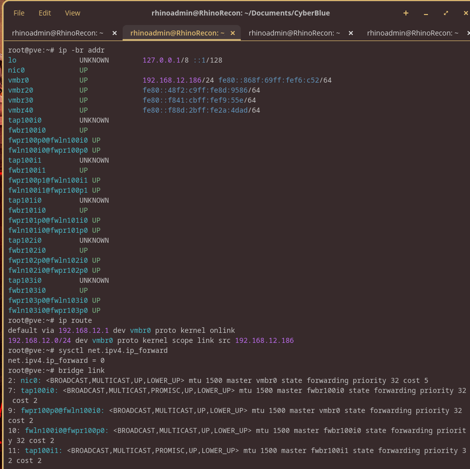

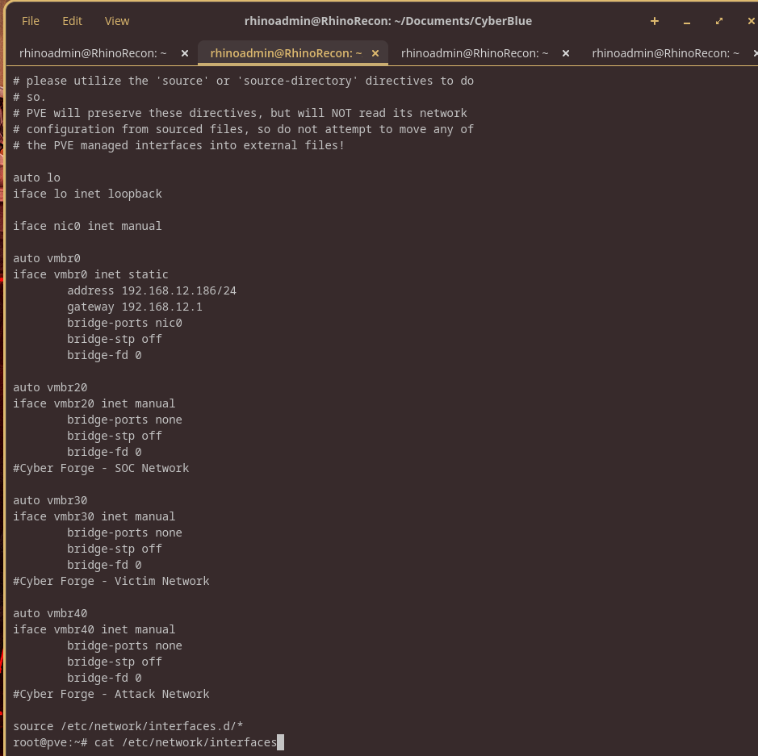

Before introducing routing, the Proxmox host was revalidated.

Observed state:

```text
vmbr0   192.168.12.186/24
vmbr20  no IPv4 address
vmbr30  no IPv4 address
vmbr40  no IPv4 address

net.ipv4.ip_forward = 0
```

The Proxmox host had only its management route and default gateway:

```text
default via 192.168.12.1 dev vmbr0
192.168.12.0/24 dev vmbr0
```

This confirmed that the hypervisor itself was not acting as the Cyber Forge router.

### Validated bridge membership

```text
VM100 Ubuntu-SOC
  net0 → vmbr0
  net1 → vmbr20

VM101 Linux-Mint
  net0 → vmbr20

VM102 WIN11-01
  net0 → vmbr30

VM103 KALI-01
  net0 → vmbr40
```

---

## 2. Dedicated Router Design

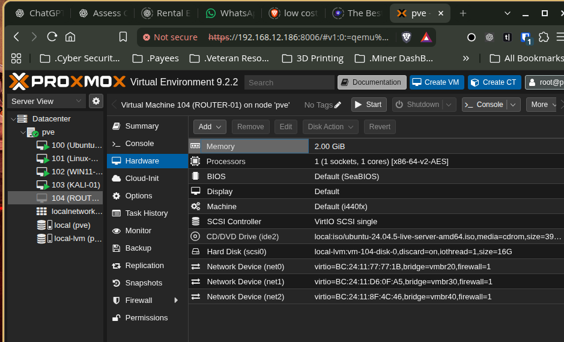

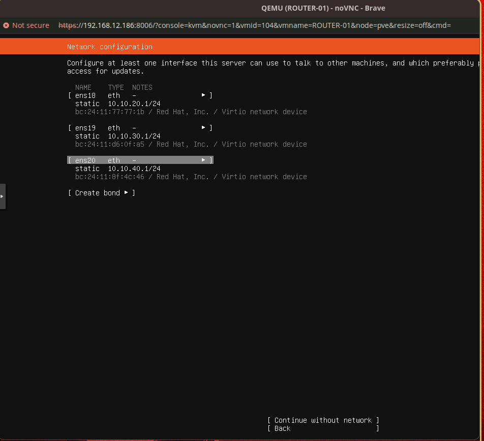

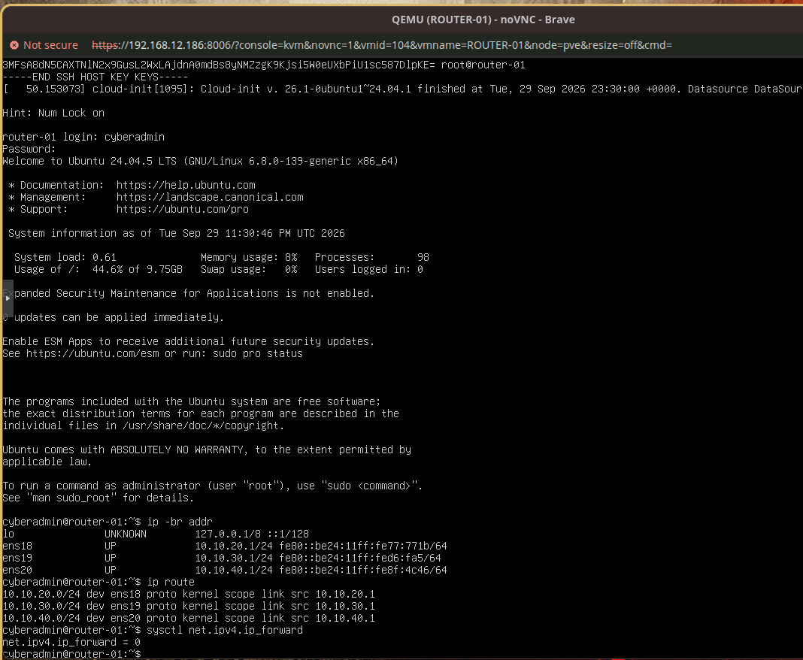

A new Ubuntu Server VM was created:

```text
VM 104 — ROUTER-01
CPU:      1 core
Memory:   2 GiB
Disk:     16 GiB
net0:     vmbr20
net1:     vmbr30
net2:     vmbr40
vmbr0:    NOT PRESENT
```

The three Linux interfaces were mapped by matching guest MAC addresses to the Proxmox NIC configuration rather than assuming interface order.

Final mapping:

```text
ens18 → vmbr20 → SOC
ens19 → vmbr30 → Victim
ens20 → vmbr40 → Attack
```

Static addressing:

```text
ens18  10.10.20.1/24
ens19  10.10.30.1/24
ens20  10.10.40.1/24
```

No default gateway was configured on ROUTER-01.

---

## 3. Local Connectivity Before Routing

Each endpoint successfully reached the ROUTER-01 interface on its own subnet:

```text
Ubuntu-SOC → 10.10.20.1  PASS
WIN11-01   → 10.10.30.1  PASS
KALI-01    → 10.10.40.1  PASS
```

This proved Layer-2/local-subnet connectivity while ROUTER-01 still had:

```text
net.ipv4.ip_forward = 0
```

### Principle demonstrated

> **Local subnet connectivity is not routing.**

A host can reach the router interface on its own subnet even when the router refuses to forward traffic between networks.

---

## 4. Routes Present, Forwarding Disabled

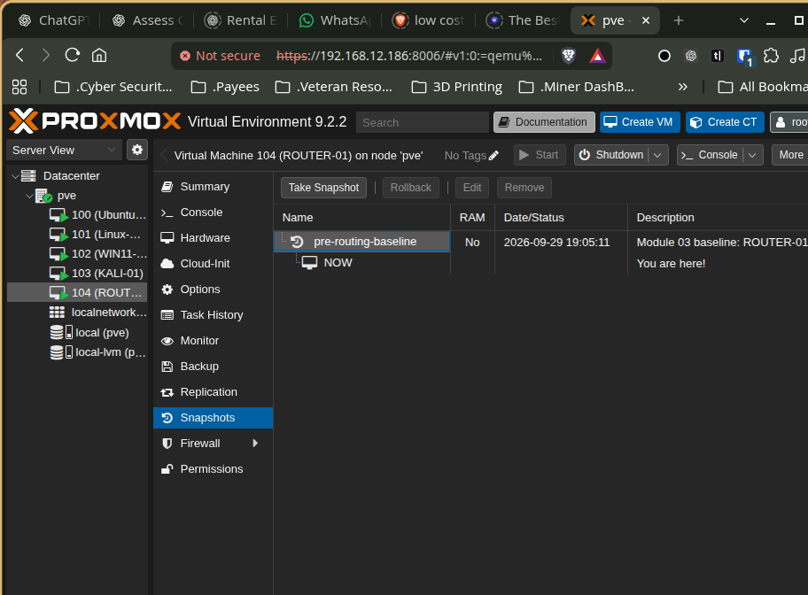

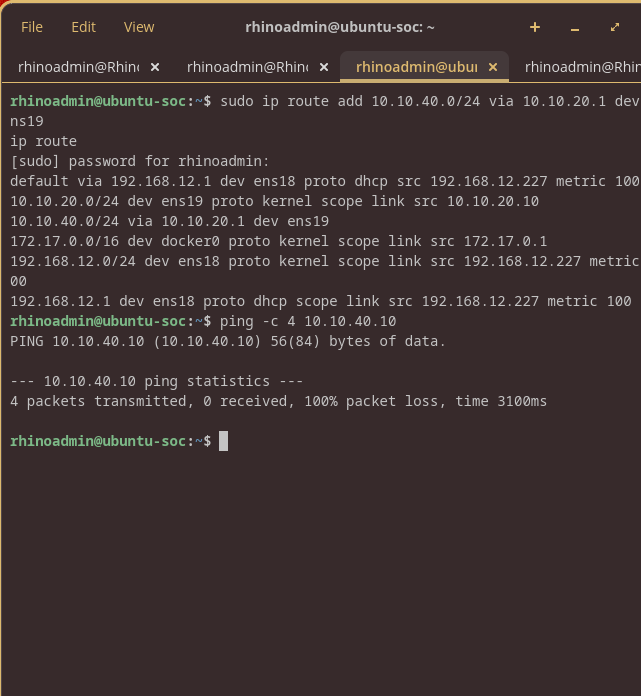

Temporary routes were added to the endpoints so they knew how to reach remote Cyber Forge subnets.

Examples:

```text
Ubuntu-SOC:
10.10.40.0/24 via 10.10.20.1

KALI-01:
10.10.20.0/24 via 10.10.40.1

WIN11-01:
10.10.20.0/24 via 10.10.30.1
```

Cross-subnet tests still failed while:

```text
net.ipv4.ip_forward = 0
```

This separated two concepts:

```text
Endpoint route
      ≠
Router forwarding
```

The endpoint knew where to send the packet, but ROUTER-01 was not yet willing to forward it.

---

## 5. Enabling IPv4 Forwarding

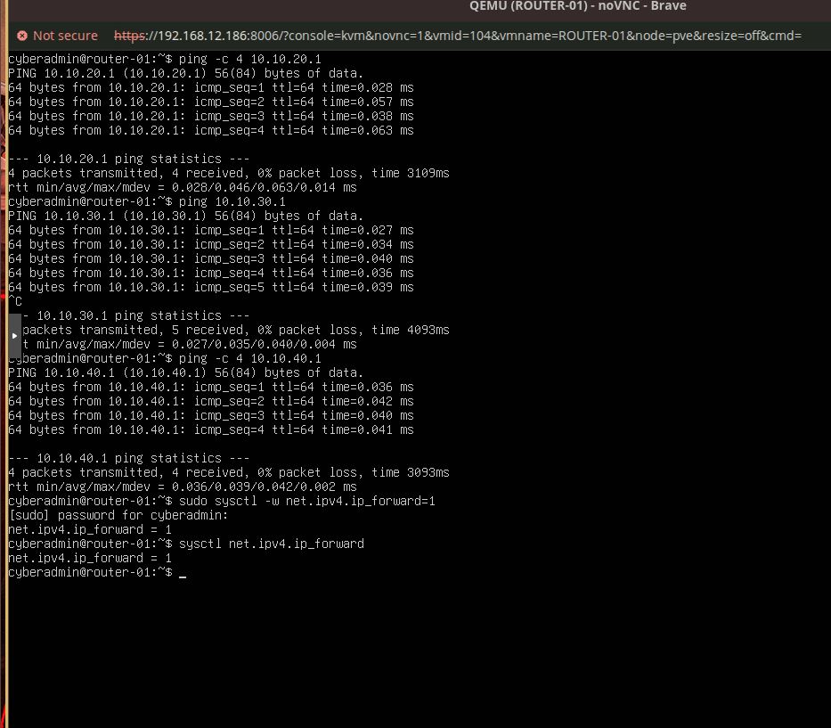

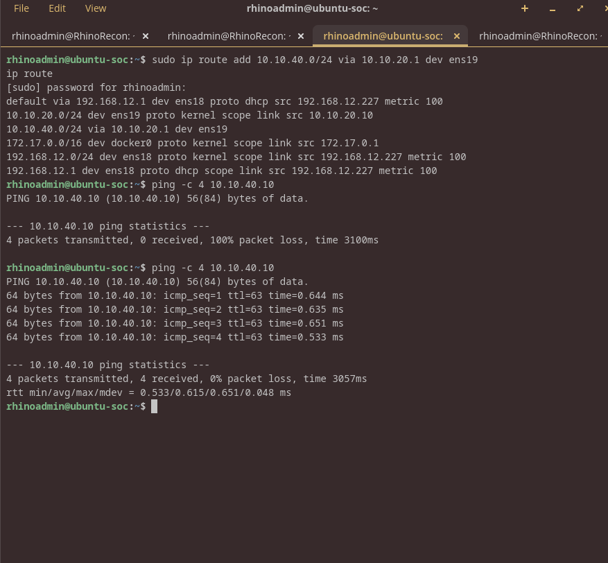

IPv4 forwarding was enabled at runtime:

```bash
sudo sysctl -w net.ipv4.ip_forward=1
```

After forwarding was enabled, the same routed tests began succeeding.

Validated paths included:

```text
Ubuntu-SOC → KALI-01      PASS
KALI-01 → Ubuntu-SOC      PASS
WIN11-01 → Ubuntu-SOC     PASS
```

Observed TTL values dropped by one hop, providing additional evidence that traffic crossed ROUTER-01.

### Before / After

```text
Routes present + ip_forward=0
→ cross-subnet traffic failed

Routes unchanged + ip_forward=1
→ cross-subnet traffic succeeded
```

---

## 6. Persistent Router Forwarding

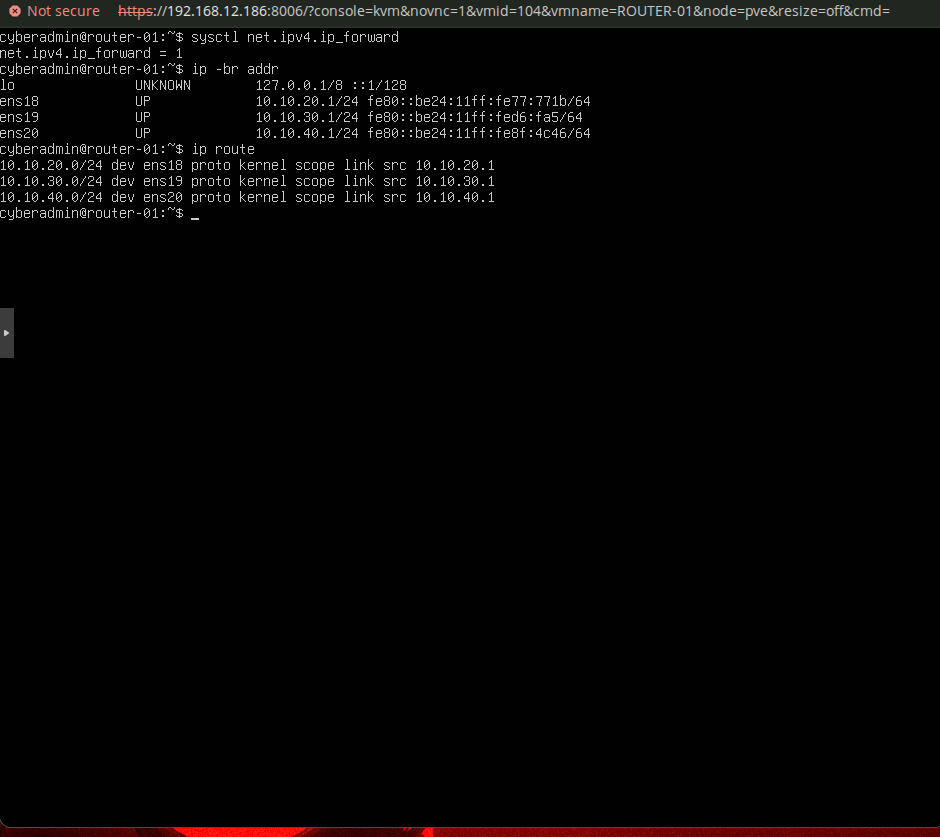

The runtime forwarding change was made persistent:

```text
/etc/sysctl.d/99-cyberblue-router.conf
```

Contents:

```text
net.ipv4.ip_forward=1
```

After reboot:

```text
net.ipv4.ip_forward = 1
```

and all three ROUTER-01 interface addresses remained present.

This proved that ROUTER-01 remained a functional Layer-3 router after reboot.

---

## 7. Persistent Endpoint Routes

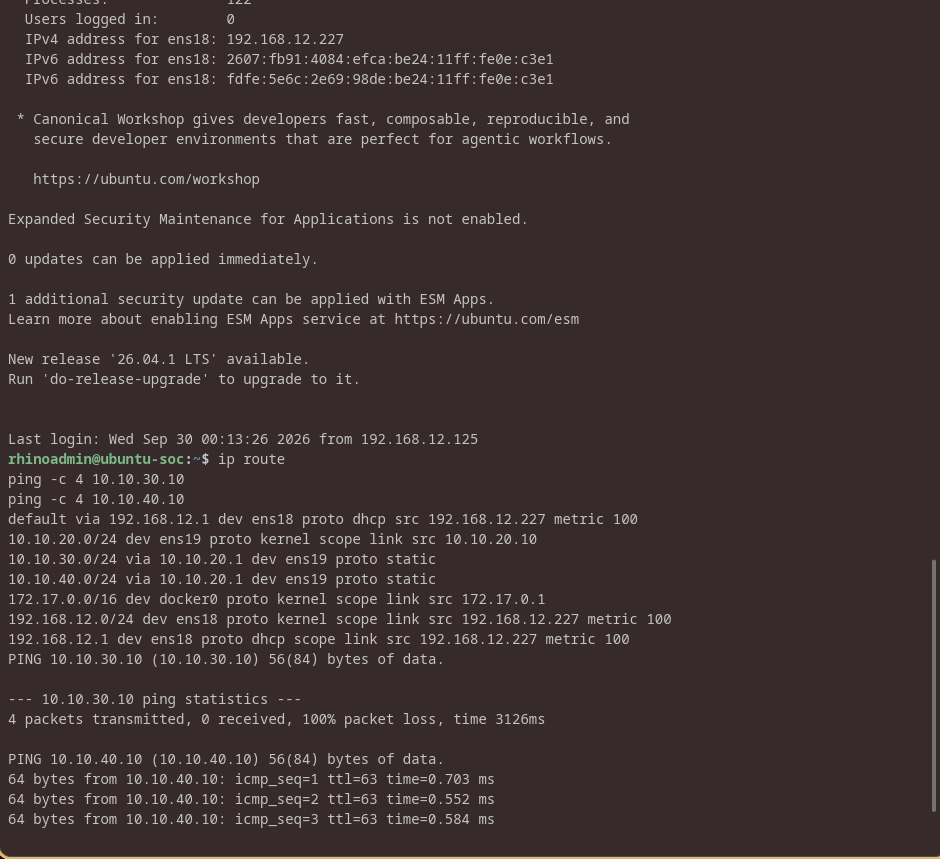

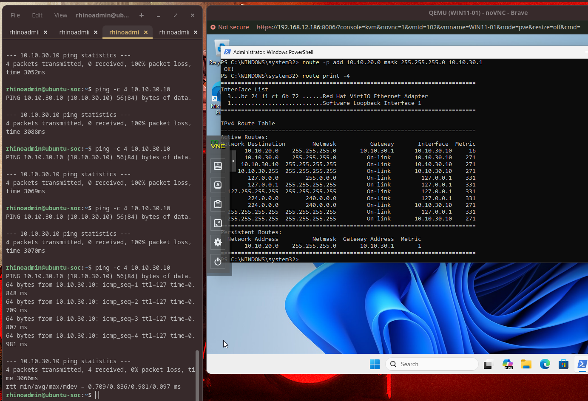

### Ubuntu-SOC

Ubuntu-SOC retained its existing management default route on `ens18` while persistent Cyber Forge routes were attached to `ens19`.

A dedicated Netplan file was created:

```text
/etc/netplan/60-cyberblue-routes.yaml
```

Routes:

```text
10.10.30.0/24 via 10.10.20.1
10.10.40.0/24 via 10.10.20.1
```

After reboot, both routes remained present.

### WIN11-01

Persistent Windows routes were created with `route -p`:

```text
10.10.20.0/24 via 10.10.30.1
10.10.40.0/24 via 10.10.30.1
```

### KALI-01

Kali uses NetworkManager profile:

```text
Wired connection 1
```

Persistent routes:

```text
10.10.20.0/24 via 10.10.40.1
10.10.30.0/24 via 10.10.40.1
```

The routes remained present after reboot.

---

## 8. Troubleshooting Case — Windows Return Path

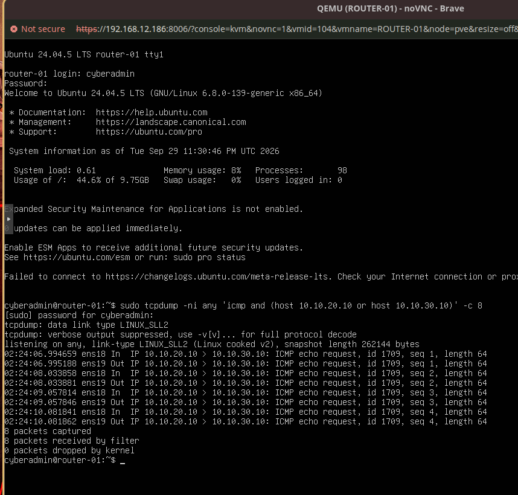

One of the most useful failures in the module occurred when:

```text
WIN11-01 → Ubuntu-SOC   PASS
Ubuntu-SOC → WIN11-01   FAIL
```

Rather than assuming the router or firewall was broken, the packet path was traced layer by layer.

### Router trace

A capture on ROUTER-01 showed the ICMP request entering on the SOC interface and leaving on the Victim interface:

```text
ens18 In   10.10.20.10 > 10.10.30.10  ICMP echo request
ens19 Out  10.10.20.10 > 10.10.30.10  ICMP echo request
```

That proved ROUTER-01 was forwarding correctly.

### Proxmox trace

A capture on the Windows VM tap interface:

```bash
tcpdump -ni tap102i0 icmp
```

showed all four Echo Requests reaching the Windows virtual NIC.

That ruled out the Proxmox bridge path.

### Windows packet tracing

Windows `pktmon` then showed the packets reaching:

```text
Red Hat VirtIO Ethernet Adapter
WFP Native Filter
TCPIP
```

but no transmitted replies.

The formatted capture identified the exact drop reason:

```text
DropReason ICMP: no route
```

The Windows routing table confirmed that the earlier temporary route had disappeared.

### Root cause

```text
Windows received the Echo Request,
generated a reply,
but had no route back to 10.10.20.0/24.
```

### Resolution

A persistent route was added:

```cmd
route -p add 10.10.20.0 mask 255.255.255.0 10.10.30.1
```

Immediately afterward:

```text
Ubuntu-SOC → WIN11-01
4 sent
4 received
0% loss
```

### Lesson

> **A successful forward path does not guarantee a successful conversation. Routing must work in both directions.**

---

## 9. Routing vs. Host Firewall Policy

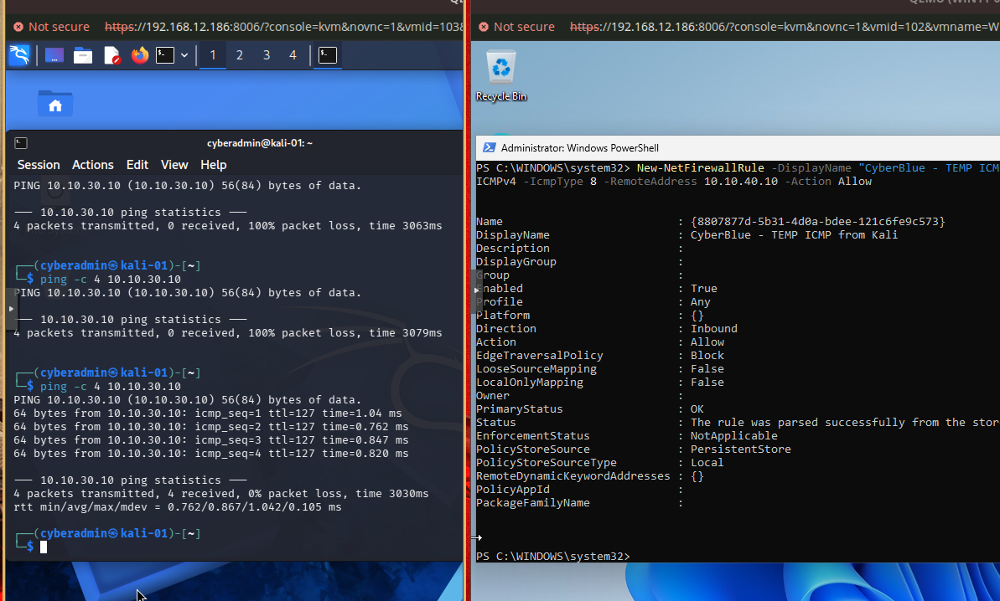


Kali later had valid persistent routing to WIN11-01, and Windows had a valid return route, but Kali-to-Windows ICMP still failed.

A narrowly scoped temporary Windows Defender Firewall rule was created allowing ICMP Echo Requests only from:

```text
10.10.40.10
```

Kali immediately reached WIN11-01.

After the temporary rule was removed, Kali-to-Windows ICMP returned to failing.

This demonstrated another important principle:

```text
Reachability ≠ Authorization
```

A valid network path can exist while a security control intentionally denies the traffic.

---

## 10. Pre-Policy Router Baseline

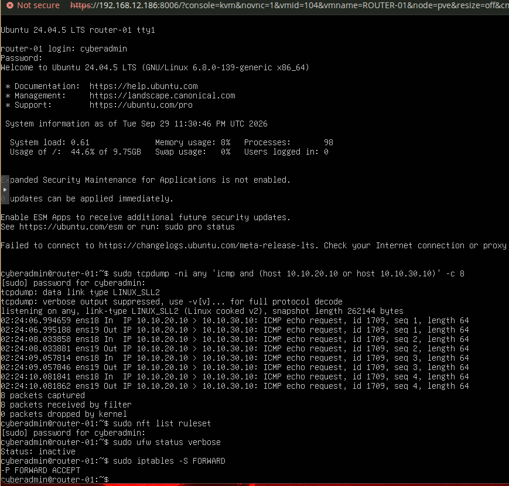

Before implementing router-level segmentation policy, ROUTER-01 was inspected.

Observed state:

```text
nftables ruleset:   empty
UFW:                inactive
iptables FORWARD:   ACCEPT
```

So ROUTER-01 currently routes traffic but does not yet enforce an explicit forwarding security policy.

Current state:

```text
Routing exists
      ↓
Traffic can cross zones
      ↓
Section 11:
Policy decides what SHOULD cross zones
```

---

## 11. Stateful Router Security Policy

**Status: COMPLETE ✓**

With routing working and persistent, ROUTER-01 was converted from an unrestricted Layer-3 router into a **stateful policy enforcement point** using `nftables`.

### Runtime policy

The initial ruleset was created as a runtime-only policy and syntax-checked before deployment.

```nft
table inet cyberblue {
    chain forward {
        type filter hook forward priority 0; policy drop;

        ct state invalid counter drop
        ct state established,related counter accept

        iifname "ens18" oifname "ens19" ip saddr 10.10.20.0/24 ip daddr 10.10.30.0/24 icmp type echo-request counter accept

        iifname "ens18" oifname "ens20" ip saddr 10.10.20.0/24 ip daddr 10.10.40.0/24 icmp type echo-request counter accept

        counter drop
    }
}
```

The ruleset was validated with:

```bash
sudo nft -c -f /tmp/cyberblue-policy.nft
```

and then loaded into the running kernel.

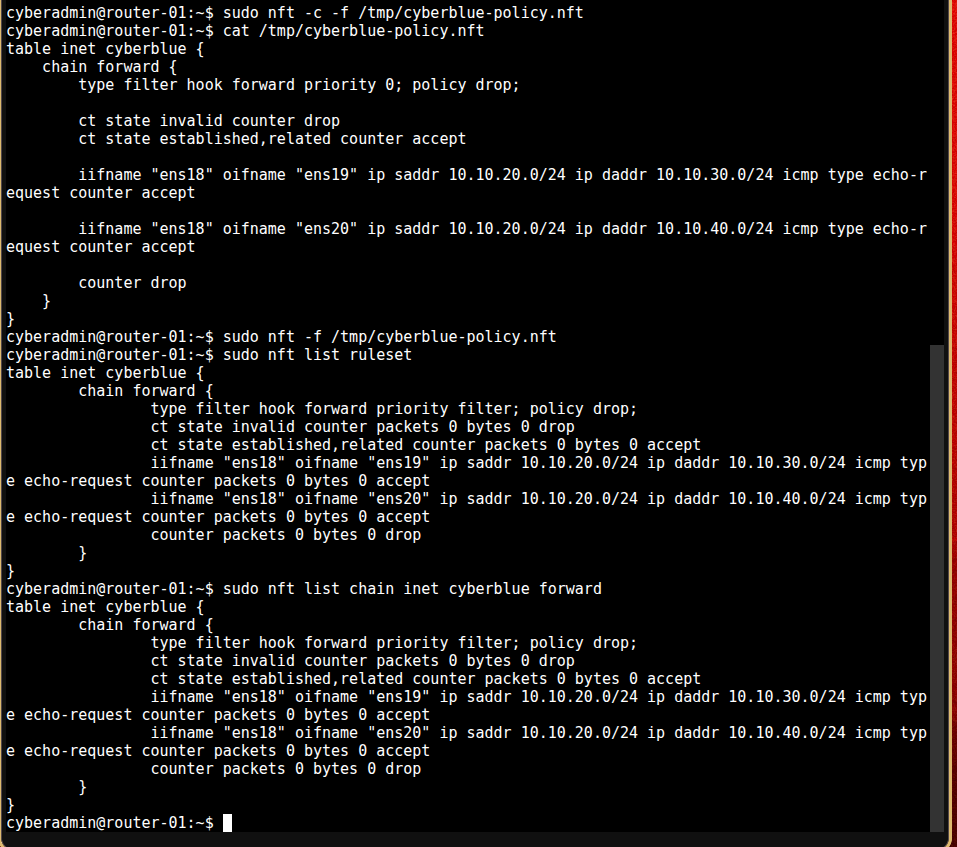

### Stateful behavior

The policy permits SOC-initiated ICMP toward the Victim and Attack networks while using conntrack to permit only legitimate return traffic:

```text
ct state established,related accept
```

This means a Victim or Attack endpoint may reply to a connection that the SOC was authorized to initiate without gaining permission to initiate a new connection back into the SOC zone.

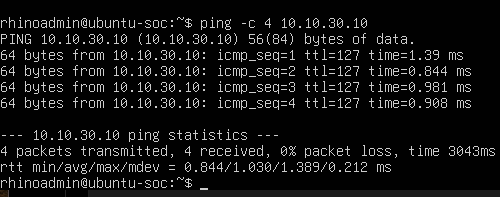

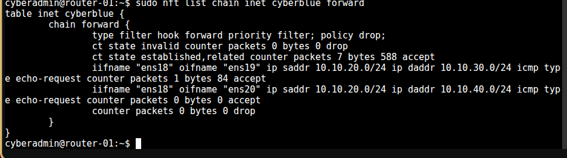

### Directional segmentation validation

The complete policy matrix was tested from both permitted and denied directions:

| Source | Destination | Expected | Result |
|---|---|---:|---:|
| SOC | Victim | Allow | **PASS ✓** |
| SOC | Attack | Allow | **PASS ✓** |
| Victim | SOC | Block | **PASS ✓** |
| Attack | SOC | Block | **PASS ✓** |
| Attack | Victim | Block | **PASS ✓** |
| Victim | Attack | Block | **PASS ✓** |

Attack-to-SOC traffic was denied by the router and verified by the nftables drop counter:

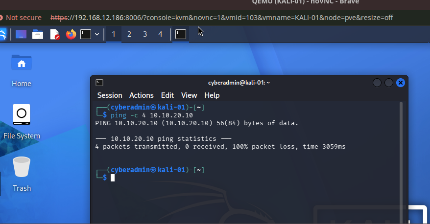

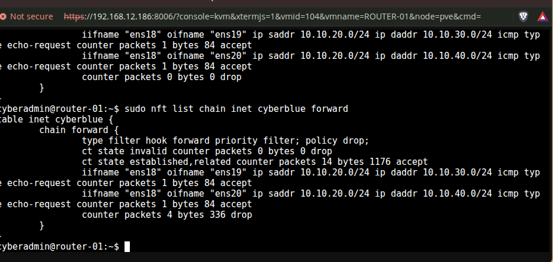

Victim-to-SOC traffic was also denied:

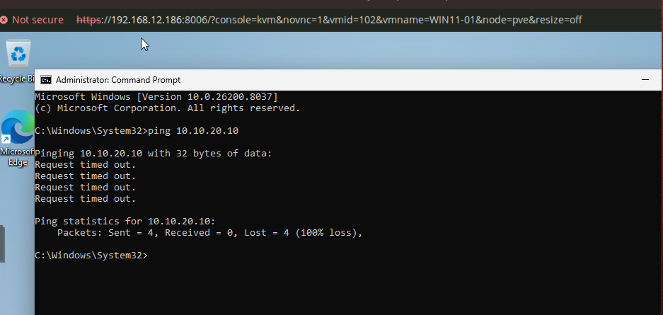

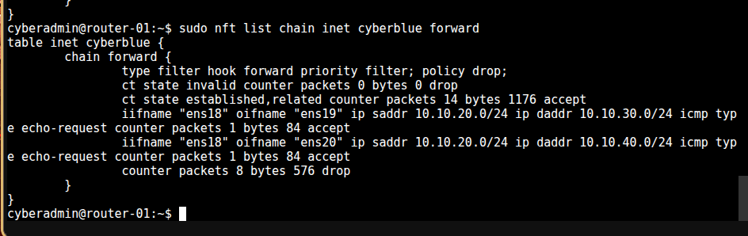

Attack-to-Victim traffic was denied before Windows host-firewall policy became relevant:

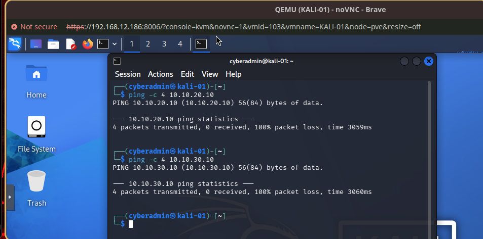

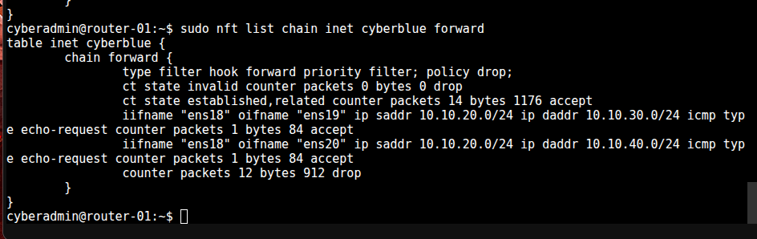

The final runtime segmentation test reached the expected default-drop count:

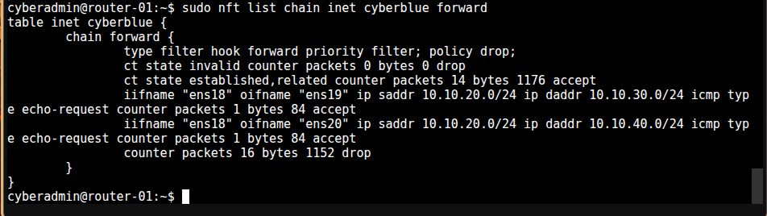

### Validated-policy snapshot

After the runtime rules passed the directional matrix, a ROUTER-01 snapshot was created as a recovery point before persistence work.

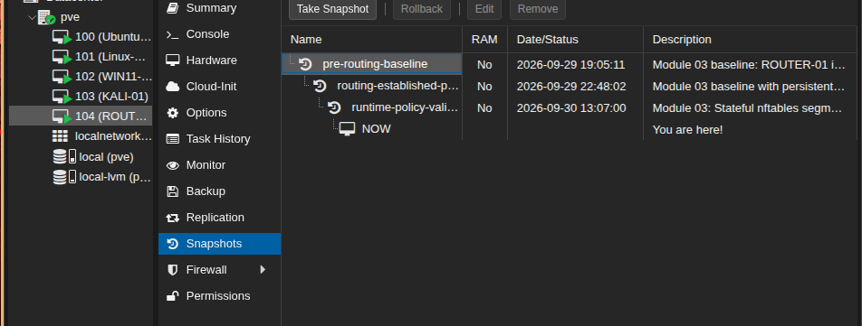

### Persistent nftables configuration

The validated policy was written to:

```text
/etc/nftables.conf
```

The service was enabled, restarted, and confirmed active.

### Full reboot validation

ROUTER-01 was rebooted and revalidated.

Post-reboot state:

```text
net.ipv4.ip_forward = 1
nftables service    = active

10.10.20.0/24 → ens18
10.10.30.0/24 → ens19
10.10.40.0/24 → ens20
```

Fresh traffic tests after reboot proved both sides of the policy:

```text
Ubuntu-SOC → WIN11-01
4 transmitted / 4 received
ALLOW ✓

KALI-01 → Ubuntu-SOC
4 transmitted / 0 received
BLOCK ✓
```

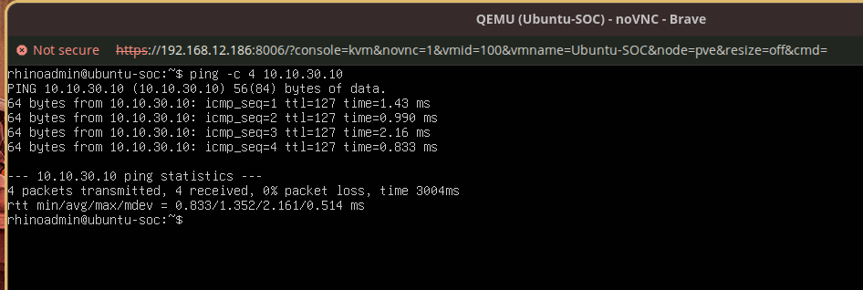

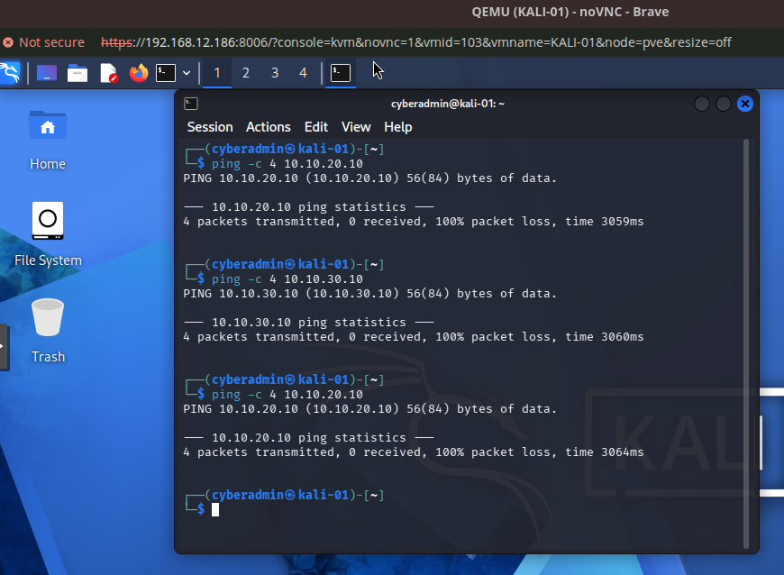

The final post-reboot nftables counters showed accepted established traffic and four packets hitting the default-drop rule:

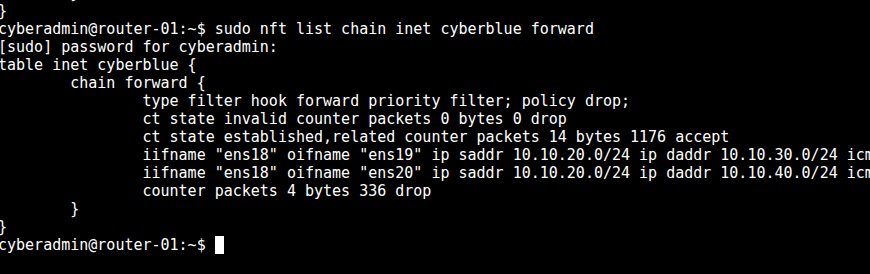

### Section 11 outcome

```text
Module 02
No Layer-3 path between zones
        ↓
Isolation by architecture

Module 03
Layer-3 routing exists
        ↓
ROUTER-01 forwards between zones
        ↓
nftables authorizes selected flows
        ↓
conntrack permits legitimate replies
        ↓
default deny blocks unauthorized initiation
```

---

## Serial Console Improvement

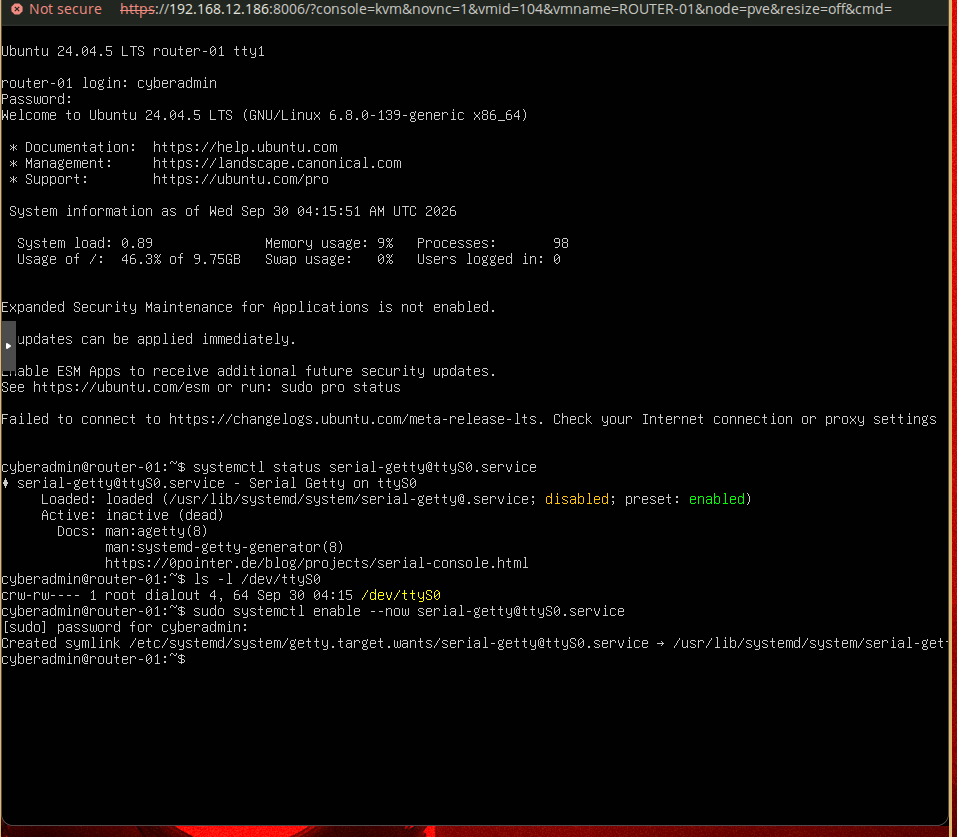

During the module, ROUTER-01 was also configured with a Proxmox serial port and Ubuntu serial getty:

```text
serial0
serial-getty@ttyS0.service
```

This enabled the Proxmox xterm.js serial console and reliable browser copy/paste for longer routing and firewall commands.

That console improvement will be used for the remaining nftables work.

---

## Skills Demonstrated

Module 03 demonstrates practical work with:

- Linux IPv4 routing;
- Proxmox Linux bridges;
- multihomed routing VMs;
- static addressing;
- Linux kernel IP forwarding;
- persistent sysctl configuration;
- Netplan static routes;
- NetworkManager static routes;
- Windows persistent routes;
- return-path routing analysis;
- ICMP and TTL interpretation;
- Linux `tcpdump`;
- Proxmox tap-interface packet tracing;
- Windows `pktmon`;
- Windows Defender Firewall rule scoping;
- distinguishing routing failures from firewall-policy failures;
- serial-console configuration;
- Linux nftables;
- stateful firewall policy;
- connection tracking;
- default-deny segmentation;
- firewall persistence with systemd;
- post-reboot security-control validation; and
- evidence-driven troubleshooting.

---

## Evidence Status

Evidence has been captured for the major Module 03 build and validation checkpoints, including:

- Proxmox and Linux-bridge baseline;
- ROUTER-01 provisioning and addressing;
- forwarding disabled/enabled comparison;
- persistent endpoint and router routing;
- packet tracing and Windows return-path diagnosis;
- host-firewall authorization testing;
- runtime nftables policy;
- directional segmentation tests;
- default-drop counters;
- validated-policy snapshot;
- persistent nftables configuration; and
- post-reboot allow/deny validation.

The technical evidence package is complete. The remaining knowledge review is a separate learning phase rather than a blocker for continued Cyber Forge construction.

---

## Current Module State

```text
ROUTER-01 operational                 ✓
Three routed lab networks             ✓
IPv4 forwarding persistent            ✓
Ubuntu-SOC routes persistent          ✓
WIN11-01 routes persistent            ✓
KALI-01 routes persistent             ✓
Packet-path troubleshooting           ✓
Host-policy behavior validated        ✓
Stateful nftables policy              ✓
Directional segmentation matrix       ✓
nftables persistence                  ✓
Post-reboot allow/deny validation      ✓
Technical Build Gate                  PASS ✓

Knowledge Review                       PENDING
```

## Build Gate vs. Knowledge Review

CyberBlue separates **building and validating a capability** from later **conceptual mastery**.

For Module 03:

- **Build Gate — PASS ✓:** the environment was built, validated, troubleshot, persisted, reboot-tested, and documented.
- **Knowledge Review — PENDING:** deeper explanation and interview-level recall will be revisited after the wider Cyber Forge range is built.

This keeps forward momentum on the range without treating incomplete memorization as equivalent to incomplete engineering work.

**Module 03 technical build is COMPLETE.**
