# CyberBlue — Module 04

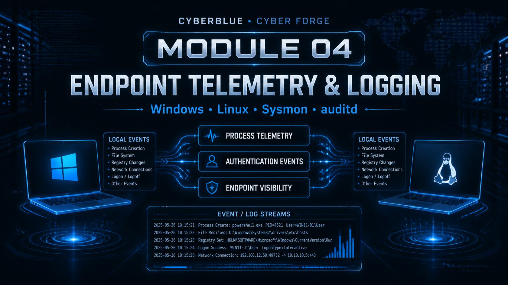

## Endpoint Telemetry & Logging

**Status:** TECHNICAL BUILD COMPLETE ✓  
**Current checkpoint:** Build Gate complete — Knowledge Review / Independent Qualification Pending  
**Platform:** Proxmox VE 9.2.2  
**Endpoints:** `Linux-Mint` and `WIN11-01`  
**Module focus:** Native endpoint telemetry, event correlation, enhanced visibility, visibility-gap validation, and telemetry recovery  
**Training method:** Principle → Architecture → Build → Validate → Break/Test → Troubleshoot → Restore → Explain → Document → Qualify

> Module 04 has completed its **technical Build Gate**. Native and enhanced endpoint telemetry were built and validated on both Windows and Linux, a controlled visibility failure was demonstrated, and telemetry was restored successfully. Deeper knowledge review and independent qualification are intentionally deferred until the wider Cyber Forge range is built.

---

## Module Purpose

Module 04 moves Cyber Forge from network-path engineering into **endpoint visibility**.

The capability being learned is not “how to install Sysmon” or “how to run auditd.” The capability is:

> **Generate known activity, locate the evidence, determine what the endpoint can and cannot see, improve visibility, and prove that telemetry can fail and be restored.**

The operational model used throughout the module was:

```text
ACTIVITY
   ↓
TELEMETRY SOURCE
   ↓
EVENT / LOG RECORD
   ↓
CORRELATION
   ↓
VISIBILITY GAP?
   ↓
ENHANCE / TROUBLESHOOT
   ↓
VALIDATE
```

---

## Lab Endpoints

| System | Role | Address | Segment |
|---|---|---:|---|
| Linux-Mint | Linux endpoint | `10.10.20.11/24` | SOC / `vmbr20` |
| WIN11-01 | Windows endpoint | `10.10.30.10/24` | Victim / `vmbr30` |

Both endpoints entered Module 04 with validated connectivity and segmentation from Module 03.

---

## Technical Build Gate

```text
[✓] Endpoint baseline snapshots
[✓] Native Linux telemetry explored
[✓] Native Windows telemetry explored
[✓] Linux authentication activity correlated
[✓] Windows interactive logon correlated
[✓] Linux service activity generated and investigated
[✓] Native file/process visibility gap demonstrated
[✓] Native telemetry matrix documented
[✓] Sysmon installed and validated on WIN11-01
[✓] Sysmon process-creation visibility demonstrated
[✓] auditd installed and validated on Linux-Mint
[✓] Linux exec auditing demonstrated
[✓] Temporary management access removed after installation
[✓] Controlled telemetry failure demonstrated
[✓] Visibility gap confirmed while telemetry rule was absent
[✓] Telemetry restored and same activity re-detected
[✓] Temporary test rules cleaned up
[✓] Lab network architecture restored
[ ] Knowledge Review — deferred
[ ] Independent Qualification — deferred
```

---

## 1. Endpoint Baseline

Clean pre-telemetry snapshots were created for both endpoints before introducing enhanced instrumentation.

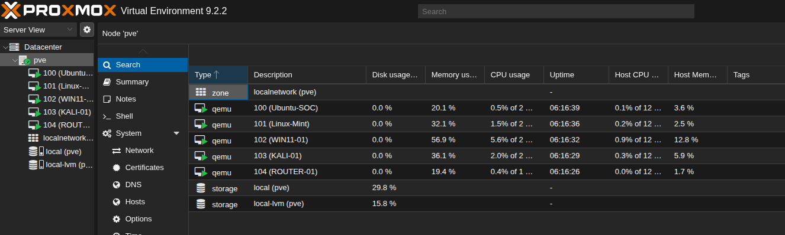

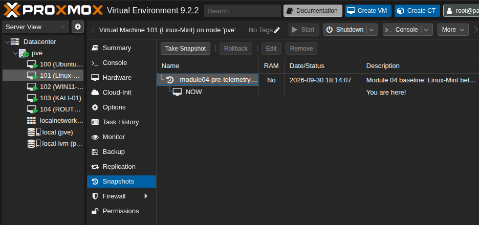

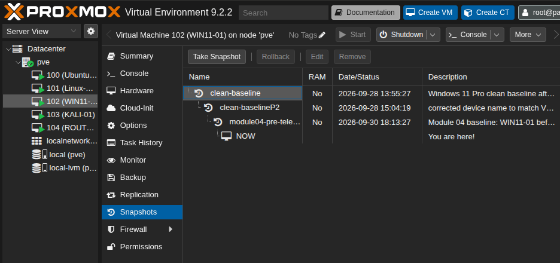

Snapshot name:

```text
module04-pre-telemetry-baseline
```

This established rollback points before changing endpoint telemetry configuration.

---

## 2. Native Linux Telemetry

The Linux endpoint was examined before adding any enhanced auditing.

### Recent journal events

```bash
journalctl -n 50 --no-pager
```

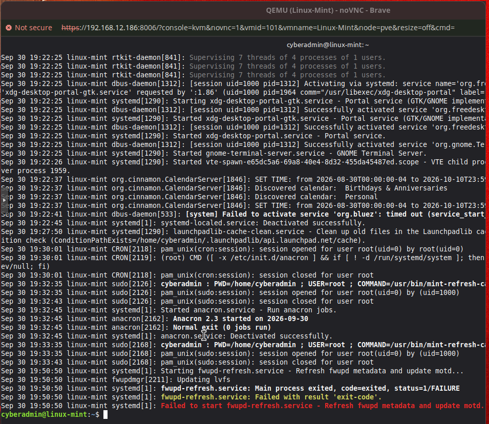

### Current boot telemetry

```bash
journalctl -b
```

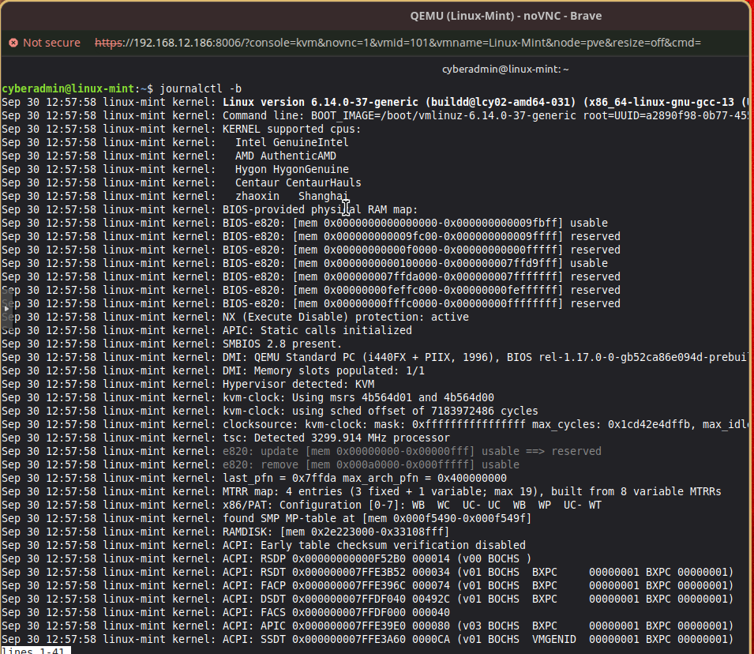

### Login and reboot history

```bash
last
```

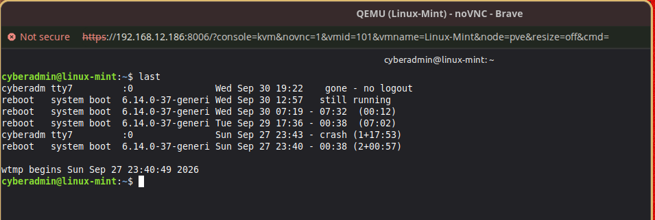

The native sources showed systemd activity, boot records, sessions, reboots, `sudo`, cron, and service failures.

---

## 3. Linux Service and Log-Source Inspection

Service-specific telemetry was inspected with:

```bash
journalctl -u NetworkManager -n 30 --no-pager
```

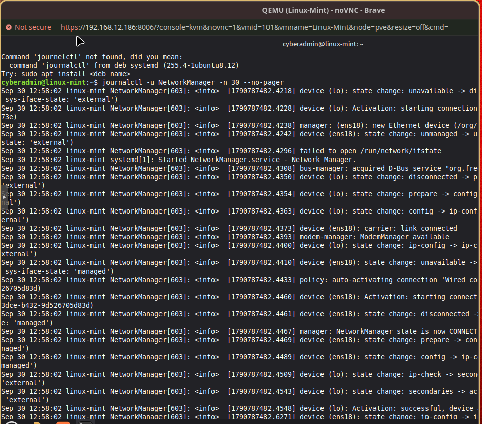

The traditional Linux log directory was also inventoried:

```bash
sudo ls -lah /var/log
```

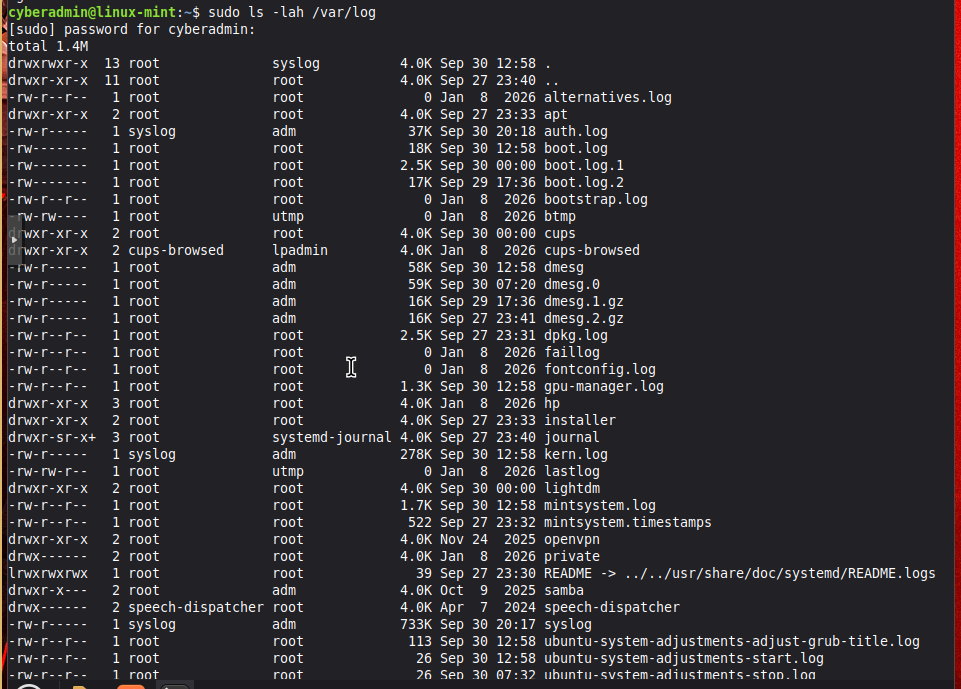

Observed sources included:

```text
auth.log
boot.log
dmesg
kern.log
syslog
wtmp
btmp
journal/
```

---

## 4. Linux Authentication and Privilege Telemetry

Authentication telemetry was queried from `/var/log/auth.log`:

```bash
sudo grep -E 'sudo|session opened|session closed|authentication failure|Failed password|Accepted' /var/log/auth.log | tail -n 40
```

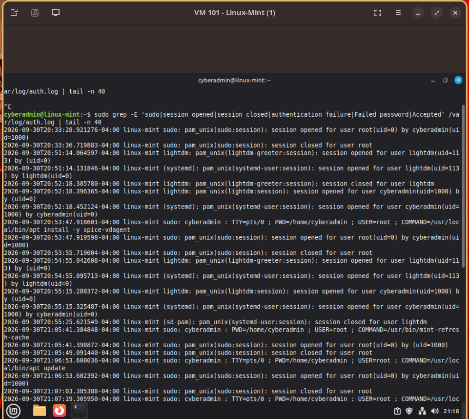

A known privileged action was then generated:

```bash
date
sudo whoami
```

The corresponding authentication evidence showed the command, the `cyberadmin` account, and root session open/close records.

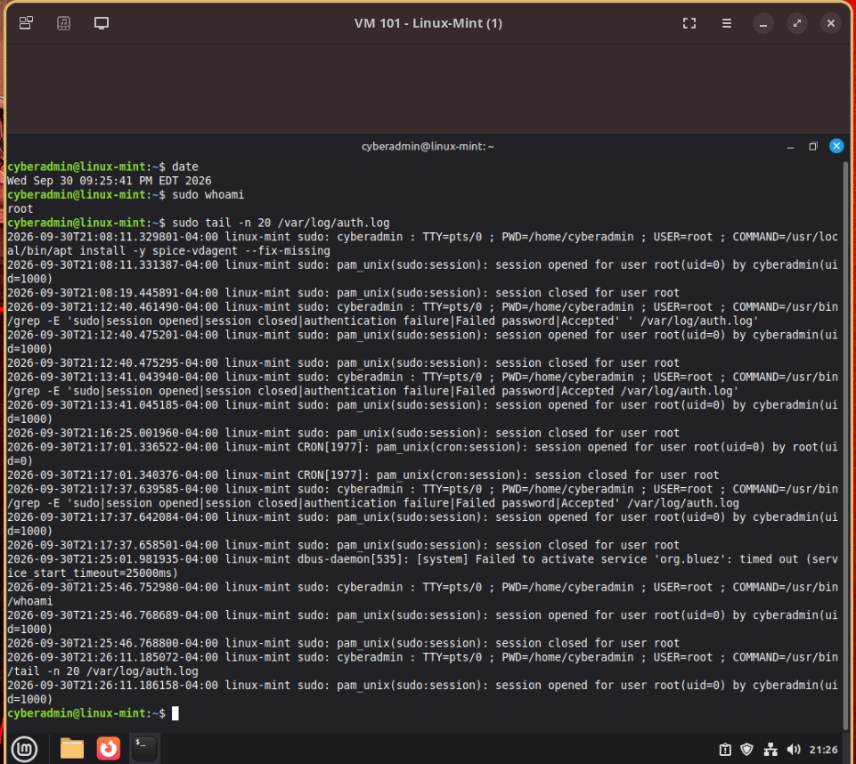

### Correlation

```text
Known action
   ↓
Known timestamp
   ↓
Known privileged command
   ↓
Authentication evidence
```

---

## 5. Native Windows Security Telemetry

Windows Event Viewer was used to inspect:

```text
Event Viewer
└── Windows Logs
    └── Security
```

A native Security event was inspected in detail:

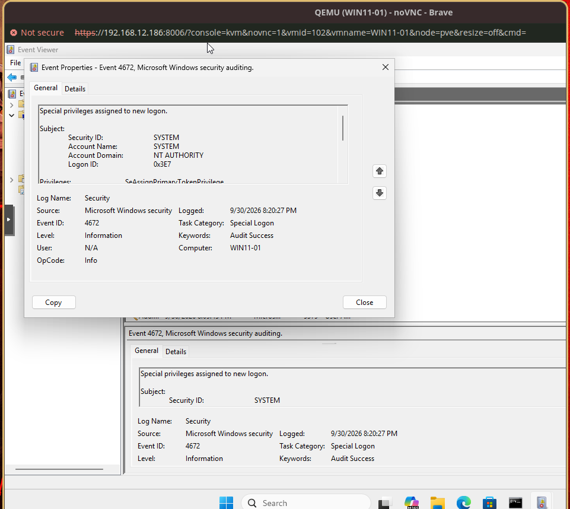

Observed example:

```text
Event ID:     4672
Description:  Special privileges assigned to new logon
Account:      SYSTEM
Result:       Audit Success
Host:         WIN11-01
```

A known user-authentication event was then correlated to:

```text
Event ID:       4624
Logon Type:     2
Account Name:   cyberadmin
Account Domain: WIN11-01
Computer:       WIN11-01
```

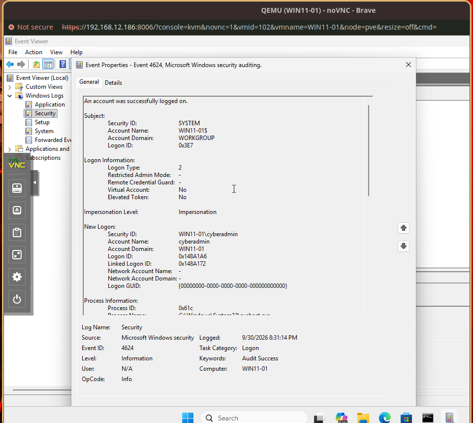

A Logon Type 5 service event was deliberately rejected as evidence of the interactive user logon. The account, timestamp, logon type, and event context had to agree.

---

## 6. Linux Service Activity

A safe service lifecycle event was generated by restarting `cron` and then querying its journal.

```bash
sudo systemctl restart cron
journalctl -u cron -n 20 --no-pager
```

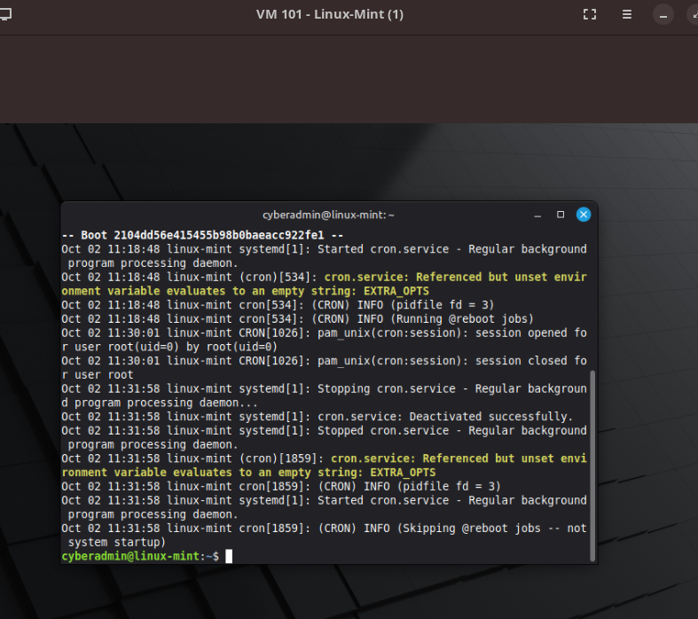

The telemetry showed:

```text
Stopping cron.service
Deactivated successfully
Stopped cron.service
Started cron.service
```

This demonstrated that service lifecycle activity can be identified directly through native endpoint logs.

---

## 7. Native File and Process Visibility Gap

Known activity was generated:

```bash
echo "CyberBlue telemetry test" > ~/cyberblue-telemetry-test.txt
cat ~/cyberblue-telemetry-test.txt
whoami
hostname
journalctl --since "2 minutes ago" --no-pager
```

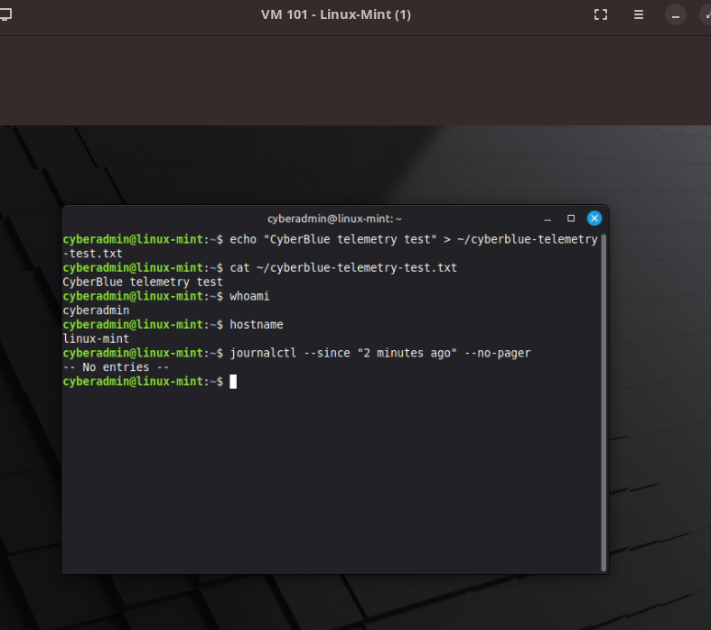

The file was created and the commands executed successfully, but the journal returned no useful evidence for those actions.

### Finding

```text
Activity happened
        ≠
Native journal necessarily recorded useful evidence
```

This was treated as a visibility finding rather than a failed lab.

---

## 8. Native Telemetry Matrix

The matrix below reflects only what was actually observed in this build.

| Activity | Linux Native | Windows Native | Observed Result |
|---|---|---|---|
| Successful login | Yes | Yes | Evidence located |
| Privilege use | Yes | Partial / contextual | Linux sudo and Windows privilege/logon evidence observed |
| Service activity | Yes | Not tested in this build | Linux lifecycle evidence located |
| Process execution | Limited | Not demonstrated natively | Visibility gap |
| File creation | Not visible in tested journal view | Not tested | Visibility gap / not demonstrated |
| File deletion | Not tested | Not tested | Not claimed |
| Network connection | Not evaluated as an endpoint event in this module | Not evaluated | Deferred |

The purpose of this matrix is to prevent assumptions. “Not observed” and “not tested” are kept distinct.

---

## 9. Enhanced Windows Telemetry — Sysmon

### Pre-install baseline

Sysmon was not present initially:

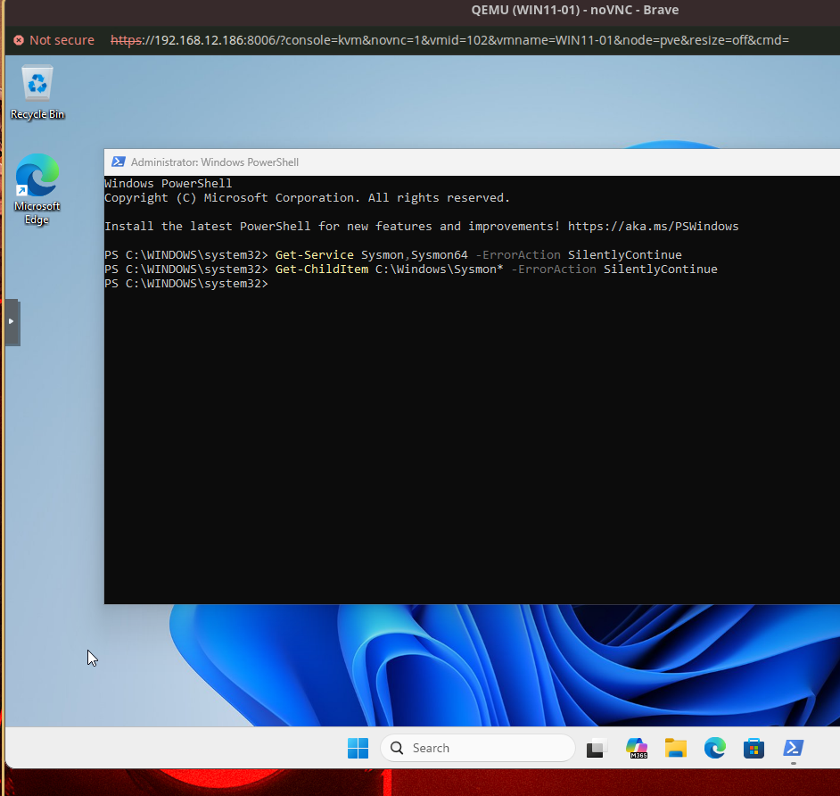

Because `WIN11-01` is intentionally isolated on `vmbr30`, a temporary second NIC on `vmbr0` was used only for installation access. The original Victim NIC remained in place.

Sysmon was enabled and installed, then validated as a running service with an active Operational log.

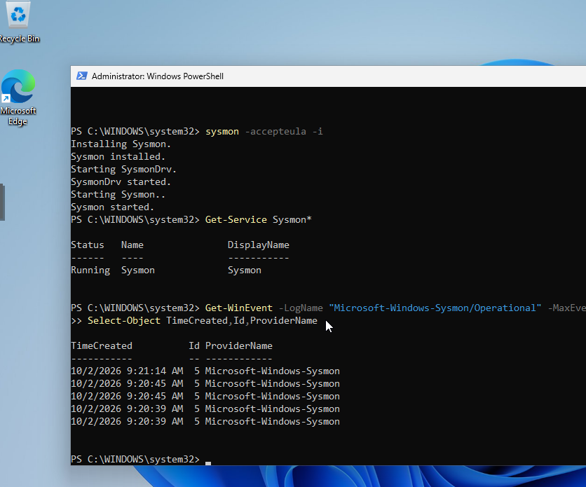

### Process-creation telemetry

Known processes were generated and Sysmon Event ID 1 records were queried.

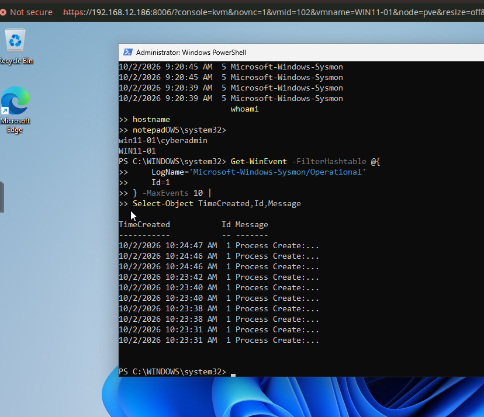

A controlled `notepad.exe` launch then produced detailed process telemetry:

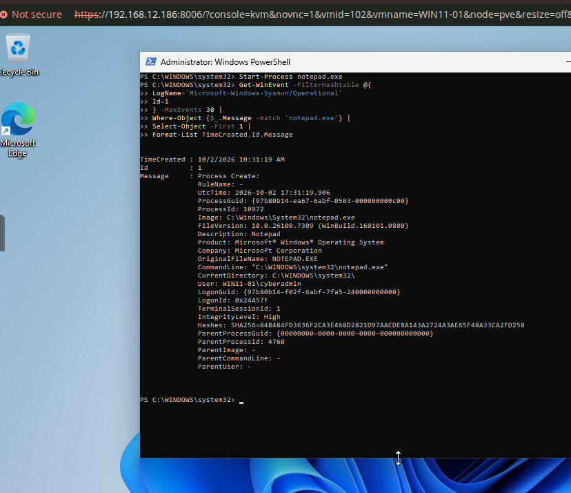

Observed fields included:

```text
Image
CommandLine
User
ProcessId
ProcessGuid
Hashes
IntegrityLevel
```

### Before / after result

```text
Native test:
process execution → little/no useful evidence

Sysmon:
process execution → detailed Event ID 1 record
```

> Sysmon Event ID 3 network-connection logging is configuration-dependent and is not assumed to be enabled merely because Sysmon is installed. Network Event ID 3 visibility was not claimed in this build.

After installation, the temporary `vmbr0` NIC was removed and the Victim network was restored:

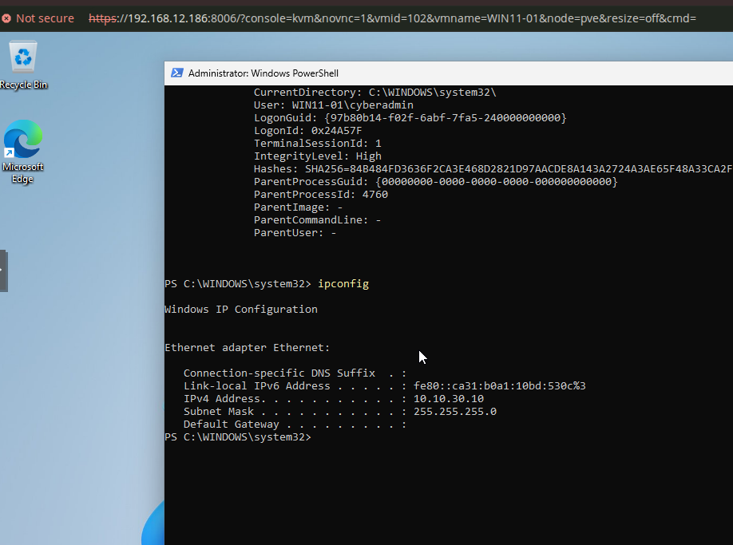

```text
WIN11-01
10.10.30.10/24
No management-LAN address
No default gateway
```

---

## 10. Enhanced Linux Telemetry — auditd

### Pre-install baseline

The Linux endpoint initially had no `auditctl` binary and no `auditd.service`.

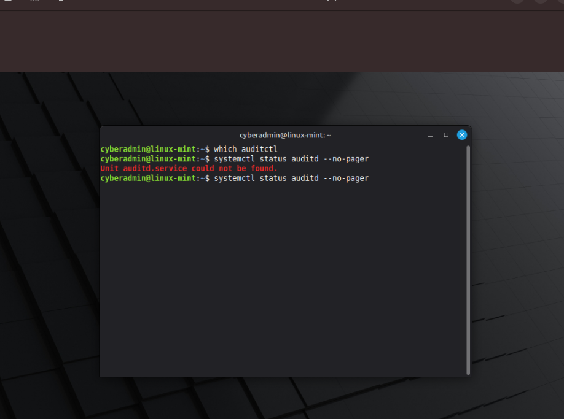

A temporary `vmbr0` management NIC was added for package installation while preserving:

```text
ens18 → vmbr20 → 10.10.20.11/24
```

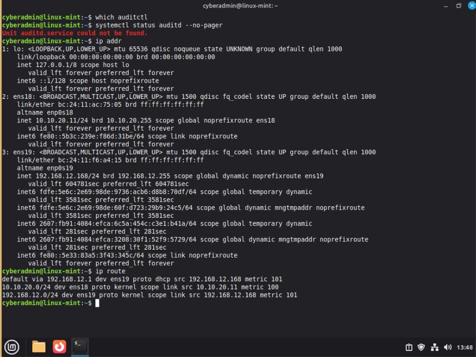

`auditd` and `audispd-plugins` were installed and validated:

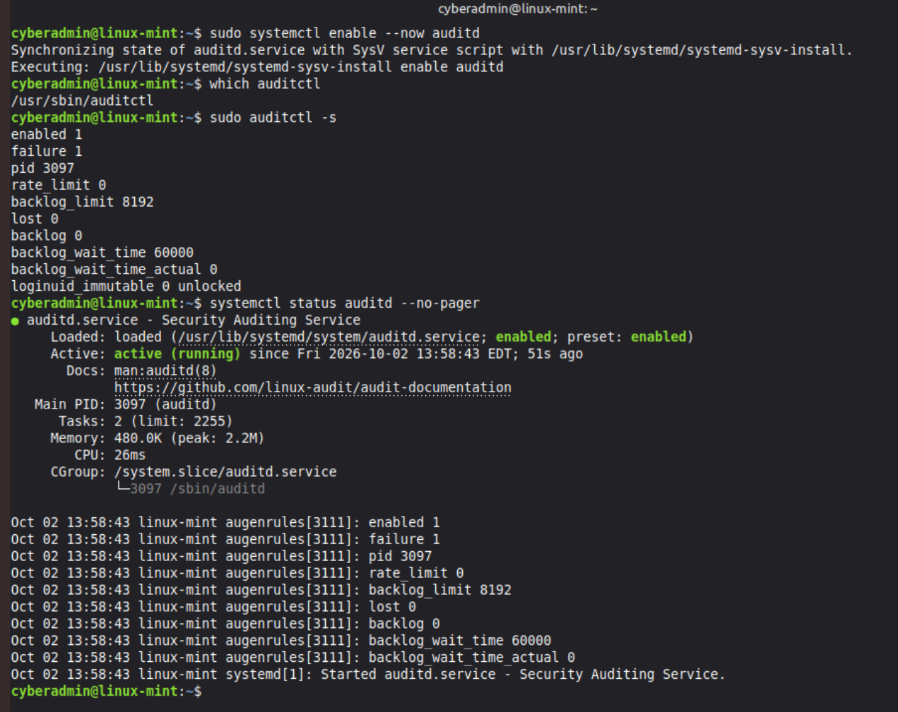

Validation showed:

```text
/usr/sbin/auditctl
enabled 1
auditd.service → active (running)
```

### Enhanced process auditing

An execution rule was added for user-launched `execve` activity. A known `whoami` process was then generated and located with `ausearch`.

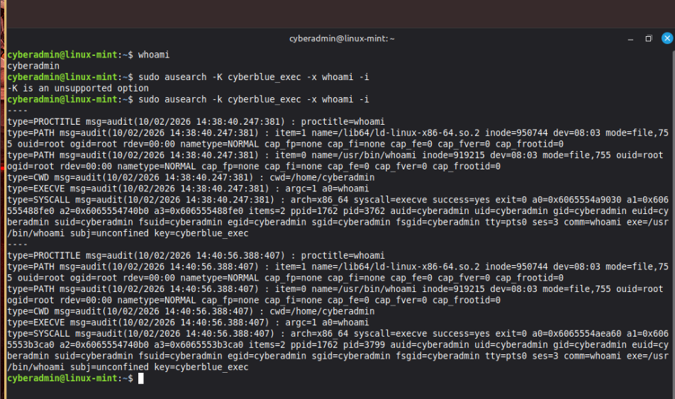

Observed evidence included:

```text
PROCTITLE → whoami
PATH      → /usr/bin/whoami
EXECVE    → a0=whoami
SYSCALL   → execve success=yes
auid      → cyberadmin
comm      → whoami
key       → cyberblue_exec
```

### Before / after result

```text
Native journal:
whoami execution → no useful event

auditd:
whoami execution → executable, user, syscall, path, and audit key
```

Temporary audit rules were removed:

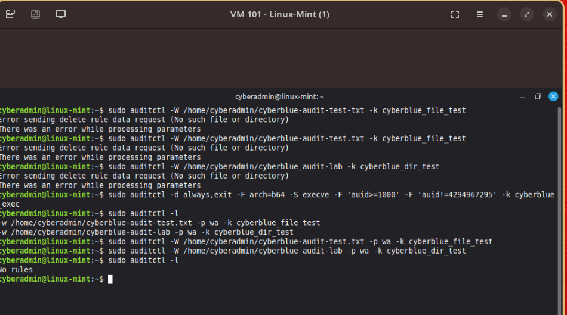

The temporary management NIC was then removed and Linux-Mint returned to its SOC-only network state:

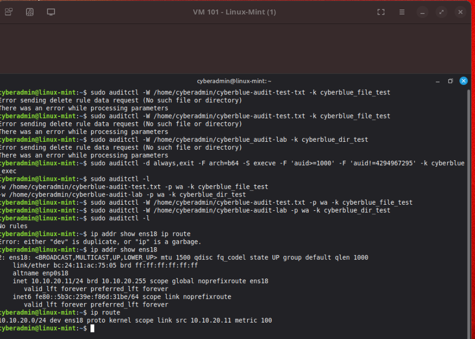

```text
ens18 → 10.10.20.11/24
10.10.20.0/24 dev ens18
No 192.168.12.x management address
No default route
```

---

## 11. Controlled Telemetry Failure and Recovery

A dedicated audit rule using the key `cyberblue_visibility` was deliberately removed before known activity was generated.

The activity occurred:

```bash
/usr/bin/uname -a
```

but a search for the expected key/activity produced no matching event:

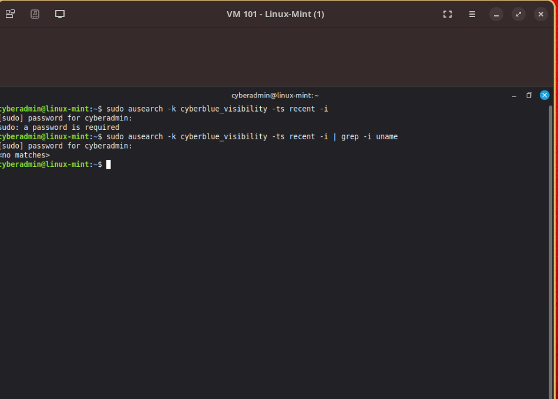

### Principle

> **Absence of evidence is not evidence of absence.**

The same audit rule was then restored and the same `uname -a` activity was repeated.

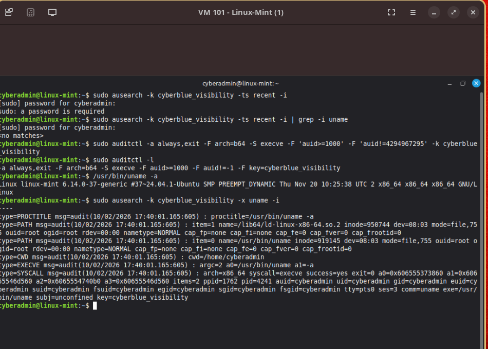

The restored evidence included:

```text
PROCTITLE → /usr/bin/uname -a
PATH      → /usr/bin/uname
EXECVE
SYSCALL   → execve success=yes
auid      → cyberadmin
comm      → uname
exe       → /usr/bin/uname
key       → cyberblue_visibility
```

The temporary rule was then removed and final cleanup validated:

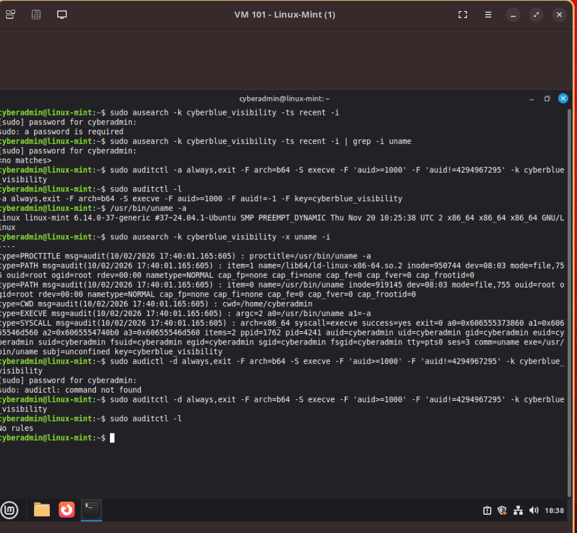

```text
sudo auditctl -l
→ No rules
```

The audit service remains installed and running; only the temporary lab rules were removed.

---

## Troubleshooting Highlights

### Windows logon correlation

A 4624 event with Logon Type 5 was initially encountered but correctly identified as a service logon rather than the known interactive user action. A Logon Type 2 event for `WIN11-01\cyberadmin` was then located.

### SPICE clipboard detour

SPICE guest clipboard support was investigated on Linux-Mint, but `spice-vdagent` was not installed and the endpoint was intentionally isolated from package repositories. Rather than derail the module or permanently alter network architecture for convenience, the effort was deferred.

### auditd file-watch tests

Initial file and directory watch experiments primarily returned audit rule configuration events rather than the intended file-modification evidence. The lab pivoted to an `execve` rule, which produced a cleaner and more defensible before/after comparison against the earlier native process-visibility gap.

### Shell parsing

The `auditctl` user-ID comparison filters required quoting:

```bash
-F 'auid>=1000' -F 'auid!=4294967295'
```

Without quoting, the shell interpreted the comparison characters and the rule was rejected.

These troubleshooting steps are retained because they demonstrate diagnostic discipline rather than a perfect-path installation.

---

## Evidence Ledger

```text
01a-endpoint-lab-baseline.png
01b-linux-mint-pre-telemetry-snapshot.png
01c-win11-pre-telemetry-snapshot.png

02a-linux-recent-journal-events.png
02b-linux-current-boot-telemetry.png
02c-linux-login-reboot-history.png

03a-linux-networkmanager-telemetry.png
03b-linux-var-log-inventory.png

04a-linux-authentication-telemetry.png

05a-windows-security-event-viewer.png

06a-linux-known-sudo-event.png
06b-windows-known-authentication-event.png

07a-linux-service-activity.png
07b-linux-native-file-process-visibility.png

08a-windows-sysmon-preinstall-baseline.png
08b-windows-sysmon-installed.png
08c-windows-sysmon-process-creation.png
08d-windows-sysmon-process-detail.png
08e-windows-victim-network-restored.png

09a-linux-auditd-preinstall-baseline.png
09b-linux-temporary-management-network.png
09c-linux-auditd-installed.png
09d-linux-enhanced-audit-event.png
09e-linux-audit-rules-cleaned.png
09f-linux-soc-network-restored.png

10b-linux-visibility-gap.png
10c-linux-telemetry-restored.png
10d-linux-audit-cleanup-verified.png
```

---

## Skills Demonstrated

- Windows Event Viewer and Security log analysis;
- Event 4624 logon-type correlation;
- Event 4672 privilege-event interpretation;
- Linux `journalctl`, `last`, and `auth.log` investigation;
- service lifecycle telemetry;
- known-event generation and timestamp correlation;
- identifying native endpoint visibility gaps;
- Sysmon installation and operational validation;
- Sysmon Event ID 1 process-creation analysis;
- Linux `auditd` installation and validation;
- `auditctl` rule creation and removal;
- `ausearch` investigation;
- process execution auditing;
- controlled telemetry failure and recovery;
- differentiating “no event” from “no activity”;
- temporary management-access design and cleanup;
- maintaining Cyber Forge segmentation after tooling installation;
- evidence-driven troubleshooting and documentation.

---

## Build Gate Result

```text
Endpoint baseline                    PASS
Native Linux telemetry               PASS
Native Windows telemetry             PASS
Known-event correlation              PASS
Service telemetry                    PASS
Native visibility-gap testing        PASS
Enhanced Windows telemetry           PASS
Enhanced Linux telemetry             PASS
Controlled telemetry failure         PASS
Telemetry restoration                PASS
Test-rule cleanup                    PASS
Network architecture restoration     PASS

TECHNICAL BUILD GATE                  PASS ✓
KNOWLEDGE REVIEW                      PENDING
INDEPENDENT QUALIFICATION             PENDING
```

The Build Gate is complete. The deferred qualification phase will revisit interpretation, timeline reconstruction, blind investigation, and interview-level explanation after the wider Cyber Forge range has been built.

---

## Next CyberBlue Milestone

Module 04 deliberately keeps most analysis local to the endpoints.

That creates the next operational problem:

```text
How do we collect and investigate telemetry
from many systems without logging into each endpoint?
```

**Module 05 — Centralized Logging & SIEM Foundations** addresses that problem.

That is where Cyber Forge begins moving from individual endpoint telemetry into centralized security operations.
