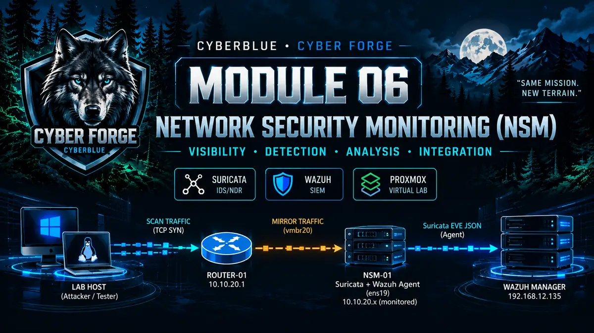
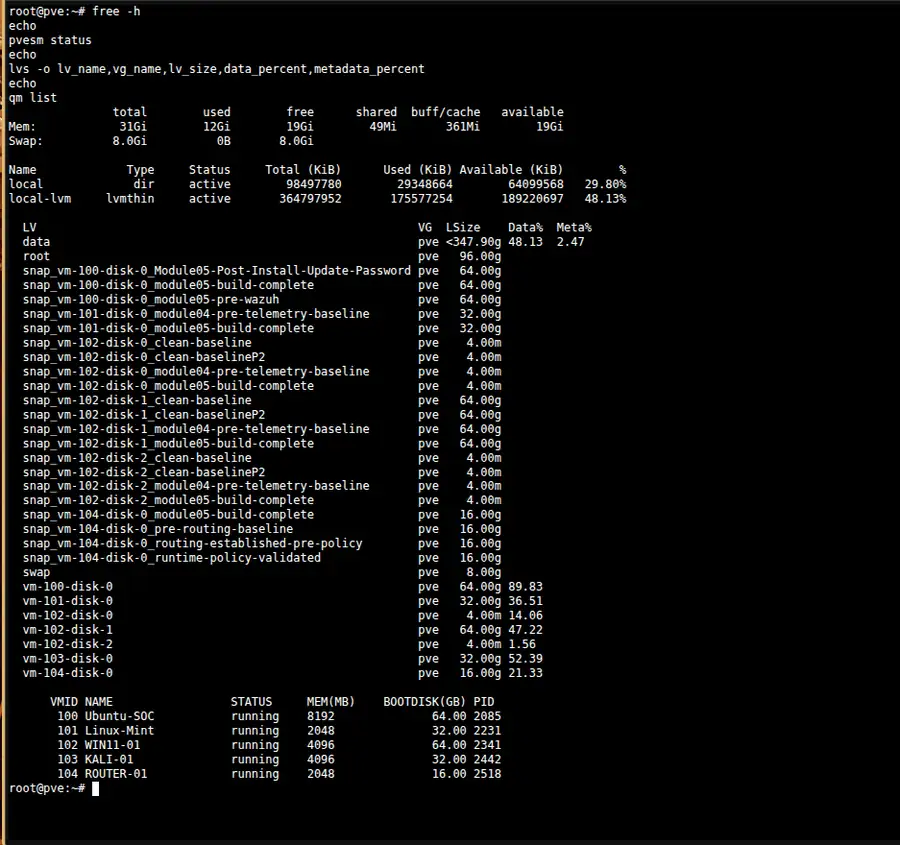
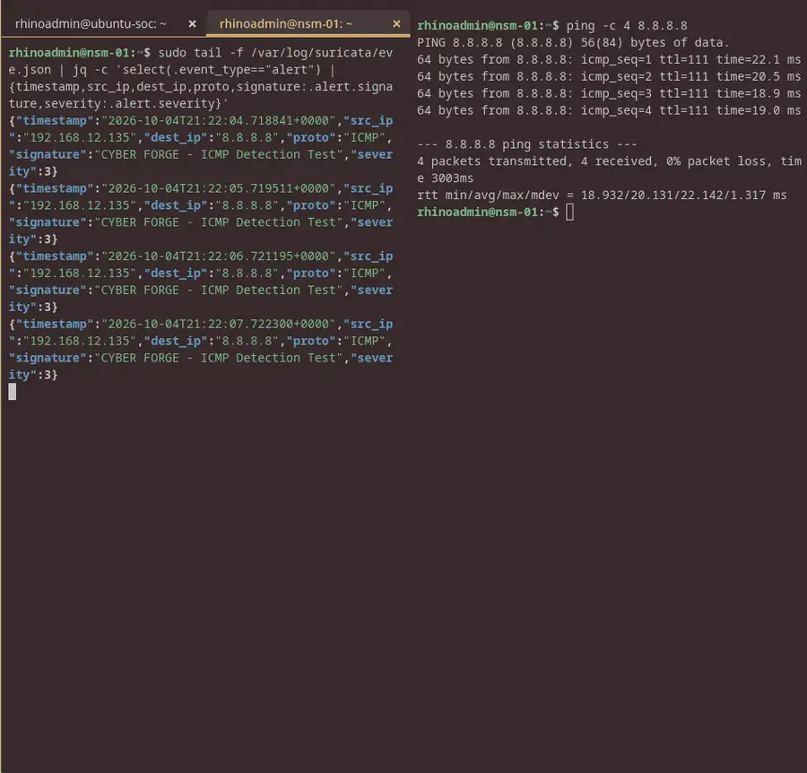
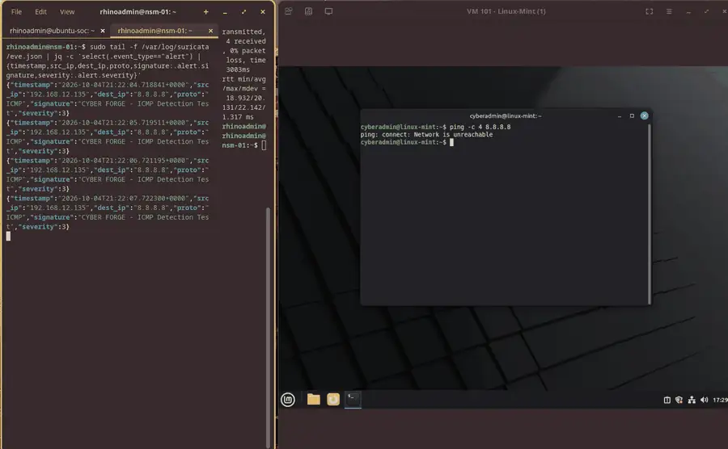
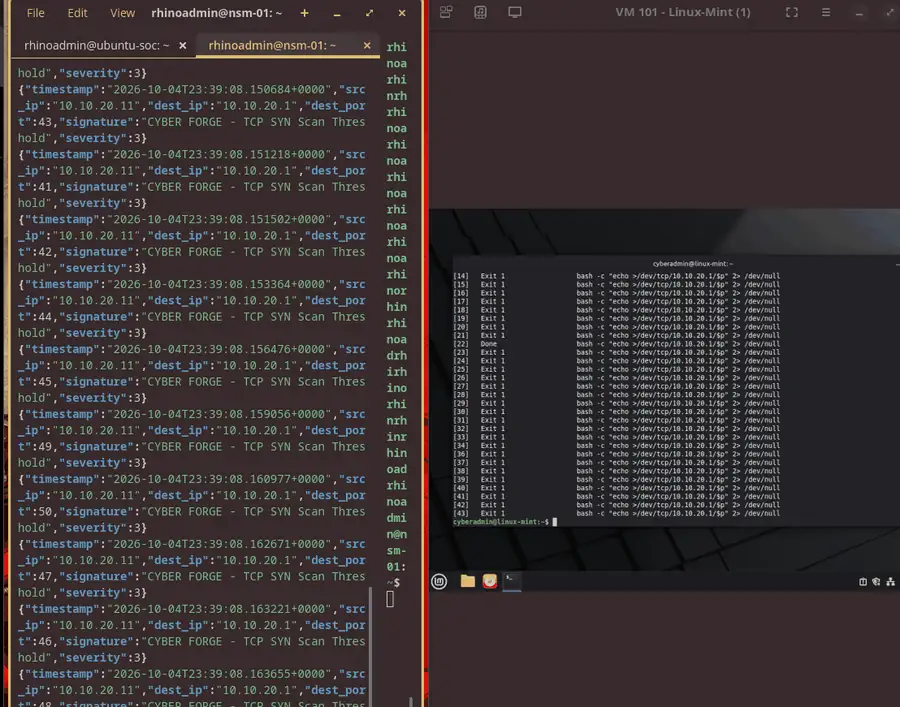
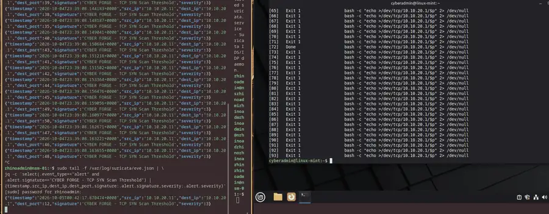
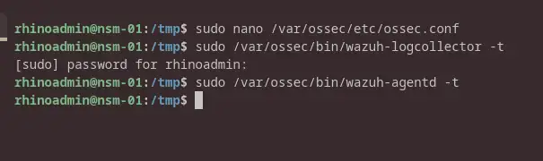
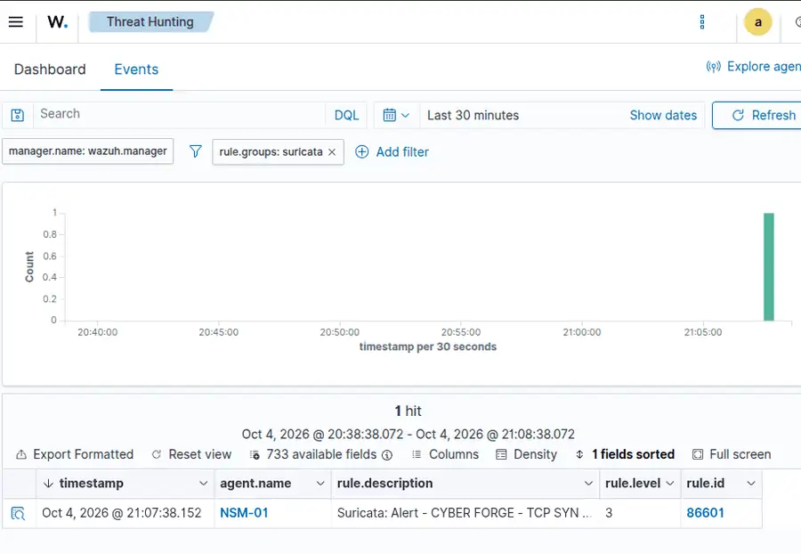
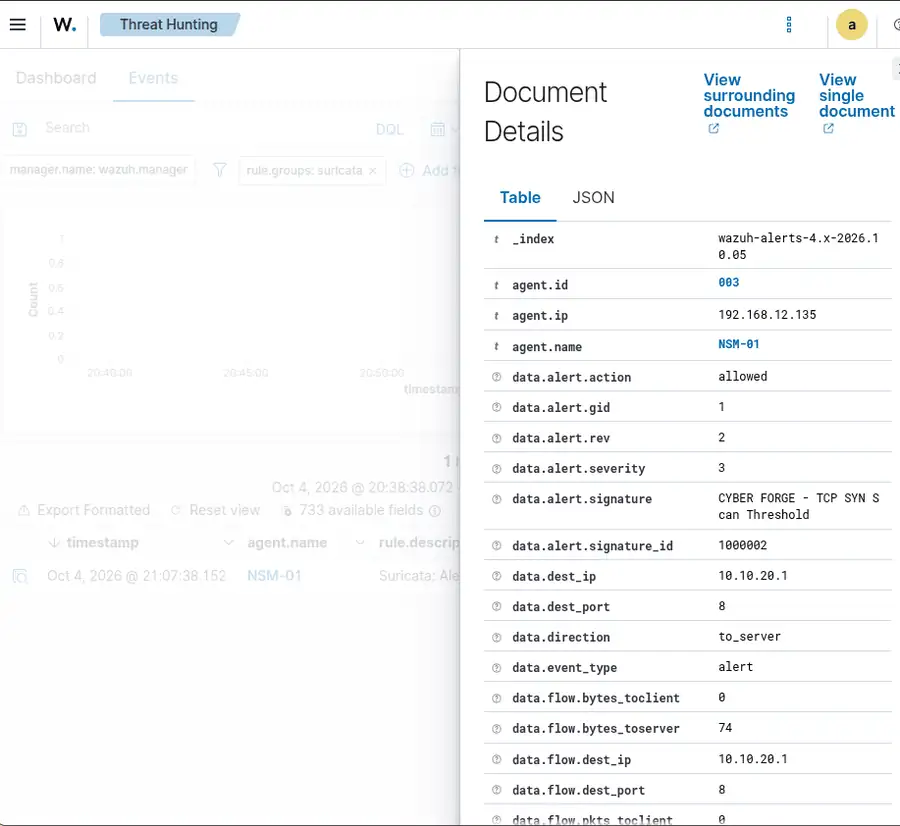
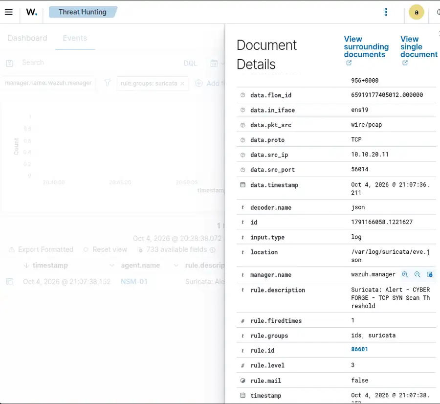

# CyberBlue — Module 06



## Network Security Monitoring

**Status:** WORK IN PROGRESS  
**Current checkpoint:** Passive NSM, behavioral detection tuning, and Suricata → Wazuh integration validated  
**Platform:** Proxmox VE 9.2.2  
**NSM implementation:** Suricata 7.0.3 on VM105 — NSM-01  
**SIEM integration:** Wazuh 4.14.8  
**Training method:** Principle → Architecture → Build → Validate → Break/Test → Troubleshoot → Restore → Explain → Document → Qualify

> Module 06 moves Cyber Forge from endpoint and SIEM telemetry into **passive network security monitoring**. This README follows the same build-document format used in Modules 02–05: architecture, implementation sequence, validation checkpoints, troubleshooting, and evidence embedded at the stage where it was captured.

---

# Module Objective

Module 05 established centralized endpoint telemetry in Wazuh.

Module 06 addresses the next operational problem:

> **How do we observe network behavior between systems, detect suspicious patterns, tune the resulting detections, and present those events to an analyst in the SIEM?**

The capability being built is:

```text
NETWORK ACTIVITY
      ↓
OBSERVATION POINT
      ↓
PASSIVE PACKET CAPTURE
      ↓
FLOW / PROTOCOL INSPECTION
      ↓
DETECTION LOGIC
      ↓
ALERT
      ↓
SIEM INGESTION
      ↓
ANALYST INVESTIGATION
```

The goal is not simply to install Suricata. The goal is to prove that the sensor can see the right traffic, produce useful detections, reduce avoidable alert noise, and deliver actionable telemetry to Wazuh.

---

# Core Principle

> **A network sensor is useful only when it can see the traffic that matters, detect meaningful behavior, and deliver actionable telemetry to an analyst.**

A healthy Suricata process does not by itself prove useful monitoring.

Module 06 therefore validates:

- sensor placement;
- packet visibility;
- third-party traffic observation;
- signature processing;
- behavior-based detection;
- alert tuning;
- flow-level investigation; and
- end-to-end SIEM ingestion.

---

# Final Architecture — Current Checkpoint

```text
                         MANAGEMENT LAN
                         192.168.12.0/24
                                |
                              vmbr0
                                |
                   +------------+-------------+
                   |                          |
              Ubuntu-SOC                  NSM-01
           Wazuh single-node          ens18 192.168.12.135
            192.168.12.227                management
                                              |
                                              |
                                       ens19 — no IPv4
                                              |
                                            vmbr20
                                              ^
                                              |
                                   mirrored ROUTER-01 traffic
                                              |
                               +--------------+--------------+
                               |                             |
                          Linux-Mint                     ROUTER-01
                          10.10.20.11                    10.10.20.1
```

### NSM-01

```text
VM 105 — NSM-01
OS:        Ubuntu Server 24.04
CPU:       2 vCPU
Memory:    4 GiB
Disk:      32 GiB

ens18 → vmbr0  → management / SSH
        192.168.12.135/24

ens19 → vmbr20 → passive monitoring
        no IPv4 address
```

Suricata listens on `ens19`, keeping the management plane and passive monitoring plane separate.

---

# Build Walkthrough

## 1. Capacity Preflight and NSM-01 Provisioning

Before introducing another security workload, I reviewed the Proxmox host for available memory, storage, and active VM pressure.



The host had sufficient memory headroom to proceed, and the guest filesystem review from the previous SIEM work confirmed that the Wazuh data footprint was legitimate rather than an immediate storage fault.

NSM-01 was provisioned as:

```text
VM ID:     105
Name:      NSM-01
OS:        Ubuntu Server 24.04
CPU:       2 vCPU
Memory:    4096 MiB
Disk:      32 GiB
net0:      VirtIO → vmbr0
```

The management interface became:

```text
ens18 → 192.168.12.135/24
```

OpenSSH was installed so the remaining work could be performed through a reliable terminal session.

---

## 2. Deploy and Validate Suricata

Suricata 7.0.3 was installed on NSM-01.

The first service start failed because the default capture configuration referenced `eth0`, while the actual interface was `ens18`.

Observed error:

```text
Failure when trying to get MTU via ioctl for 'eth0':
No such device
```

The AF_PACKET capture interface was corrected without globally replacing every interface reference in the configuration.

The Emerging Threats Open ruleset was installed using:

```bash
sudo suricata-update
```

Result:

```text
53,038 enabled rules
/var/lib/suricata/rules/suricata.rules
```

Configuration validation:

```bash
sudo suricata -T -c /etc/suricata/suricata.yaml
```

Live EVE JSON telemetry confirmed DNS, HTTP, IPv4, IPv6, flow, and multicast/broadcast processing.

### Principle

> Service health is not enough. The capture interface, ruleset, and actual packet processing must all be validated.

---

## 3. Create the First Controlled Detection

A local ICMP signature was created:

```text
alert icmp any any -> any any (msg:"CYBER FORGE - ICMP Detection Test"; itype:8; sid:1000001; rev:1;)
```

Controlled ICMP traffic from NSM-01 to `8.8.8.8` produced four matching alerts.



This proved the first complete detection path:

```text
packet capture
    ↓
rule evaluation
    ↓
signature match
    ↓
EVE JSON alert
```

### Capability demonstrated

> Created, loaded, and validated a custom Suricata rule against known traffic.

---

## 4. Build the Passive Monitoring Path

The first ICMP test proved that Suricata could inspect traffic generated by NSM-01 itself, but a network sensor must also observe traffic generated by other systems.

A second NSM-01 virtual NIC was added:

```text
net1 → vmbr20
       ↓
     ens19
       ↓
  no IPv4 address
```

Suricata was moved from `ens18` to `ens19`.

Simply placing NSM-01 on the same bridge was not enough. Proxmox had to copy the target traffic to the sensor.

The relevant tap mappings were:

```text
tap104i0 → ROUTER-01 net0 / vmbr20
tap105i1 → NSM-01 net1 / vmbr20
```

Linux traffic control (`tc`) was used to mirror ROUTER-01 vmbr20 ingress and egress traffic to NSM-01.

The current runtime configuration is preserved in:

```text
configs/proxmox-vmbr20-mirror.sh
```

Linux-Mint then generated ICMP traffic:

```text
10.10.20.11 → 10.10.20.1
```

Suricata on the unaddressed `ens19` interface detected the third-party traffic.



### Principle

> Passive monitoring depends on the observation point. Installing an IDS on the same subnet does not guarantee visibility into unrelated traffic.

---

## 5. Validate Protocol-Aware Inspection

A controlled request was sent from Linux-Mint to ROUTER-01 TCP/22 using an HTTP-style client.

Packet capture on `ens19` showed the TCP exchange and SSH service response.

Suricata also generated application-layer anomaly telemetry because the observed application behavior did not match the expected service interaction.

This demonstrated that NSM can interpret protocol behavior rather than operating only on IP addresses and port numbers.

---

## 6. Create a Behavior-Based TCP SYN Detection

A second custom rule was created to identify rapid TCP SYN activity from one source:

```text
alert tcp any any -> any any (msg:"CYBER FORGE - TCP SYN Scan Threshold"; flags:S; flow:stateless; detection_filter:track by_src, count 10, seconds 5; sid:1000002; rev:1;)
```

Linux-Mint generated controlled connection attempts across 50 destination ports on ROUTER-01.

The detection worked, but once the threshold was crossed the original rule produced repeated alerts.



That created a realistic detection-engineering problem:

```text
Detection works
     ↓
Duplicate alerts accumulate
     ↓
Signal-to-noise decreases
     ↓
Rule requires tuning
```

---

## 7. Tune the Detection and Retest the Same Behavior

The rule was revised to use `threshold:type both`:

```text
alert tcp any any -> any any (msg:"CYBER FORGE - TCP SYN Scan Threshold"; flags:S; flow:stateless; threshold:type both, track by_src, count 10, seconds 5; sid:1000002; rev:2;)
```

Before restarting Suricata, the configuration was validated:

```bash
sudo suricata -T -c /etc/suricata/suricata.yaml
```

The exact same 50-port behavior was replayed.

### Before tuning

The scan produced multiple duplicate alerts.

### After tuning

The same behavior produced one clean alert for the interval.



### Principle

> A detection that technically works but overwhelms the analyst is not a well-tuned detection.

The exercise demonstrated:

```text
Detect
  ↓
Identify noise
  ↓
Modify rule
  ↓
Validate syntax
  ↓
Replay identical behavior
  ↓
Compare result
```

The current local rules are preserved in:

```text
configs/suricata-local.rules
```

---

## 8. Investigate the TCP SYN Alert

The tuned event identified:

```text
Source:        10.10.20.11
Destination:   10.10.20.1
Protocol:      TCP
Signature:     CYBER FORGE - TCP SYN Scan Threshold
Signature ID:  1000002
Revision:      2
Severity:      3
Action:        allowed
Sensor:        ens19
```

Flow records showed rapid connections to many destination ports on one target.

Most probes closed quickly. TCP/22 showed additional bidirectional interaction, consistent with the reachable SSH service observed during protocol inspection.

### Preliminary disposition

> **True Positive — Controlled Reconnaissance.** A single internal host generated rapid TCP SYN activity across multiple ports on ROUTER-01. The activity exceeded the configured scan threshold and was detected by the passive NSM sensor. The activity was authorized as part of the Cyber Forge lab exercise; no containment was required.

The exact alert-window correlation write-up remains open before the Module 06 technical build gate is closed.

---

# Suricata → Wazuh Integration

## 9. Enroll NSM-01 as Wazuh Agent 003

The Wazuh 4.14.8 agent was installed on NSM-01.

The agent was configured to collect:

```text
/var/log/suricata/eve.json
```

Configuration block:

```xml
<localfile>
  <log_format>json</log_format>
  <location>/var/log/suricata/eve.json</location>
</localfile>
```

The first agent restart failed because the new `<localfile>` block had been placed outside an `<ossec_config>` section.

After correcting the XML structure, both Wazuh configuration tests completed without errors:

```bash
sudo /var/ossec/bin/wazuh-logcollector -t
sudo /var/ossec/bin/wazuh-agentd -t
```



The service then started successfully, including:

```text
wazuh-agentd
wazuh-syscheckd
wazuh-logcollector
wazuh-modulesd
```

The agent log confirmed:

```text
Analyzing file: '/var/log/suricata/eve.json'
```

The reusable collection block is preserved in:

```text
configs/wazuh-suricata-localfile.xml
```

---

## 10. Validate Suricata Alert Ingestion in Wazuh

A fresh controlled SYN-scan test was generated after the Wazuh agent was online.

Wazuh Threat Hunting returned the Suricata alert under:

```text
rule.groups: suricata
```



The visible event confirmed:

```text
agent.name        NSM-01
rule.description  Suricata: Alert - CYBER FORGE - TCP SYN Scan Threshold
rule.level        3
rule.id           86601
```

### Capability demonstrated

> Proved that Suricata EVE JSON telemetry could traverse the full NSM → Wazuh pipeline and appear in the analyst-facing Threat Hunting interface.

---

## 11. Inspect the Suricata Event in Wazuh

The Wazuh document detail view exposed the original Suricata fields.





Validated fields included:

```text
agent.id                 003
agent.ip                 192.168.12.135
agent.name               NSM-01
data.alert.action        allowed
data.alert.rev           2
data.alert.severity      3
data.alert.signature     CYBER FORGE - TCP SYN Scan Threshold
data.alert.signature_id  1000002
data.src_ip              10.10.20.11
data.dest_ip             10.10.20.1
data.dest_port           8
data.in_iface            ens19
data.proto               TCP
rule.groups              ids, suricata
rule.id                  86601
rule.level               3
rule.firedtimes          1
```

The rule-classification evidence confirms that Wazuh parsed the Suricata event under the expected security groups and rule:

```text
rule.groups  ids, suricata
rule.id      86601
rule.level   3
```

This provides a second layer of validation: the event was not merely transported to Wazuh; it was recognized and classified as Suricata/IDS telemetry.

This validated the complete path:

```text
Linux-Mint
   ↓
ROUTER-01 traffic
   ↓
Proxmox traffic mirror
   ↓
NSM-01 / ens19
   ↓
Suricata
   ↓
eve.json
   ↓
Wazuh Agent 003
   ↓
Wazuh Manager
   ↓
Threat Hunting
   ↓
Field-level investigation
```

---

# Troubleshooting & Lessons Learned

## Suricata referenced the wrong capture interface

**Symptom:** Suricata failed to start.

**Root cause:** The configuration referenced `eth0`; NSM-01 used predictable interface names.

**Resolution:** Corrected only the AF_PACKET capture interface and validated with `suricata -T`.

**Lesson:** Avoid global configuration replacement when the fault is isolated to one stanza.

---

## Custom rule file was accidentally contaminated

**Symptom:**

```text
detect-parse: An invalid action "af-packet:" was given
```

**Root cause:** Part of the YAML AF_PACKET configuration was accidentally pasted into `local.rules`.

**Resolution:** Rebuilt `local.rules` with only valid signatures and validated the Suricata configuration before restart.

**Lesson:** Syntax validation should precede service restart after detection-rule changes.

---

## Wazuh rejected the Suricata localfile configuration

**Symptom:**

```text
Invalid element in the configuration: 'localfile'
```

**Root cause:** The Suricata `<localfile>` block was outside the active `<ossec_config>` section.

**Resolution:** Moved the block inside the Wazuh XML structure and tested both `wazuh-logcollector` and `wazuh-agentd` before restarting the agent.

**Lesson:** A telemetry integration is not complete until both configuration parsing and event flow are validated.

---

# Current Temporary / Nonpersistent State

Two pieces of the monitoring path remain intentionally runtime-only.

### NSM monitoring NIC

```bash
sudo ip link set ens19 up
```

The `ens19` UP state may be lost after an NSM-01 reboot until it is made persistent through guest networking.

### Proxmox traffic mirror

The current `tc` mirror configuration is runtime-only.

It should be revalidated/reapplied after a Proxmox reboot or relevant VM/tap-interface recreation.

These are tracked as open build items rather than silently treated as permanent.

---

# Evidence Status

The current Module 06 build evidence is now embedded throughout this README at the stage where each validation occurred:

```text
01a-module06-proxmox-capacity-preflight.webp
02a-module06-first-suricata-detection.webp
02b-module06-passive-mirrored-detection.webp
03a-module06-tcp-syn-threshold-detection.webp
03b-module06-tuned-syn-detection.webp
04a-module06-wazuh-agent-validation.webp
04b-module06-suricata-wazuh-integration.webp
04c-module06-wazuh-alert-details.webp
04d-module06-wazuh-rule-classification.webp
```

The screenshot is the evidence; the surrounding explanation records what was being tested, what the result proved, and why it matters.

---

# Skills Demonstrated

Module 06 work to date demonstrates practical experience with:

- Suricata IDS / NSM deployment;
- AF_PACKET capture configuration;
- Emerging Threats Open rules;
- EVE JSON telemetry;
- custom Suricata signatures;
- ICMP detection;
- behavior-based TCP SYN detection;
- threshold tuning and alert-noise reduction;
- repeatable before/after detection testing;
- passive monitoring architecture;
- dual-NIC sensor design;
- Proxmox Linux bridges;
- Linux `tc` traffic mirroring;
- third-party packet observation;
- `tcpdump` validation;
- protocol-aware NSM interpretation;
- flow and alert correlation;
- Wazuh agent enrollment;
- Suricata-to-Wazuh log ingestion;
- Wazuh Threat Hunting;
- SIEM field-level investigation; and
- evidence-driven troubleshooting.

---

# Remaining Module Work

Before the Module 06 technical build gate is complete:

1. Complete the exact alert-window analyst correlation.
2. Perform a controlled monitoring-path / telemetry visibility failure.
3. Demonstrate the blind spot while visibility is broken.
4. Restore the monitoring path and prove detection returns.
5. Make the passive monitoring NIC state persistent.
6. Make the Proxmox traffic mirror persistent or replace it with a documented durable mechanism.
7. Reboot and revalidate the final monitoring path.
8. Capture the final evidence and close the technical build gate.

---

# Current Module State

```text
Dedicated NSM sensor deployed            ✓
Passive monitoring interface             ✓
Third-party mirrored visibility          ✓
Suricata ruleset active                   ✓
Custom ICMP detection                     ✓
Behavior-based SYN detection              ✓
Alert-noise tuning                        ✓
Suricata → Wazuh integration              ✓
Threat Hunting visibility                 ✓
Inline build evidence                     ✓
Exact alert-window investigation          IN PROGRESS
Controlled visibility-failure test        PENDING
Monitoring-path persistence               PENDING
Post-reboot validation                    PENDING
Technical Build Gate                      OPEN
```

Module 06 has reached a meaningful checkpoint: **Cyber Forge now has a working passive network-security-monitoring pipeline with tuned behavioral detection and centralized SIEM visibility.**
