# CyberBlue — Module 07

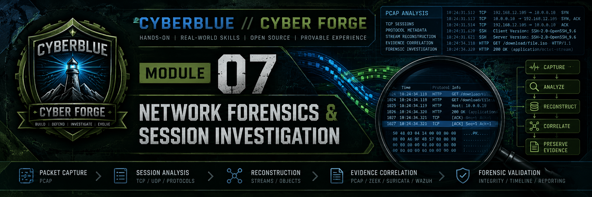

## Network Forensics & Session Investigation

> **Focus:** Capture | Reconstruction | Correlation | Validation

---

## Module Objective
In this module, I captured and analyzed network traffic to validate session behavior across multiple layers of the stack. I used Zeek for protocol-aware metadata, tshark for packet/stream reconstruction, Suricata for detection, and Wazuh for centralized visibility and correlation.

## Tools Used
- Proxmox
- tcpdump
- tshark / Wireshark
- Zeek
- Suricata
- Wazuh

## Outcome
This module validated the ability to:
- capture live traffic
- reconstruct TCP, SSH, and HTTP sessions
- correlate Zeek, Suricata, and Wazuh observations
- recover transmitted evidence objects
- verify recovered content integrity
- validate persistence and restart behavior of the monitoring stack

**Status:** IN PROGRESS  
**Current checkpoint:** Packet/session reconstruction, Zeek protocol analysis, multi-source reconnaissance correlation, HTTP object recovery, evidence-gap testing, live Zeek deployment, and Zeek persistence are validated. VM-lifecycle mirror rebinding is configured but final automatic restart qualification is still pending.  
**Platform:** Proxmox VE 9.2.2  
**Sensor:** VM105 — NSM-01  
**Primary tools:** tcpdump, TShark/Wireshark CLI, Zeek 8.0.10, Suricata 7.0.3, Wazuh 4.14.8  
**Training method:** Principle → Architecture → Build → Validate → Break/Test → Troubleshoot → Restore → Explain → Document → Qualify

> Module 07 extends the passive NSM capability built in Module 06. The goal is no longer only to detect suspicious traffic; it is to reconstruct what happened from packet, session, IDS, and SIEM evidence and support an analyst conclusion with defensible artifacts.

---

# Module Objective

Module 06 answered:

> **Can Cyber Forge see suspicious network behavior and alert on it?**

Module 07 asks the next question:

> **What actually happened on the network, and what evidence proves it?**

The capability chain being developed is:

```text
PACKETS
   ↓
PRESERVED PCAP
   ↓
SESSION RECONSTRUCTION
   ↓
PROTOCOL METADATA
   ↓
IDS CORRELATION
   ↓
SIEM CORRELATION
   ↓
OBJECT / CONTENT RECOVERY
   ↓
ANALYST FINDING
```

---

# Core Principle

> **Network forensics is evidence reconstruction, not alert reading.**

A useful investigation should be able to answer:

- who communicated;
- with what system;
- when;
- over which transport and service;
- how the session behaved;
- what application metadata or content can be recovered;
- which evidence sources agree or disagree; and
- what conclusion the available evidence supports.

The module also treats capture quality as part of evidence integrity. If a critical packet is missing, metadata may survive while exact content recovery becomes impossible.

---

# Current Architecture

```text
Linux-Mint 10.10.20.11
        |
        | controlled traffic
        v
ROUTER-01 10.10.20.1
        |
        | Proxmox tc mirror
        v
NSM-01 ens19 (no IP)
        |
        +--> tcpdump / PCAP
        +--> TShark session reconstruction
        +--> Zeek session + protocol metadata
        +--> Suricata detection
        |
        v
Wazuh Agent 003
        |
        v
Wazuh Threat Hunting
```

---

# Build Walkthrough

## 1. Validate the Passive Forensic Observation Point

The existing Module 06 mirror path was reused rather than creating another sensor. `ens19` remained unaddressed and Suricata remained active while tcpdump observed Linux-Mint ↔ ROUTER-01 ICMP traffic.

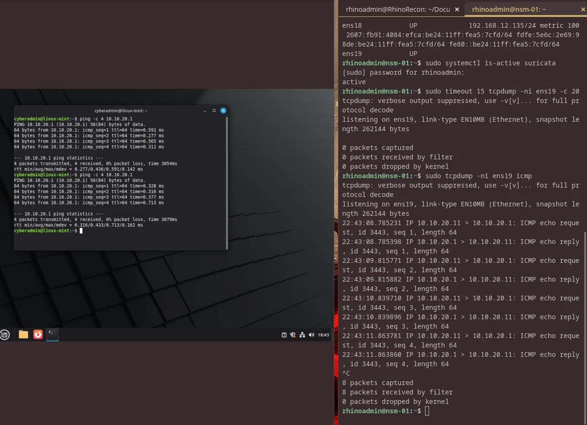

**Result:** PASS — third-party traffic was visible on the passive interface with zero packet drops.

---

## 2. Preserve the First TCP Session as PCAP

A controlled TCP/22 connection from Linux-Mint to ROUTER-01 was captured to `02a-first-tcp-session.pcap`.

The preserved packets showed:

```text
10.10.20.11:50570 → 10.10.20.1:22   SYN
10.10.20.1:22     → 10.10.20.11      SYN/ACK
10.10.20.11       → 10.10.20.1:22    ACK
10.10.20.1:22     → 10.10.20.11      43-byte SSH banner
```

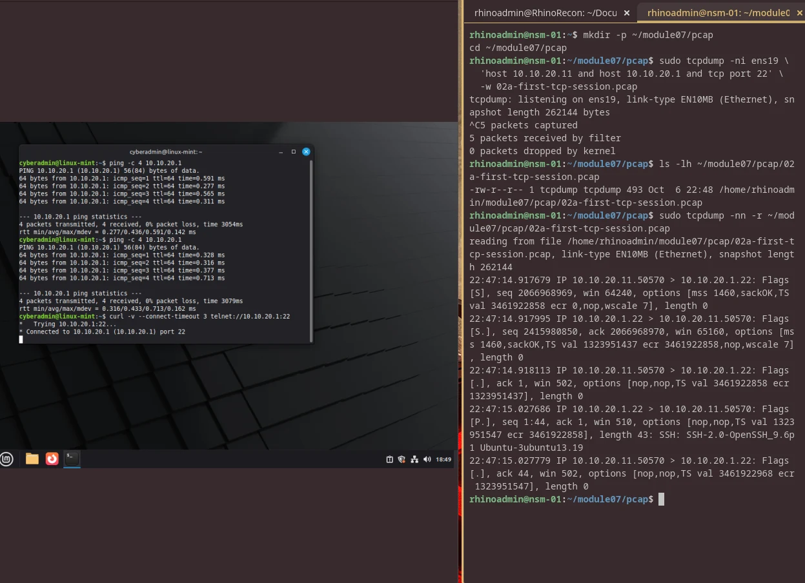

**Result:** PASS — a live third-party conversation was preserved and reopened as forensic evidence.

---

## 3. Reconstruct the Session with TShark

TShark summarized the same five packets into a TCP conversation and exposed timing, endpoints, TCP flags, and payload length.

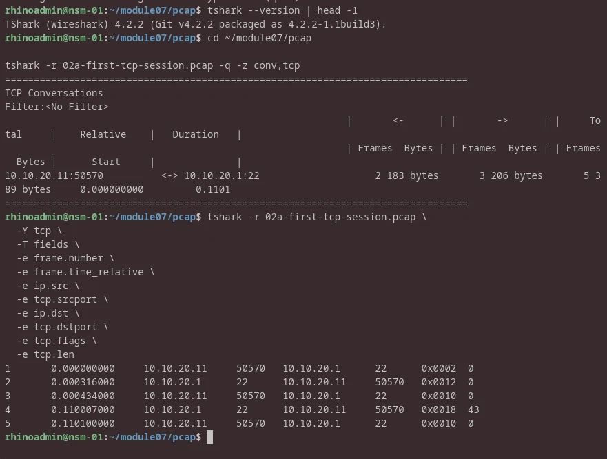

The packet sequence demonstrated a successful three-way handshake followed by a 43-byte server payload.

---

## 4. Recover Application Evidence from the Stream

Following the TCP stream exposed the clear-text SSH identification banner:

```text
SSH-2.0-OpenSSH_9.6p1 Ubuntu-3ubuntu13.19
```

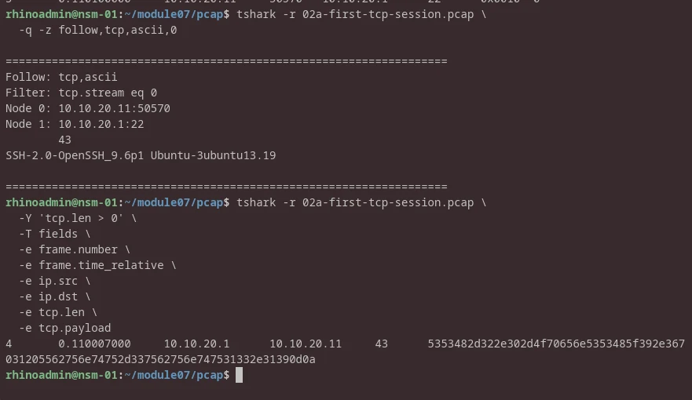

This proved the service from payload evidence rather than only assuming SSH because TCP/22 was used.

### Finding

> **Observed SSH Service Session — Benign Controlled Activity.** Linux-Mint established a TCP session to ROUTER-01 TCP/22. Packet and stream evidence showed the successful handshake and a server identification banner for OpenSSH. The activity was intentionally generated for Cyber Forge validation.

---

## 5. Introduce Zeek and Reconcile Analyzer Output with Raw Evidence

Zeek 8.0.10 was installed on NSM-01. The first offline analysis of the short PCAP produced incomplete/fragmented connection interpretation.

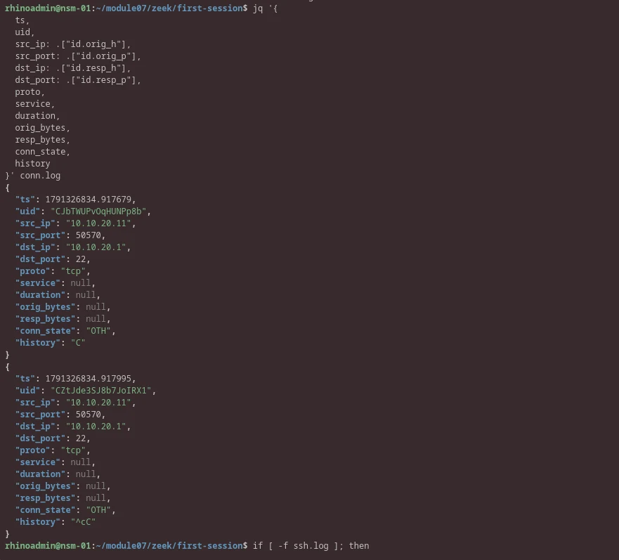

The raw PCAP and TShark evidence already proved that the TCP handshake completed, so the Zeek result was challenged rather than accepted blindly. Reprocessing the same PCAP with checksum validation disabled (`-C`) corrected the session reconstruction.

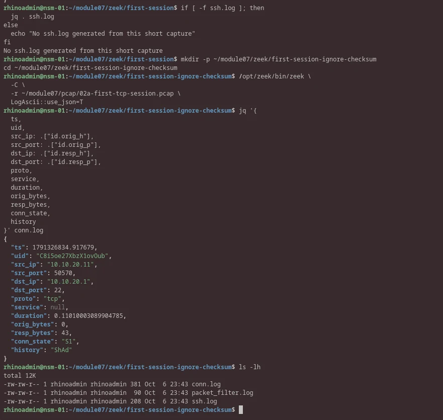

Corrected Zeek metadata included:

```text
src_ip:      10.10.20.11
src_port:    50570
dst_ip:      10.10.20.1
dst_port:    22
proto:       tcp
duration:    ~0.1101 sec
resp_bytes:  43
conn_state:  S1
```

### Lesson

> Virtualized/mirrored captures can contain checksum-offload artifacts. Higher-level analyzer output must be reconciled against the underlying packet evidence.

---

## 6. Generate Full SSH Protocol Metadata

A longer controlled SSH negotiation gave Zeek enough protocol exchange to generate `ssh.log` and classify the service.

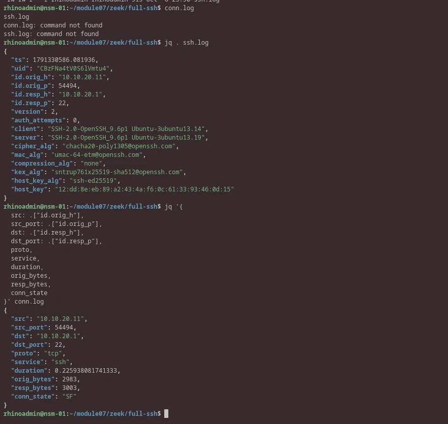

Zeek extracted:

- SSH version 2;
- OpenSSH client/server strings;
- negotiated cipher;
- key-exchange algorithm;
- host-key algorithm;
- session byte counts; and
- connection state `SF`.

### Finding

> **Observed SSH Negotiation — Controlled Benign Activity.** Zeek identified a complete SSH negotiation between Linux-Mint and ROUTER-01, including client/server versions and negotiated cryptographic parameters. The session terminated normally and was authorized lab traffic.

---

## 7. Reconstruct TCP Port Reconnaissance

The known Module 06 50-port TCP reconnaissance behavior was replayed while NSM-01 captured the traffic.

The PCAP contained 107 packets over roughly 90 milliseconds with zero capture loss.

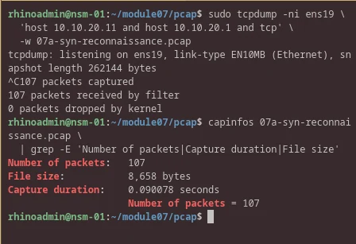

Zeek reconstructed one source contacting destination ports 1–50 on a single target. Most sessions were `REJ`, while TCP/22 behaved differently from the closed ports and progressed beyond a simple rejected SYN.

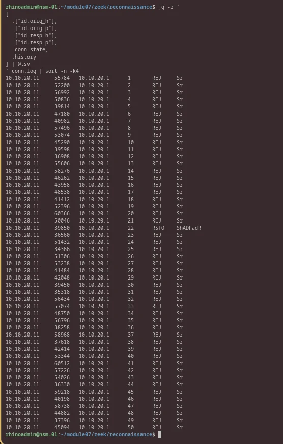

### Finding

> **TCP Port Reconnaissance — Controlled True Positive.** Linux-Mint (`10.10.20.11`) initiated rapid TCP connections against ports 1–50 on ROUTER-01 (`10.10.20.1`) within approximately 90 milliseconds. Zeek reconstructed 50 destination-port conversations. Most were rejected; TCP/22 exhibited different behavior consistent with the known SSH service.

---

## 8. Correlate PCAP / Zeek Evidence with Suricata

The PCAP time window was compared directly with the Suricata event stream.

```text
PCAP start:      23:57:04.287131 UTC
Suricata alert:  23:57:04.315207 UTC
PCAP end:        23:57:04.377209 UTC
```

The alert occurred inside the exact packet-capture window and matched:

```text
src_ip:      10.10.20.11
dest_ip:     10.10.20.1
signature:   CYBER FORGE - TCP SYN Scan Threshold
sid:         1000002
rev:         2
severity:    3
```

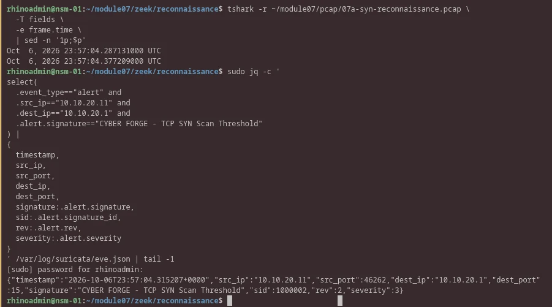

---

## 9. Complete the Correlation in Wazuh

Wazuh Threat Hunting displayed the same Suricata scan event from NSM-01 under rule `86601`.

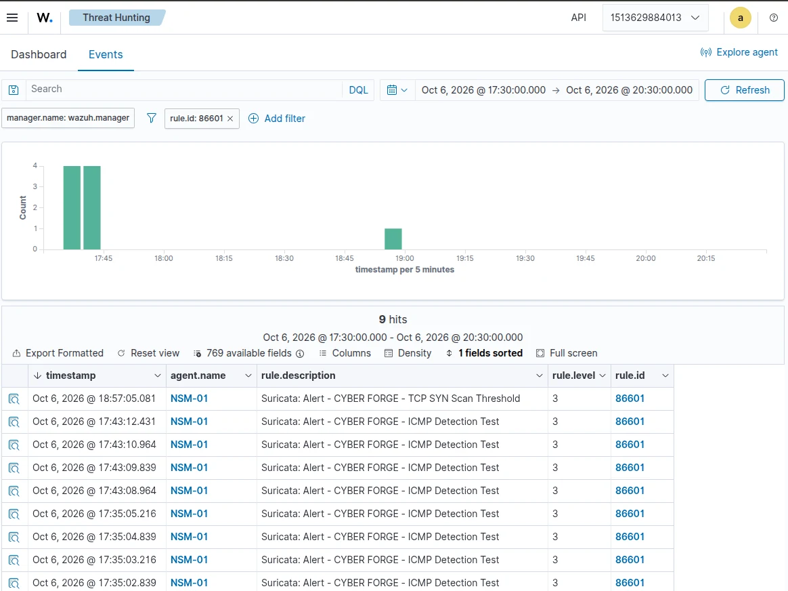

The detailed event confirmed Agent 003, source/destination information, SID `1000002`, revision `2`, severity `3`, and the Cyber Forge scan signature.

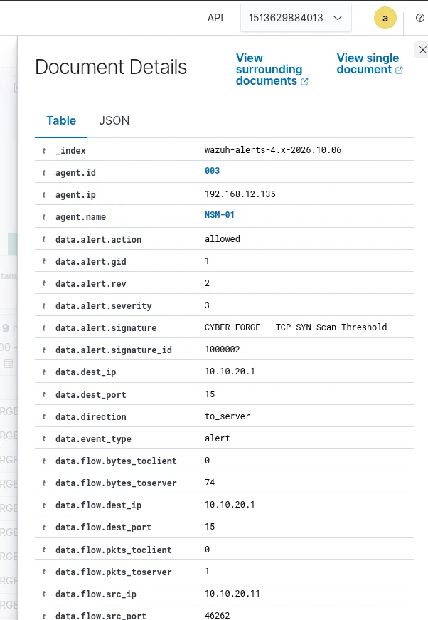

### Multi-source investigation chain

```text
PCAP
  ↓
Zeek — 50 destination ports reconstructed
  ↓
Suricata — SID 1000002 inside same capture window
  ↓
Wazuh — Rule 86601 / matching signature
  ↓
Analyst conclusion
```

> **True Positive — Authorized TCP Port Reconnaissance.** Packet, session, IDS, and SIEM evidence independently supported the same controlled reconnaissance event. No containment was required because the activity was authorized lab validation.

---

## 10. Reconstruct a Clear-Text HTTP Transaction

A temporary HTTP service on ROUTER-01 served `/evidence.txt` to Linux-Mint. Zeek generated `conn.log`, `http.log`, and `files.log`.

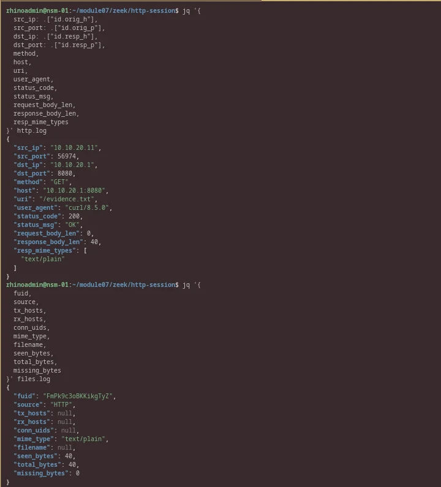

Zeek identified:

```text
Client:           10.10.20.11
Server:           10.10.20.1:8080
Method:           GET
URI:              /evidence.txt
User-Agent:       curl/8.5.0
HTTP status:      200 OK
MIME type:        text/plain
Response body:    40 bytes
Missing bytes:    0
```

TShark reconstructed the actual HTTP request, response headers, and body.

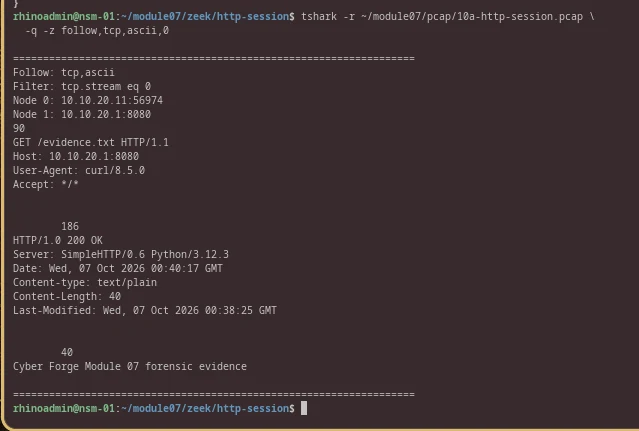

---

## 11. Recover and Hash the Transferred Object

TShark exported the HTTP object directly from the PCAP.

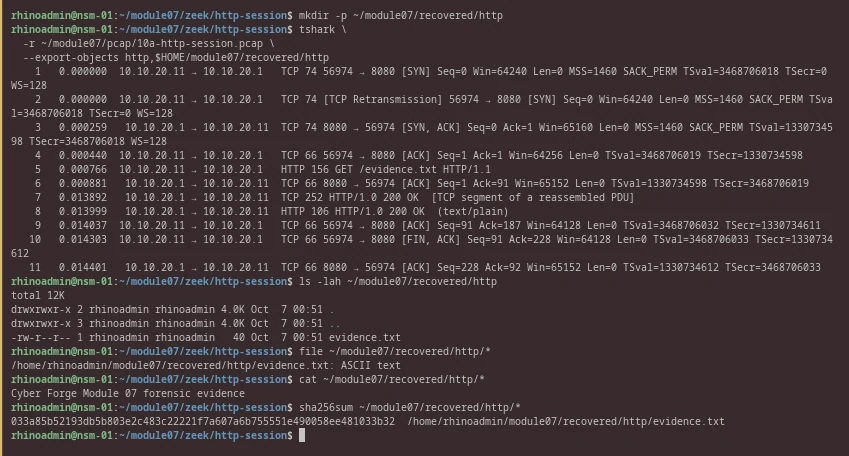

Recovered content:

```text
Cyber Forge Module 07 forensic evidence
```

The object was hashed with SHA-256:

```text
033a85b52193db5b803e2c483c22221f7a607a6b755551e490058ee481033b32
```

The source object on ROUTER-01 and the object reconstructed from network evidence produced the same hash.

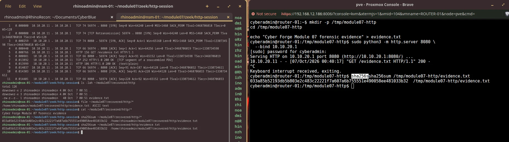

**Result:** PASS — the recovered network artifact was byte-for-byte identical to the source object.

---

## 12. Create and Investigate a Controlled Evidence Gap

The complete PCAP was copied and the single packet carrying the 40-byte HTTP body was deliberately removed.

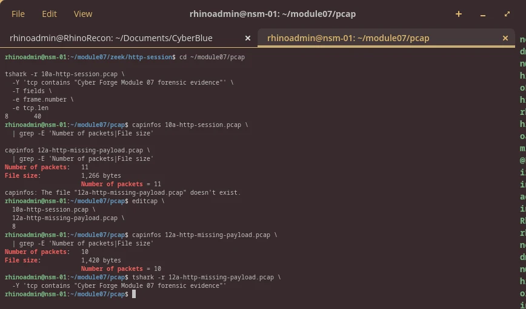

The damaged capture retained useful metadata:

- TCP conversation;
- HTTP GET request;
- `200 OK` response;
- content type; and
- expected content length.

But the actual object body was gone. Zeek produced no `files.log`, and TShark could not export the transferred file.

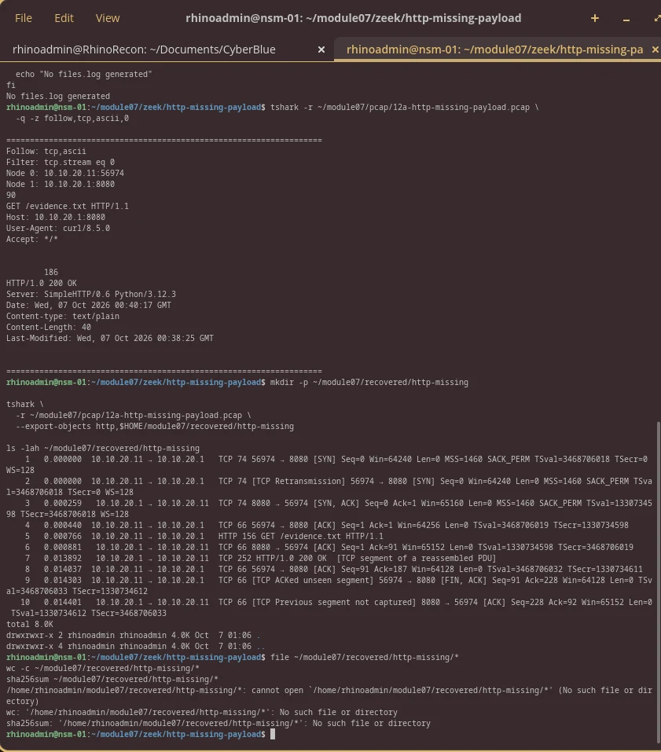

Returning to the complete PCAP restored object recovery and the known SHA-256.

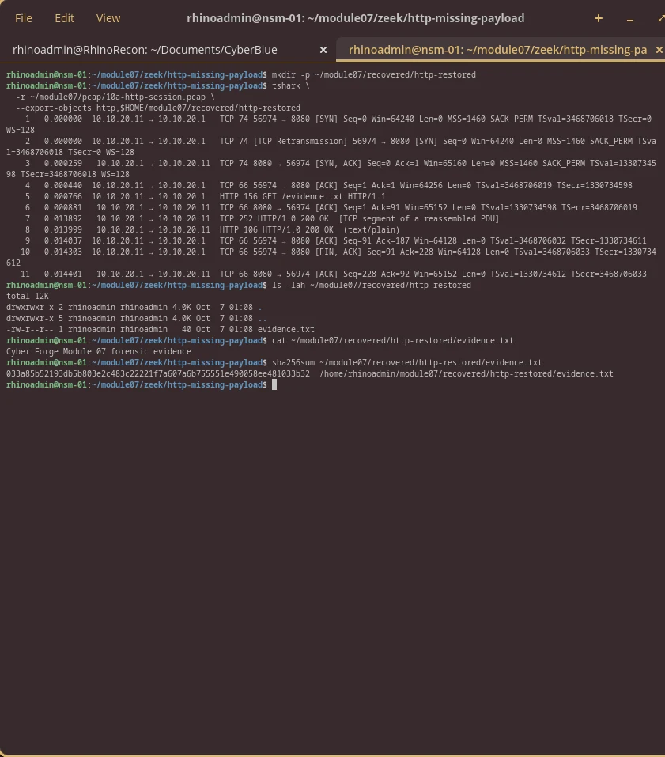

### Principle

> **Metadata can prove that a transfer occurred without providing enough evidence to prove what was transferred. Capture completeness is part of evidence integrity.**

---

## 13. Move Zeek from Offline Analysis to Live Monitoring

Zeek was run directly against `ens19` while Linux-Mint generated a fresh SSH negotiation. Live packet intake produced `conn.log` and `ssh.log` with complete session metadata.

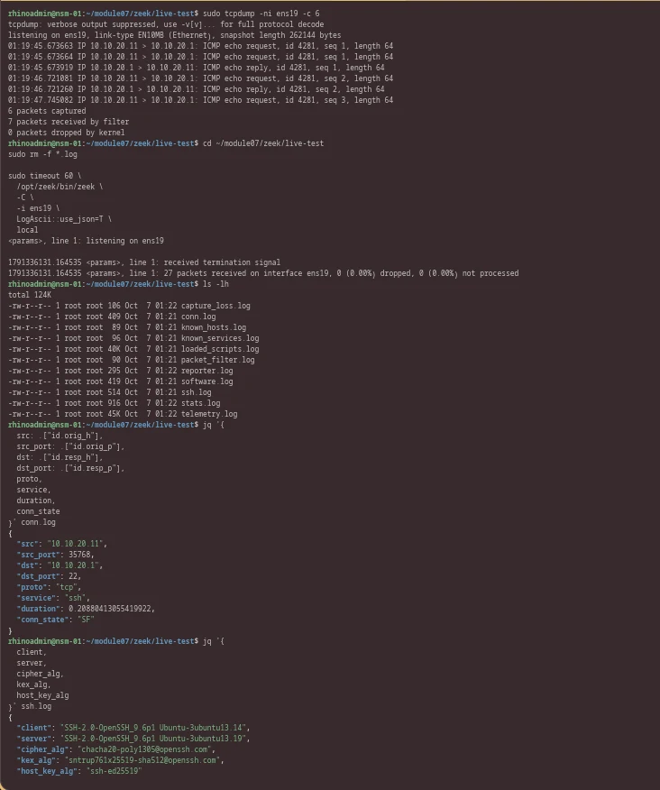

**Result:** PASS — Zeek successfully consumed the existing passive mirror path in real time.

---

## 14. Deploy Zeek as a Managed Sensor and Enable JSON Telemetry

ZeekControl was configured as a standalone sensor on `ens19` and successfully deployed.

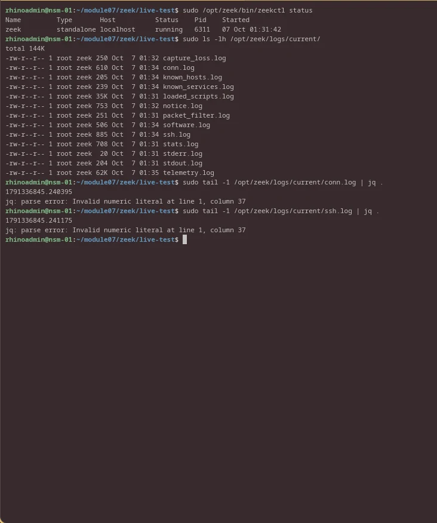

Managed logs initially used Zeek's native tab-separated format. `local.zeek` was then configured for JSON output to simplify later SIEM ingestion and automation.

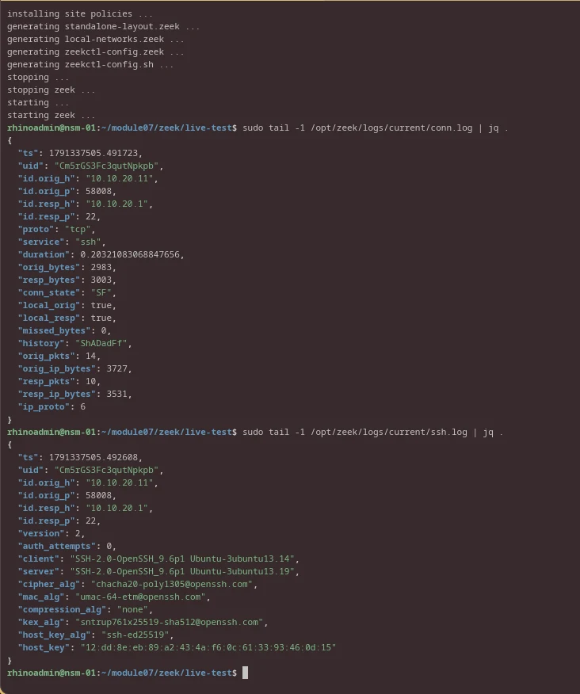

The managed sensor generated live JSON `conn.log` and `ssh.log` records for the SSH test.

---

## 15. Persist Zeek and Investigate a VM-Lifecycle Blind Spot

A systemd wrapper was created around ZeekControl so the managed sensor starts automatically.

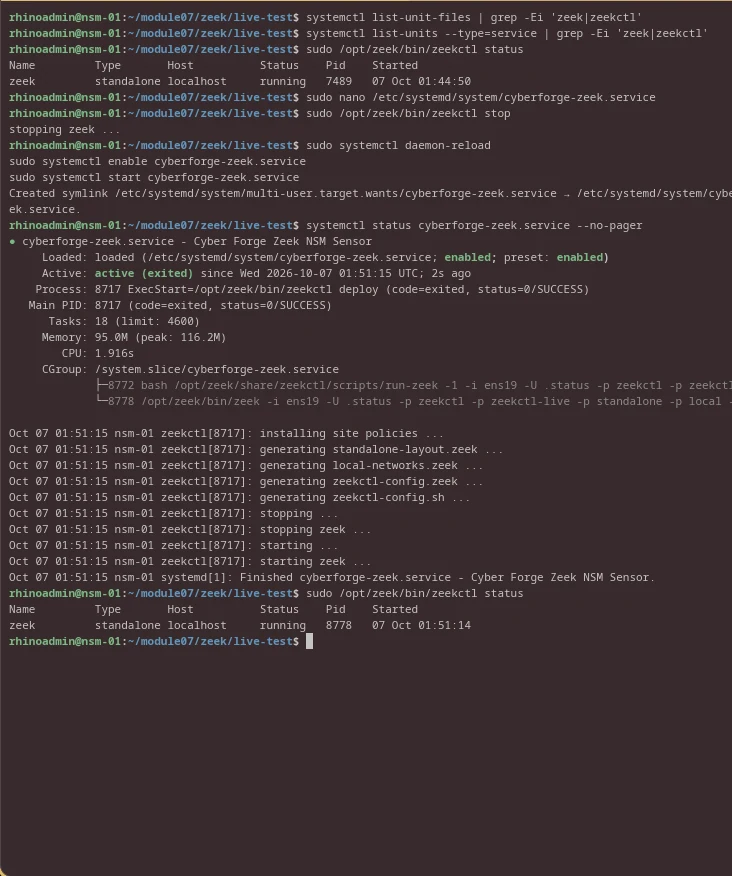

After rebooting NSM-01, Zeek started automatically, but the first live session was incomplete and `ssh.log` was absent. Packet capture on `ens19` showed no traffic.

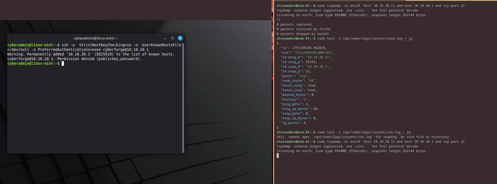

The Proxmox host revealed the actual root cause: the existing `tc` mirred action still existed but its destination had become:

```text
mirred (Egress Mirror to device *)
```

Rebooting VM 105 destroyed and recreated `tap105i1`; the old `tc` action remained bound to the previous device instance. Restarting the mirror service rebound the action to the current tap device.

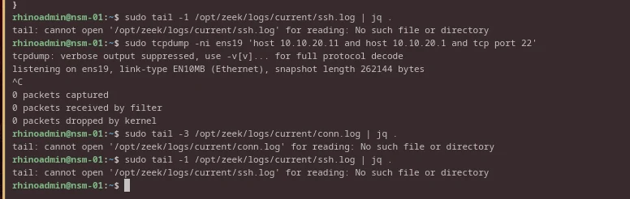

Replaying the same SSH behavior then restored complete bidirectional visibility:

```text
service:       ssh
conn_state:    SF
orig_pkts:     14
resp_pkts:     10
missed_bytes:  0
```

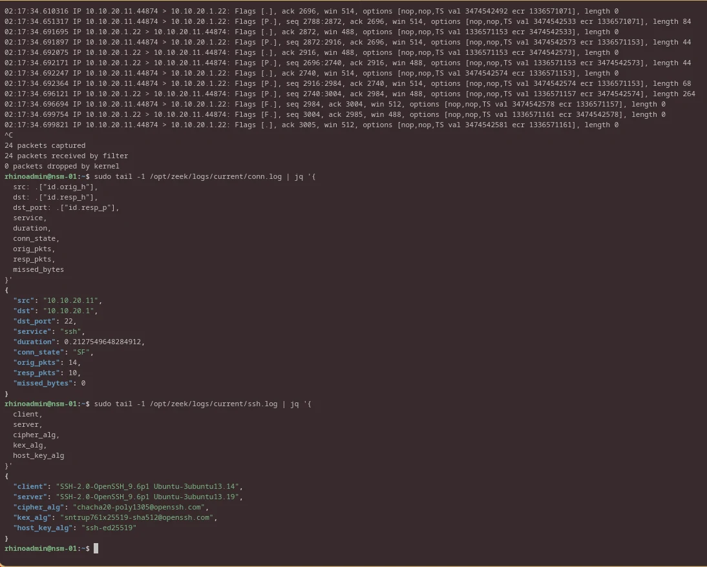

### Lifecycle hardening

The first VM-hook test showed that no hook was actually present or attached, so the mirror again became stale after a VM lifecycle event.

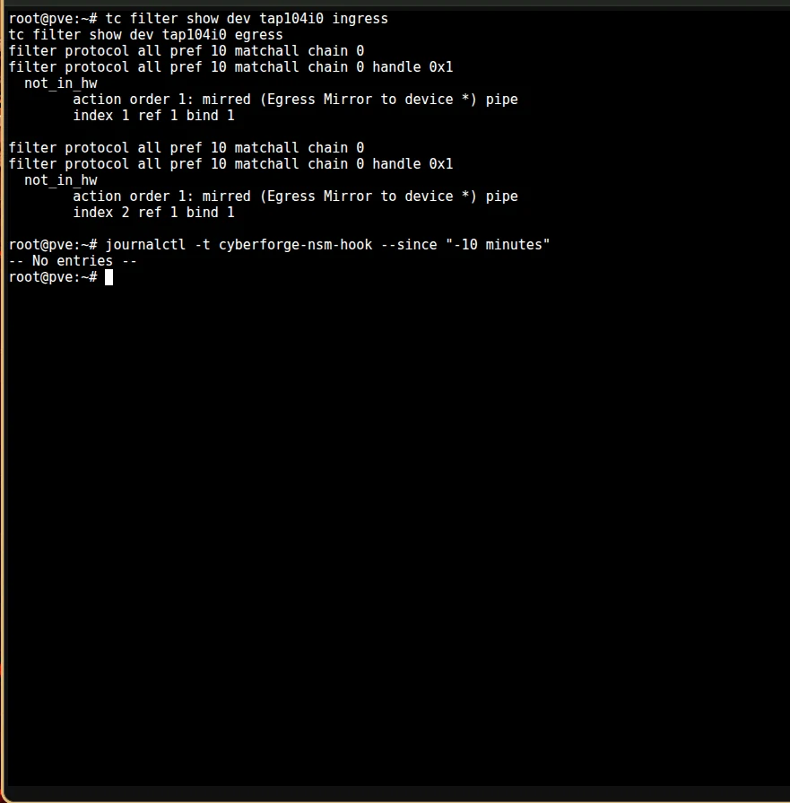

Proxmox `local` storage was then enabled for `snippets`, `cyberforge-nsm-hook.sh` was created and made executable, and VM 105 was configured to use the hookscript. The current mirror was also confirmed bound to `tap105i1`.

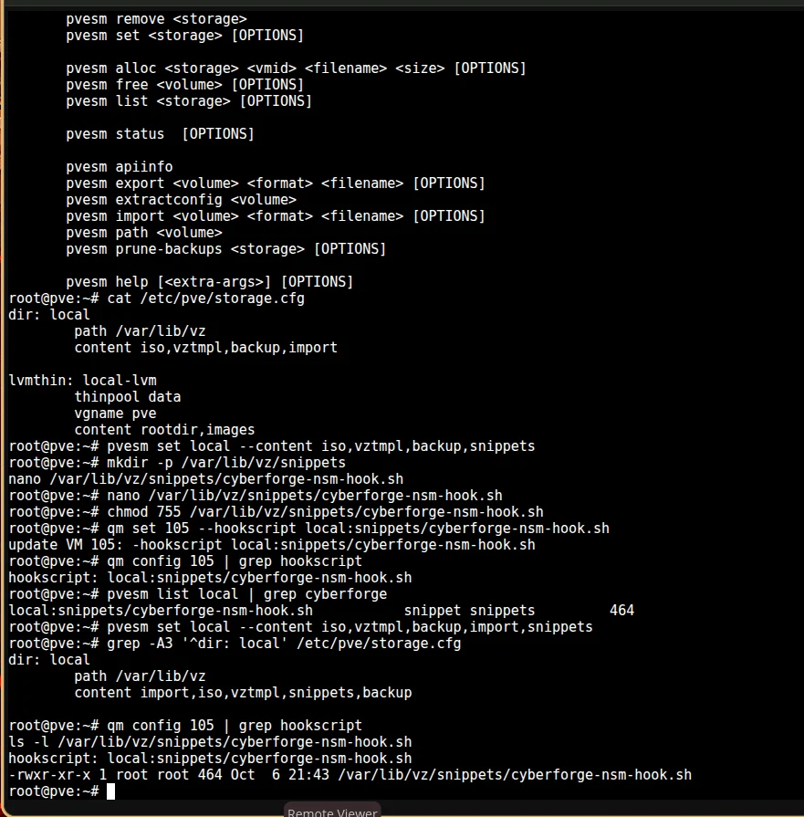

**Current checkpoint:** the hook is configured, but the final independent VM 105 restart qualification still needs to be performed without manually restarting the mirror service.

---

# Troubleshooting & Lessons Learned

## Analyzer output must be challenged with lower-level evidence

Zeek initially interpreted the short PCAP incorrectly because of checksum-offload artifacts. TShark and raw packet evidence had already proven that the handshake completed. Reprocessing with `-C` reconciled the analyzer output with the packet evidence.

## Service health is not telemetry health

Zeek can be `running` while receiving no useful traffic. After an NSM-01 reboot, the sensor process returned but the Proxmox mirror destination was stale.

## Host reboot persistence and VM lifecycle persistence are different failure domains

Module 06 validated persistence across a full PVE reboot. Module 07 exposed a separate failure case: rebooting the sensor VM alone recreated its tap device and invalidated the previous mirred target.

## Capture completeness changes what an analyst can prove

Removing one application-payload packet preserved connection and HTTP metadata while eliminating the evidence needed to recover and hash the actual object.

---

# Evidence Status

See [EVIDENCE.md](EVIDENCE.md) and [screenshots/README.md](screenshots/README.md) for the chronological evidence index.

---

# Skills Demonstrated So Far

- passive packet capture;
- PCAP preservation and replay;
- TCP 5-tuple/session reconstruction;
- TShark conversation and stream analysis;
- application identification from payload evidence;
- Zeek installation and offline PCAP analysis;
- checksum-offload artifact troubleshooting;
- Zeek `conn.log` and `ssh.log` analysis;
- port-reconnaissance reconstruction;
- multi-source PCAP → Zeek → Suricata → Wazuh correlation;
- HTTP transaction reconstruction;
- transferred-object recovery from PCAP;
- SHA-256 integrity validation;
- controlled forensic evidence-gap testing;
- live Zeek monitoring on a passive interface;
- ZeekControl standalone deployment;
- JSON telemetry configuration;
- systemd persistence for Zeek;
- virtual tap lifecycle troubleshooting; and
- Proxmox hookscript preparation for mirror rebinding.

---

# Technical Build Gate — Current State

```text
Passive forensic observation point validated       ✓
PCAP capture and replay                             ✓
TCP session reconstruction                          ✓
SSH service identification                          ✓
Zeek offline analysis                               ✓
Checksum-offload troubleshooting                    ✓
Full SSH protocol metadata                          ✓
Reconnaissance reconstruction                       ✓
PCAP / Zeek / Suricata correlation                  ✓
Wazuh correlation                                   ✓
HTTP transaction reconstruction                     ✓
HTTP object recovery                                ✓
Recovered-object SHA-256 integrity match            ✓
Controlled evidence gap                             ✓
Evidence restoration                                ✓
Live Zeek monitoring                                ✓
ZeekControl managed sensor                          ✓
Managed JSON telemetry                              ✓
Zeek systemd startup                                ✓
VM-restart visibility failure identified            ✓
Mirror rebind recovery                              ✓
VM lifecycle hook configured                        ✓
Automatic hook execution after VM105 restart        PENDING
Automatic mirror rebind after VM105 restart         PENDING
Fresh post-hook Zeek SSH session                     PENDING
Final Module 07 Technical Build Gate                OPEN
```

Module 07 remains **IN PROGRESS**. The next session should begin with the final VM-lifecycle hook qualification, followed by any remaining architecture/documentation cleanup before the Technical Build Gate is closed.
