# CyberBlue — Module 08

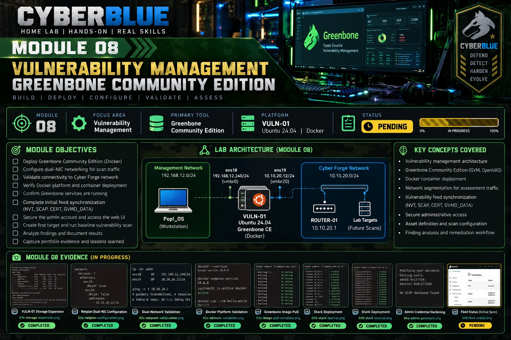

## Vulnerability Management

> **Focus:** Discover | Assess | Validate | Prioritize | Remediate | Rescan

---

## Module Objective

Module 08 builds a repeatable vulnerability-management capability inside Cyber Forge using Greenbone Community Edition as the implementation platform.

The capability being developed is:

```text
ASSET
  ↓
DISCOVER
  ↓
ASSESS
  ↓
VALIDATE
  ↓
PRIORITIZE
  ↓
REMEDIATE
  ↓
RESCAN
  ↓
PROVE CLOSURE
```

A scanner result is not treated as the final answer. Findings must be validated, placed in asset/risk context, remediated, and rescanned before closure is claimed.

**Status:** IN PROGRESS  
**Current checkpoint:** VULN-01 is provisioned, dual-homed, Docker-validated, and running Greenbone Community Edition. The admin credential is hardened. NVT feed data is current while SCAP, CERT, and GVMD_DATA are still synchronizing. Baseline scanning has not started.  
**Platform:** Proxmox VE 9.2.2  
**Scanner:** VM106 — VULN-01  
**Primary tool:** Greenbone Community Edition / OpenVAS  
**Training method:** Principle → Architecture → Build → Validate → Break/Test → Troubleshoot → Restore → Explain → Document → Qualify

---

# Core Principle

> **Vulnerability management is a lifecycle, not a scan.**

The module will distinguish:

```text
vulnerability severity
        ≠
business / operational risk
        ≠
remediation priority
```

The final technical proof will require the same target to be rescanned after remediation so closure is supported by evidence rather than assumption.

---

# Current Architecture

```text
Management Network — 192.168.12.0/24
        |
        | ens18 / vmbr0
        | 192.168.12.240
        v
     VULN-01
 Ubuntu Server 24.04
 Greenbone CE / Docker
        |
        | ens19 / vmbr20
        | 10.10.20.12/24
        v
 Cyber Forge SOC Network — 10.10.20.0/24
        |
     ROUTER-01
     10.10.20.1
        |
   segmented lab targets
```

The management interface carries administration and Internet access. The scan interface has no default gateway and provides the controlled assessment path into Cyber Forge.

---

# Build Progress

## 1. Validate Proxmox Capacity

PVE had sufficient memory and storage headroom for a dedicated vulnerability-management VM.

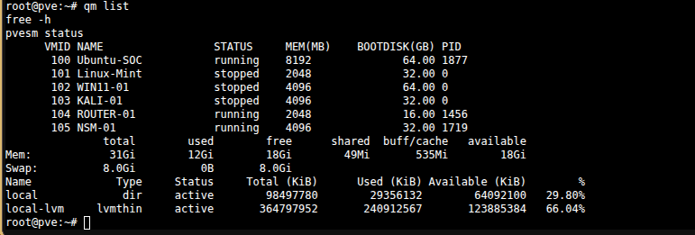

**Result:** PASS.

---

## 2. Provision VULN-01

VM 106 was created with:

```text
Name:      VULN-01
OS:        Ubuntu Server 24.04.5 LTS
vCPU:      4
Memory:    8 GiB
Disk:      60 GB
net0:      vmbr0
net1:      vmbr20
```

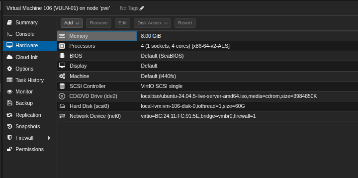

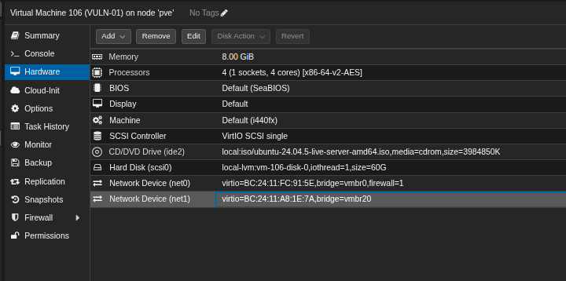

---

## 3. Validate Installer Network Mapping

Ubuntu identified the management interface as `ens18` and the isolated scan interface as `ens19`.

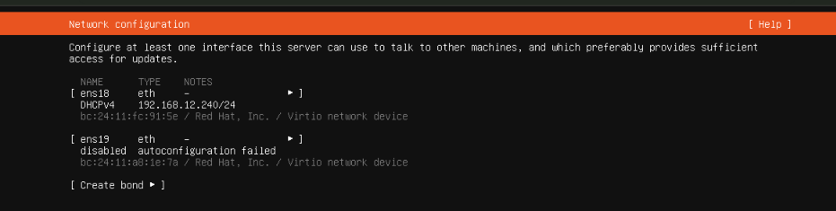

---

## 4. Expand the Root Logical Volume

The installer initially allocated roughly 29 GiB to the root LV while leaving roughly half of the VG unused. The LV and filesystem were expanded online to consume the available volume-group capacity.

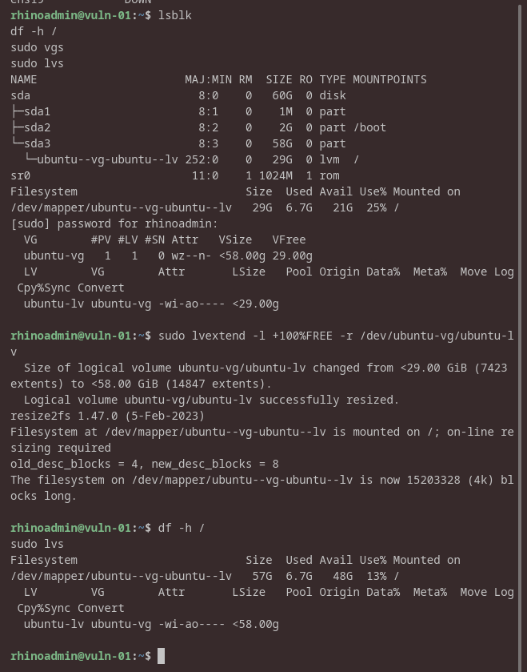

**Result:** PASS — root filesystem expanded to approximately 57 GiB.

---

## 5. Configure and Validate Dual-Network Routing

The final interface layout is:

```text
ens18  192.168.12.240/24  management / default route
ens19  10.10.20.12/24     Cyber Forge scan path
```

ROUTER-01 at `10.10.20.1` was reachable from the scan interface with 0% packet loss.

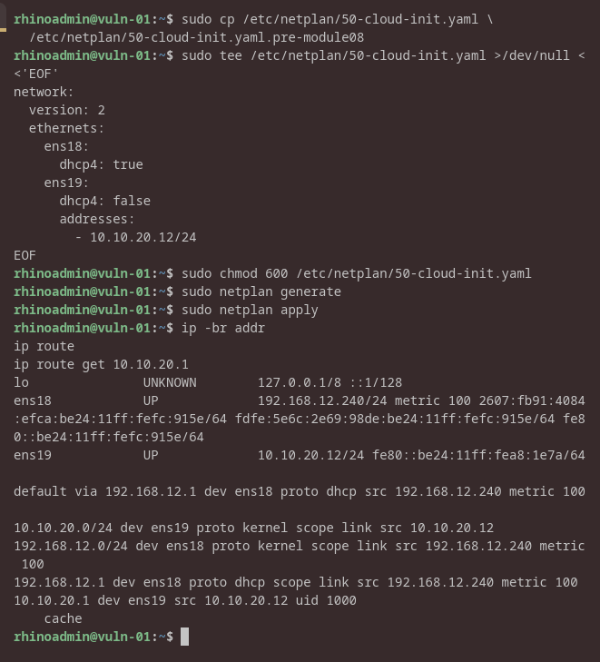

**Result:** PASS.

---

## 6. Install and Validate Docker

Docker Engine and Docker Compose were installed and validated with the `hello-world` container.

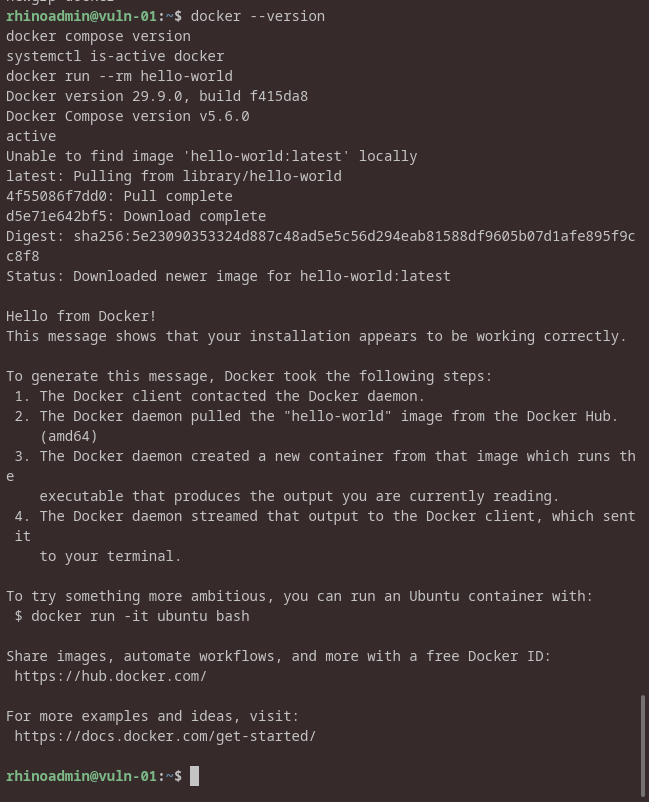

**Result:** PASS.

---

## 7. Establish a Greenbone Deployment Baseline

The current Greenbone Community Edition compose file was downloaded, hashed, and enumerated before deployment.

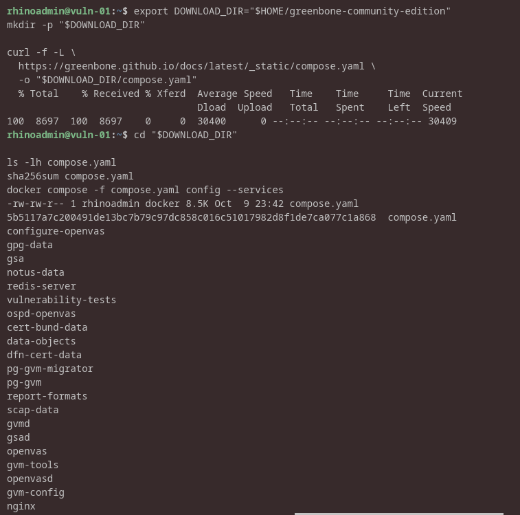

The Greenbone container images were then pulled successfully.

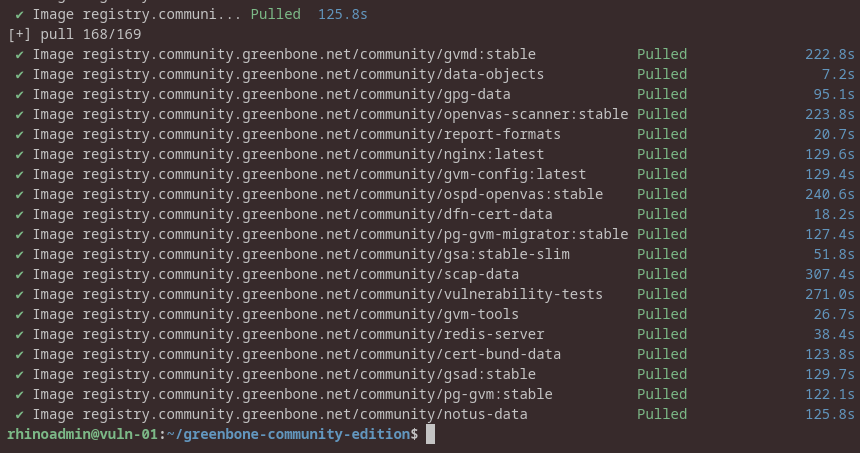

---

## 8. Deploy the Greenbone Stack

The multi-container Greenbone stack was started successfully. Core services include `gvmd`, `ospd-openvas`, OpenVAS, PostgreSQL, Redis, GSA/GSAD, nginx, and feed/data containers.

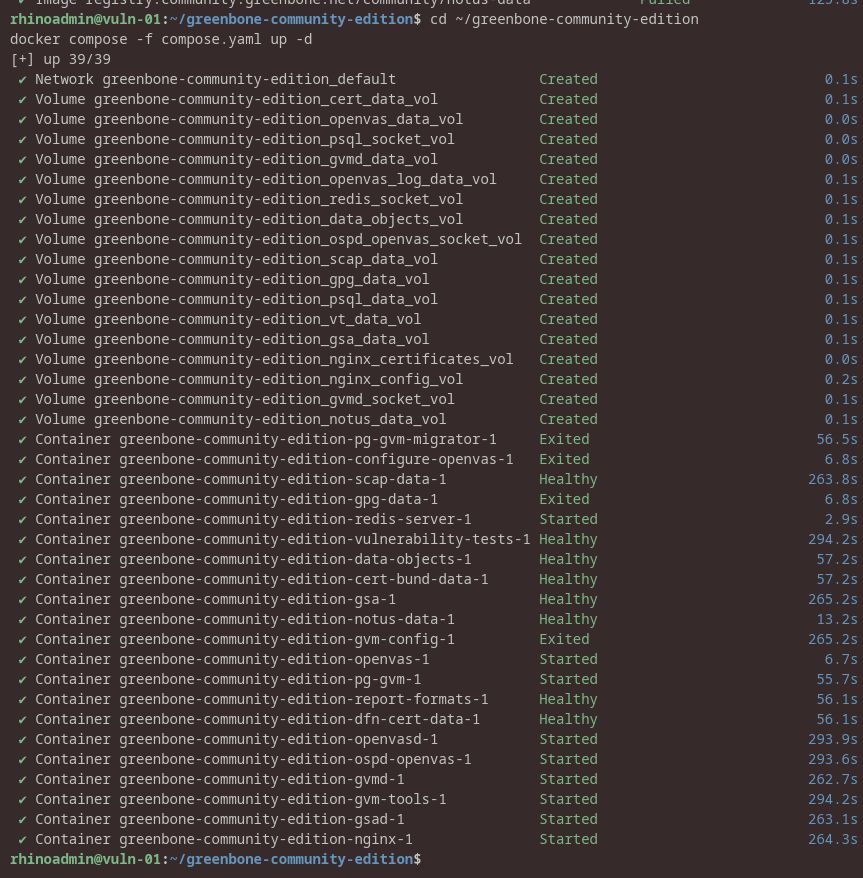

**Result:** PASS — stack deployment completed and core services started.

---

## 9. Harden the Administrative Credential

The default Greenbone administrative credential was changed without exposing the password in shell history. The `admin` account remained present after modification.

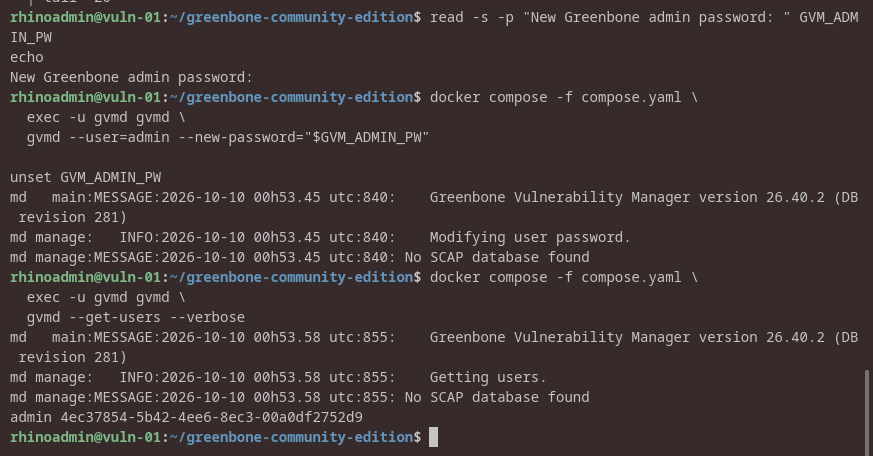

**Result:** PASS.

---

## 10. Validate Feed Synchronization State

The Greenbone Feed Status page currently shows:

```text
NVT        Current
SCAP       Update in progress
CERT       Update in progress
GVMD_DATA  Update in progress
```

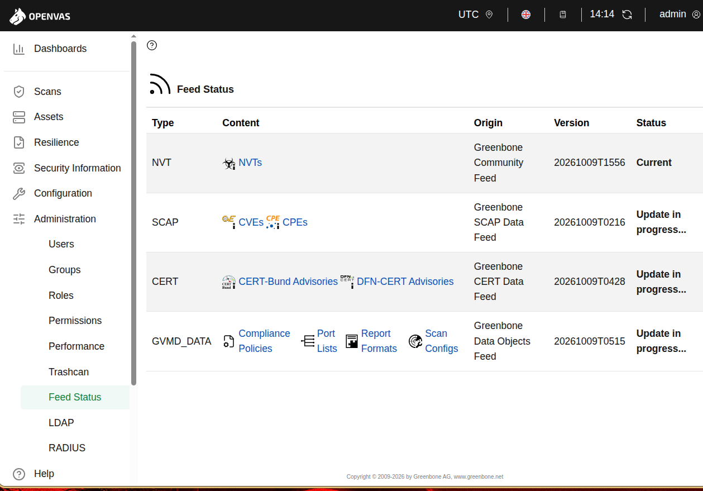

**Current state:** PENDING — initial feed synchronization must finish before the first baseline vulnerability scan is considered trustworthy.

---

# Technical Build Gate — Current State

```text
Dedicated VULN-01 provisioned                         ✓
Root storage expanded                                ✓
Management NIC validated                             ✓
Dedicated scan NIC validated                         ✓
Single default route preserved                       ✓
ROUTER-01 reachable from scan network                ✓
Docker Engine validated                              ✓
Greenbone compose baseline recorded                  ✓
Greenbone image pull completed                       ✓
Greenbone stack deployed                             ✓
Admin credential hardened                            ✓
NVT feed loaded                                      ✓
SCAP feed current                                    PENDING
CERT feed current                                    PENDING
GVMD_DATA current                                    PENDING
First target defined                                 PENDING
Unauthenticated baseline scan                        PENDING
Finding validation / prioritization                  PENDING
Remediation                                          PENDING
Same-target rescan                                   PENDING
Closure evidence                                     PENDING
Final Module 08 Technical Build Gate                 OPEN
```

---

# Next Checkpoint

Wait for all Greenbone feed categories to report **Current**. Then:

```text
Define first asset
→ create target
→ run unauthenticated baseline scan
→ analyze findings
→ validate findings
→ prioritize
→ remediate
→ rescan
→ prove closure
```

The initial controlled target is planned to be ROUTER-01 (`10.10.20.1`).
